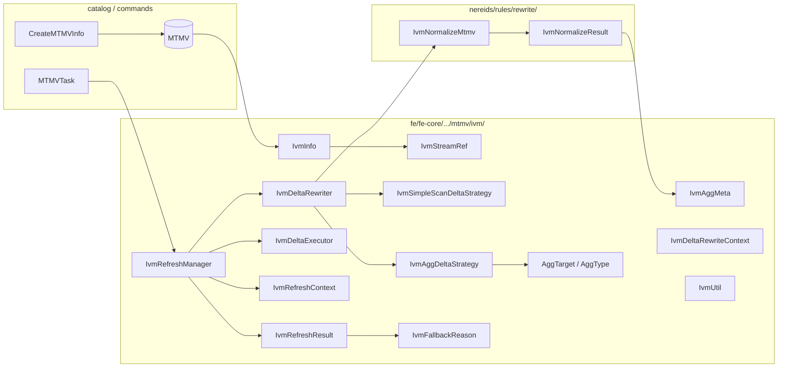
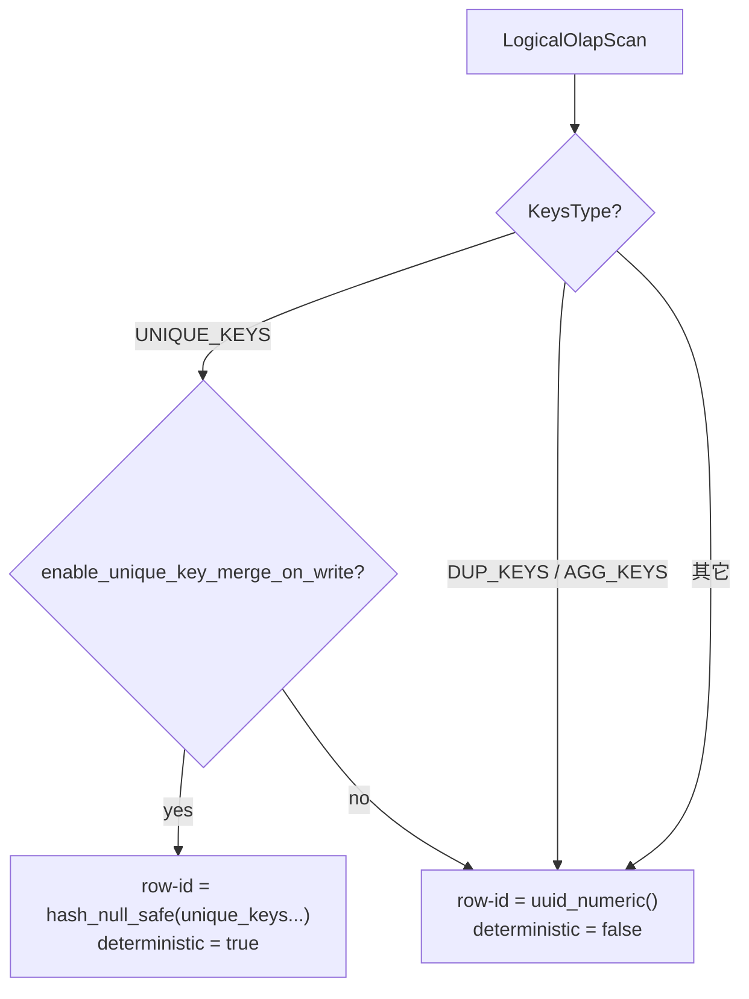
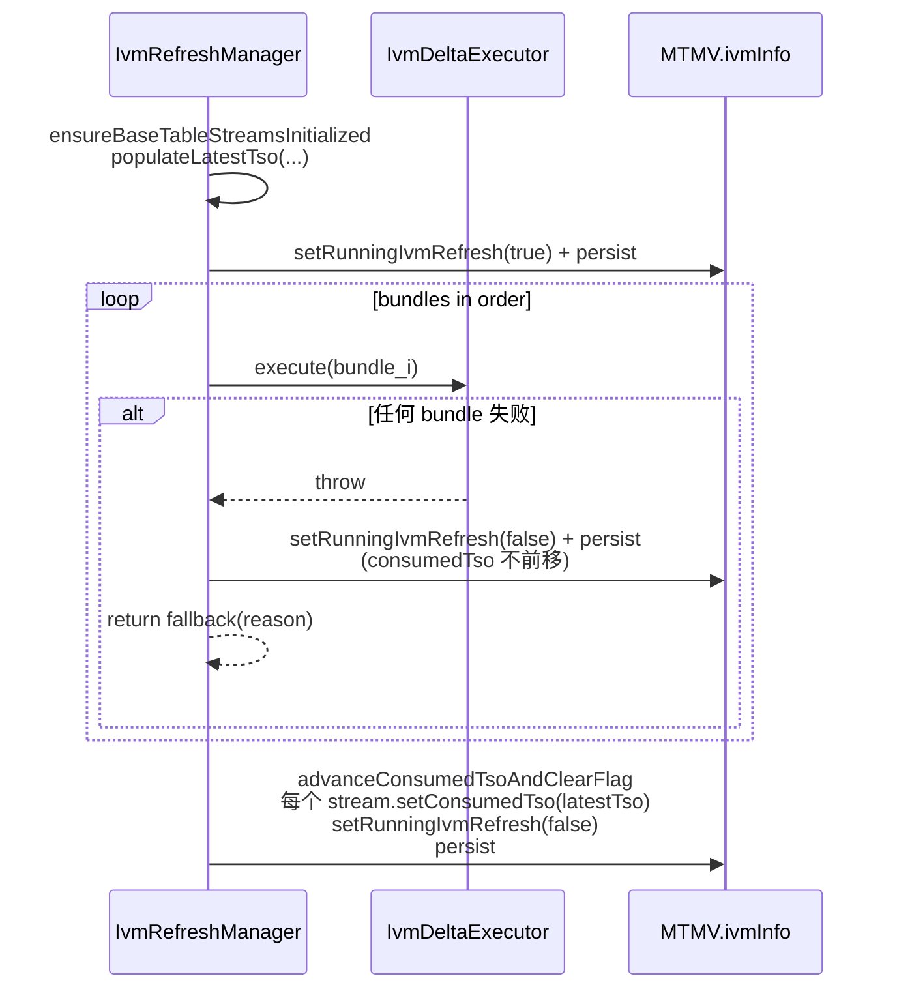
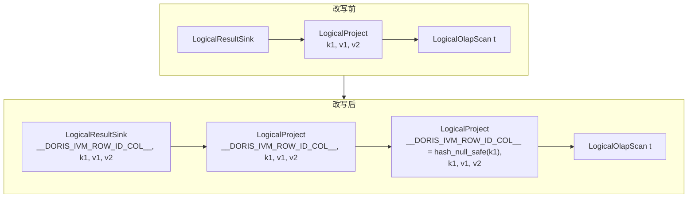
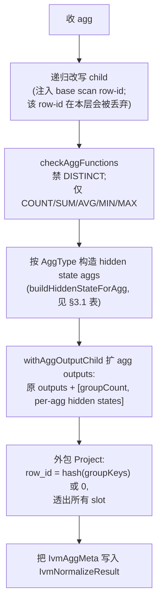
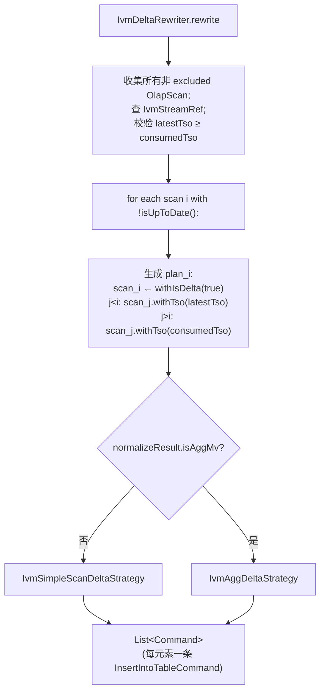
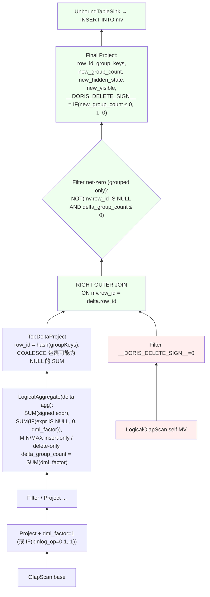

# IVM (Incremental View Maintenance) 设计文档

> 适用范围：Apache Doris MTMV 的 IVM 子系统。本文档以代码为准，所有公式、白名单、状态翻转点都附文件:行号引用，可二次核对。

## 1. 什么是 IVM

IVM (Incremental View Maintenance) 让物化视图（MTMV）在基表发生变更时**只处理变化的部分**，而不是整张表重算。Doris 的 IVM 实现要解决四个核心问题：

1. **行身份** — 同一逻辑行在多次 INSERT/UPDATE/DELETE 中如何稳定标识？这决定 MV 主键 (`__DORIS_IVM_ROW_ID_COL__`) 的取值规则（§3.2）。
2. **变更方向** — 一行变更究竟是 insert 还是 delete？由 `dml_factor` 信号统一表达 (+1 / −1)（§3.3）。
3. **状态合并** — 聚合 MV 如何在不读全量基表的前提下合并旧状态 + delta？所有可代数化合并的 agg（COUNT/SUM/AVG）走 `+`/`COALESCE`；非代数化的 MIN/MAX 走 `assert_true` 守卫 + 回退（§5.4）。
4. **失败语义** — 单轮增量失败时如何不污染数据？通过 `IvmFallbackReason` + `runningIvmRefresh` flag + `consumedTso` 不前移三件套，保证 retry 与回退兜底一致（§6）。

> 当前实现已上线 simple MV、JOIN/UNION ALL、grouped/scalar aggregate、MIN/MAX 守卫；binlog 真增量尚未接入，详见 §9。

## 2. 端到端全景

```mermaid
flowchart LR
  classDef create fill:#fee,stroke:#c66
  classDef refresh fill:#eef,stroke:#66c
  classDef apply fill:#efe,stroke:#6a6

  subgraph CREATE["CREATE MV (REFRESH METHOD INCREMENTAL)"]
    direction TB
    UDDL["用户 DDL"]:::create --> CMI["CreateMTMVInfo.analyze<br/>refreshMethod=INCREMENTAL → enableIvm=true<br/>UNIQUE_KEYS + MOW 强制<br/>DISTRIBUTED → HASH(__DORIS_IVM_ROW_ID_COL__)"]:::create
    CMI --> NORM1["IvmNormalizeMtmv (CREATE)<br/>白名单校验 + 注入隐藏列<br/>持久化 MV schema"]:::create
    NORM1 --> META["MTMV.ivmInfo:<br/>enableIvm=true<br/>binlogBroken=false<br/>runningIvmRefresh=false<br/>baseTableStreams={}"]:::create
  end

  subgraph REFRESH["REFRESH MV INCREMENTAL"]
    direction TB
    TASK["MTMVTask:<br/>mtmv.isIvm() && mode∈{AUTO,INCREMENTAL}"]:::refresh --> MGR["IvmRefreshManager.doRefresh<br/>1.precheck<br/>2.buildRefreshContext<br/>3.analyzeDeltaCommands<br/>  ↳ ensureBaseTableStreamsInitialized<br/>  ↳ populateLatestTso<br/>  ↳ IvmNormalizeMtmv (REFRESH)<br/>  ↳ IvmDeltaRewriter.rewrite"]:::refresh
    MGR --> BUNDLE{"按未消费 base scan<br/>逐个生成 bundle"}:::refresh
    BUNDLE --> SIMPLE["IvmSimpleScanDeltaStrategy"]:::refresh
    BUNDLE --> AGG["IvmAggDeltaStrategy"]:::refresh
    SIMPLE --> CMD["List&lt;Command&gt;<br/>(每条 = 1 条 InsertIntoTableCommand)"]:::refresh
    AGG --> CMD
    CMD --> EXE["IvmDeltaExecutor.execute<br/>(每个 bundle 独立 StatementContext,<br/>禁用 IVM 规则避免递归)"]:::apply
    EXE --> MV[("MV 表 (UNIQUE_KEYS MOW)<br/>按 __DORIS_IVM_ROW_ID_COL__ 上 sert/delete-sign")]:::apply
    EXE --> ADV["advanceConsumedTsoAndClearFlag<br/>setConsumedTso(latestTso)<br/>setRunningIvmRefresh(false)<br/>persist"]:::refresh
  end

  META -.-> TASK

  subgraph FALLBACK["fallback 路径"]
    direction TB
    FB["IvmRefreshResult.fallback(reason, detail)"]:::refresh
    FB --> AUTO{"currentRefreshMode?"}:::refresh
    AUTO -- AUTO --> PART["走分区/完整刷新兜底"]:::apply
    AUTO -- INCREMENTAL --> JE["JobException FAILED"]:::create
  end

  MGR -.precheck/analyze 失败.-> FB
  EXE -.execute 失败.-> FB
```



> **旁注**：`IvmNormalizeMtmv` 在 CREATE 与 REFRESH 各跑一次——CREATE 时确定持久化 schema，REFRESH 时重跑以拿到当前 ExprId 上的 `IvmAggMeta` 给 `IvmDeltaRewriter` 使用（"两趟规则"）。多个 base 表都有 delta 时，`generateDeltaPlans` 会拆成 N 个 bundle，每个 bundle 仅一个 base scan 标 `isDelta=true`，其余按 TSO 锁定到 snapshot 视图。



## 3. 数据契约

### 3.1 隐藏列权威表

| 物化列名 | `Column.*` 常量 | 持久化 | 含义 / 取值 |
|---------|----------------|--------|-------------|
| `__DORIS_IVM_ROW_ID_COL__` | `IVM_ROW_ID_COL`（`Column.java:61`） | 是 | MV 主键。simple MV = 基表 row-id；agg MV = `hash_null_safe(group_keys)`，scalar agg = `0::largeint` |
| `__DORIS_IVM_DML_FACTOR_COL__` | `IVM_DML_FACTOR_COL`（`:63`） | 否（仅 delta plan） | +1 = insert，−1 = delete；由 `binlog_op` 推导 |
| `__DORIS_IVM_AGG_COUNT_COL__` | `IVM_AGG_COUNT_COL`（`:62`） | 是（agg MV） | 当前 group 总行数；归 0 时整组 `delete_sign=1` |
| `__DORIS_IVM_DELTA_GROUP_COUNT_COL__` | `IVM_DELTA_GROUP_COUNT_COL`（`:64`） | 否（仅 delta plan） | 本轮 delta 对该 group 的行数变化量 = `SUM(dml_factor)` |
| `__DORIS_IVM_AGG_{n}_SUM_COL__` | 动态构造 | 仅 SUM/AVG 持久化 | 第 n 个 agg target 的 SUM 状态。SUM(expr) 复用可见列；AVG(expr) 单独物化 |
| `__DORIS_IVM_AGG_{n}_COUNT_COL__` | 动态构造 | COUNT(expr)/SUM(expr)/AVG(expr)/MIN(expr)/MAX(expr) 都持久化 | 该 target 的非 NULL 计数。决定可见 SUM/AVG 是数值还是 NULL；MIN/MAX 用其归零分支短路守卫 |
| `__DORIS_IVM_TRANSIENT_{n}_DELMIN_COL__` | 动态构造 | 否（仅 delta plan） | MIN target 的 delete-only 极值，仅守卫使用 |
| `__DORIS_IVM_TRANSIENT_{n}_DELMAX_COL__` | 动态构造 | 否 | MAX target 的 delete-only 极值，仅守卫使用 |
| `binlog_op` | `BINLOG_OPERATION_COL`（`:70`） | 由用户 DDL 决定 | **用户基表上的可选列**，0=insert/1=delete；不带 IVM 前缀 |
| `__DORIS_DELETE_SIGN__` | `DELETE_SIGN`（`:56`） | 是（MOW 通用） | MOW delete-sign；agg MV 由 `IF(new_group_count ≤ 0, 1, 0)` 推导 |

> 所有 IVM hidden 列名都以 `IVM_HIDDEN_COLUMN_PREFIX = "__DORIS_IVM_"`（`Column.java:54`）开头。每种 AggType 实际生成哪些 hidden 列由 §5.4 / 附录 C 给出。

### 3.2 row-id 推导规则

`IvmNormalizeMtmv.buildRowId` 决策树：



- `hash_null_safe(cols...)` ≡ `CAST(murmur_hash3_64(ifnull(CAST(c AS VARCHAR), ''), CAST(c IS NULL AS VARCHAR), ...) AS LARGEINT)`，对 NULL 与空串可区分。
- **non-deterministic row-id 不允许写回 delete**：`IvmSimpleScanDeltaStrategy.visitLogicalJoin` 在 snapshot 侧 row-id 非确定且 delta 含删除时，运行期 `assert_true('delete on non-deterministic row_id')`，分类为 `NON_DETERMINISTIC_ROW_ID` 回退。

**JOIN row-id 合成**（`IvmNormalizeMtmv.visitLogicalJoin`）：

```
join_row_id = hash_null_safe(left_row_id, right_row_id)
deterministic = left.det && right.det
```

**UNION ALL row-id 合成**（`IvmNormalizeMtmv.visitLogicalUnion`）：

```
arm_i row-id = hash_null_safe(i, child_row_id)   # i 是 arm 序号
union output row-id = arm-level row-id           # 直接透传到 union 的 output
```
> arm 序号编入 hash 是为了 self-union 不冲突。

**Aggregate row-id 合成**（`IvmNormalizeMtmv.visitLogicalAggregate`）：

```
mv_row_id = hash_null_safe(group_keys...)
scalar agg (group_keys 为空) ⇒ mv_row_id = 0::largeint
```
> 聚合 MV 的 row-id 由 group key 决定，与 base scan 的 row-id 解耦——这是聚合状态可合并的关键。

### 3.3 dml_factor 信号

`IvmSimpleScanDeltaStrategy.buildDmlFactorExpr` 只识别基表上的列名 `binlog_op`：

| 基表上是否有 `binlog_op` 列 | dml_factor 表达式 |
|---------------------------|-------------------|
| 有 | `IF(binlog_op = 0, 1, -1)` |
| 无 | 常量 `1` |

注入位置：每个 `isDelta=true` 的 `OlapScan` 上方包一层 Project，新增 `__DORIS_IVM_DML_FACTOR_COL__` 输出。Filter / Project / Join / Union 各 visitor 透传该 slot。

JOIN 中：`IvmSimpleScanDeltaStrategy.visitLogicalJoin` 要求左右最多一侧带 `dml_factor`（其它 bundle 中另一侧是 snapshot scan，没有该列），输出复用唯一存在的那一份。

最终 sink 阶段：

```
__DORIS_DELETE_SIGN__ = IF(__DORIS_IVM_DML_FACTOR_COL__ < 0, 1, 0)
```

### 3.4 IvmStreamRef 与 TSO 推进

`IvmStreamRef`（`fe/fe-core/src/main/java/org/apache/doris/mtmv/ivm/IvmStreamRef.java`）：

| 字段 | 类型 | 持久化 key | 含义 |
|------|------|----------|------|
| `consumedTso` | long | `"ct"`（`:32–33`） | 已经成功消费完的 TSO；下一轮 delta 范围的左端点（开） |
| `latestTso` | long | 否（`transient`，`:36`） | 当前刷新选定的 TSO 上界；右端点（闭） |
| `streamId` | String | `"sid"` | base 表对应 stream 标识 |

关键 API：

| 方法 | 行为 | 调用点 |
|------|------|--------|
| `isUpToDate()` | `consumedTso == latestTso` | `IvmStreamRef.java:65–67`；`IvmDeltaRewriter.generateDeltaPlans` 用于跳过无 delta 的 scan |
| `setConsumedTso(t)` | 持久化字段写入 | `IvmRefreshManager.java:278`（成功后）/`:314`（清理路径） |
| `populateLatestTso(...)` | 把当前快照对齐到的 TSO 写到 transient 字段 | `IvmRefreshManager.analyzeDeltaCommands` 阶段调用 |

**TSO 推进的事务性**：



> **多 bundle 中间失败语义**：当前实现在中途失败时**整轮 consumedTso 都不前移**——下一次 INCREMENTAL 重跑会重新生成所有 bundle。`runningIvmRefresh` flag 保证 fail-after-success 路径下不会重复推进 TSO。

### 3.5 IvmInfo 持久化字段与状态翻转

`IvmInfo`（`fe/fe-core/src/main/java/org/apache/doris/mtmv/ivm/IvmInfo.java`）四个字段：

| 字段 | 类型 | 初值 | 翻转点 |
|------|------|------|--------|
| `enableIvm` | bool | 由 DDL 决定 | `MTMV.<init>:130` 一次性赋值（`this.ivmInfo.setEnableIvm(params.enableIvm)`），来源 `CreateMTMVInfo.isEnableIvm()` |
| `binlogBroken` | bool | false | 预留：`setBinlogBroken` 当前**无调用点**，靠外部链路（未来）写入 |
| `runningIvmRefresh` | bool | false | `IvmRefreshManager.java:223`（开始执行）→ true；`:281`（成功）/`:319`（失败清理）→ false；每次都 persist |
| `baseTableStreams` | `Map<TableId, IvmStreamRef>` | `{}` | 首轮 refresh 时 `ensureBaseTableStreamsInitialized` 填充；`setConsumedTso` 时随 `Env.alterMTMVIvmInfo`（`IvmRefreshManager.java:290–293`）持久化 |

`MTMV.isIvm()`（`MTMV.java:218–220`）等价于 `getIvmInfo().isEnableIvm()`，是后续所有路径的总开关：

```java
public boolean isIvm() {
    return ivmInfo != null && ivmInfo.isEnableIvm();
}
```

## 4. CREATE 阶段

### 4.1 调度判定与 DDL 重写

入口在 `CreateMTMVInfo.analyze()`：

| 行为 | 触发条件 | 代码位置 |
|------|----------|----------|
| `isEnableIvm()` 返回 `true` | `refreshInfo.getRefreshMethod() == RefreshMethod.INCREMENTAL` | `CreateMTMVInfo.java:377–379` |
| 拒绝用户指定 KEY 列 | `isEnableIvm() && !keys.isEmpty()` | `CreateMTMVInfo.java:151–154` |
| 强制 `KeysType = UNIQUE_KEYS` 并打开 `enable_unique_key_merge_on_write=true` | `isEnableIvm()` | `CreateMTMVInfo.java:318–326` |
| 把任何 distribution（含 `RANDOM`）改写为 `HASH(__DORIS_IVM_ROW_ID_COL__)` | `isEnableIvm()` | `CreateMTMVInfo.java:166–174` |

被强制改写的原因：IVM MV 是 UNIQUE_KEYS（MOW）表，主键是 `__DORIS_IVM_ROW_ID_COL__`。MOW 去重只在同一 tablet 内生效，因此 distribution 必须按 row-id 列做 HASH；RANDOM 会让同一个 key 在多次 INSERT 间落到不同 tablet，去重就坏了。

> ⚠️ 与历史描述的一处差异：旧文档曾声称"`SHOW CREATE` 会把 `HASH(__DORIS_IVM_ROW_ID_COL__)` 还原回用户原始的 `RANDOM`"。当前代码中**没有这个还原逻辑**：catalog 实际持有的是改写后的 distribution，`SHOW CREATE` 也按改写后展示。如果你写 `DISTRIBUTED BY RANDOM BUCKETS n`，最终落地是 `DISTRIBUTED BY HASH(__DORIS_IVM_ROW_ID_COL__) BUCKETS n`。

CREATE 完成后 `ivmInfo` 初始状态：`enableIvm=true / binlogBroken=false / runningIvmRefresh=false / baseTableStreams={}`（详见 §3.5）。

### 4.2 IvmNormalizeMtmv：白名单 + visitor 总览

`IvmNormalizeMtmv` 注册在 Analyzer 末尾（`Analyzer.java:224`：`custom(RuleType.IVM_NORMALIZE_MTMV, IvmNormalizeMtmv::new)`，位于 `NormalizeAggregate` 之后、`AdjustNullable` 之前），由 session variable `enable_ivm_normal_rewrite` 控制开关（默认 `false`，见 §8）。规则**幂等**：`CascadesContext` 已有 `IvmNormalizeResult` 时直接返回。

`IvmNormalizeMtmv extends DefaultPlanRewriter<Boolean>`，`Boolean` 参数含义为 `isFirstNonSink`（是否处于紧贴 sink 下方的位置——`LogicalAggregate` 仅在此位置合法）。未在白名单中的 plan 节点直接抛 `AnalysisException`：

```
LogicalResultSink / LogicalOlapTableSink
LogicalProject
LogicalFilter
LogicalJoin              （仅 INNER_JOIN / CROSS_JOIN，非 markJoin）
LogicalUnion             （仅 UNION ALL，不含纯常量 arm）
LogicalAggregate         （仅 first-non-sink 位置）
LogicalOlapScan
```

各 visitor 的核心动作已在 §3.2 / §3.3 给出（row-id 注入、JOIN/UNION row-id 合成、dml_factor 注入位置）。下面两节描述"plan 形态"。

### 4.3 简单 MV 改写



实现要点：

- 在每个 `LogicalOlapScan` 之上多加一个 `LogicalProject`，把 row-id alias 置于 output 索引 0。
- 父节点 Project / Filter / Sink 通过 `rewriteOutputsWithIvmHiddenColumns` **propagate**：保持原输出顺序，在前面插入 row-id slot，在末尾追加其它隐藏 slot；如果输出里已存在同名隐藏列占位符（由 `BindSink` 引入），就**按 ExprId 在原位替换**以保证 schema 顺序稳定。

### 4.4 聚合 MV 改写

输入假设：`NormalizeAggregate` 已经把 Aggregate 规范成
```
Project(top) → Aggregate(groupBy=[slots], outputs=[groupKeys..., Alias(AggFn(slot))...]) → Project(bottom) → ...
```

`visitLogicalAggregate` 分 5 步：



支持的 agg：`SUPPORTED_AGG_FUNCTIONS = {Count, Sum, Avg, Min, Max}`（`IvmNormalizeMtmv:133–134`）。每种 AggType 实际生成的 hidden state 见 §3.1 权威表。所有新增 agg 输出都通过 `newAgg.getOutput()` 按**名字**重新解析，避免 ExprId 漂移（`resolveAggTargetSlots`）。

> 改写后的 `IvmAggMeta` 在 REFRESH 阶段被 `IvmAggDeltaStrategy` 用来构造 signed delta 与 apply plan，权威公式见 §5.4。

---

## 5. REFRESH 阶段

### 5.1 IvmRefreshManager 流程

`IvmRefreshManager.doRefresh(MTMV)`（`:64–81`）按顺序执行：

| 步骤 | 方法 | 行号 | 失败动作 |
|------|------|------|----------|
| 1 | `precheck`：检 `binlogBroken` / `runningIvmRefresh` | `:84–96` | `BINLOG_BROKEN`（`:91`） / `PREVIOUS_RUN_INCOMPLETE`（`:87`） |
| 2 | `buildRefreshContext`：装出 `IvmRefreshContext`（包 `ConnectContext + MTMVRefreshContext`） | `:99–104` | `SNAPSHOT_ALIGNMENT_UNSUPPORTED`（`:76`） |
| 3 | `analyzeDeltaCommands`：重跑 Analyzer + ensureBaseTableStreamsInitialized + populateLatestTso + IvmDeltaRewriter.rewrite | `:107–127` | `PLAN_PATTERN_UNSUPPORTED`（`:209`） |
| 4 | `setRunningIvmRefresh(true)` + persist | `:223–224` | — |
| 5 | `IvmDeltaExecutor.execute`：按 bundle 顺序执行 | `:230` | 见 §6 |
| 6 | `advanceConsumedTsoAndClearFlag`：推进 `consumedTso`、清 flag、persist | `:274–283` | — |

任何一步失败都返回 `IvmRefreshResult.fallback(reason, detail)`；上游 `MTMVTask` 按 `currentRefreshMode` 决定回退或抛错（§6）。

### 5.2 多 bundle 生成（`IvmDeltaRewriter.generateDeltaPlans`）



**Phase 1**（`IvmDeltaRewriter.java:107–121`）：`rewriteDownShortCircuit` 收集 plan 中所有非 excluded 的 `LogicalOlapScan`，按 `scan.getTable().getId()` 查 `baseTableStreams` 得到对应 `IvmStreamRef`；并断言 `latestTso ≥ consumedTso`。这一阶段产出的 `IvmDeltaRewriteContext` 后续传给两种策略，承载 stream 与 normalize 元数据。

**Phase 2**（`:129–155`）：跳过 `isUpToDate()` 的 scan；对每个仍有 delta 的 scan i 生成一个修改后的 plan（同一遍 `rewriteDownShortCircuit`，按访问顺序计数）：

- `i 自身` → `scan.withIsDelta(true)`（mock：占位标志；将来替换成 binlog 范围 scan）
- `j < i` → `scan.withTso(latestTso)`（已包含 i 的更早 delta，看到的是新视图 v2）
- `j > i` → `scan.withTso(consumedTso)`（i 的 delta 还未被它们感知，看到的是旧视图 v1）

**不变量**：每条 plan 必须恰好包含 1 个 `isDelta=true` 的 scan，否则 `Preconditions.checkState(deltaCount == 1, ...)` 失败（`:151–152`）。

最后按 `normalizeResult.isAggMv()` 分发到 `IvmSimpleScanDeltaStrategy`（§5.3）或 `IvmAggDeltaStrategy`（§5.4）。

### 5.3 IvmSimpleScanDeltaStrategy（简单 / JOIN / UNION ALL）

`PlanVisitor<RewriteResult, Void>`，`RewriteResult = (plan, dmlFactorSlot)`。

| 节点 | 行为 |
|------|------|
| `OlapScan` | 若 `isDelta()`，包 Project 注入 `dml_factor`（`binlog_op` 推导，§3.3）；否则直接返回（snapshot 侧） |
| `Project` | 保留原投影并透传 `dml_factor` |
| `Filter` | 递归并透传 |
| `Join` | 仅 INNER/CROSS；要求两侧 `dml_factor` 不同时存在；若 MV row-id 非确定且存在 delete 行，包 `assert_true` 守卫抛 `delete on non-deterministic row_id`（→ `NON_DETERMINISTIC_ROW_ID` 回退） |
| `Union` | 仅 UNION ALL；裁掉非 delta arm；ExprId 重映射到 union 输出 |
| 其它 | 抛错 |

`buildSinkProject` 把 plan 输出改写为：

```
[ inserted_col_1, ..., inserted_col_N,
  __DORIS_DELETE_SIGN__ = IF(dml_factor < 0, 1, 0) ]
```

再用 `UnboundTableSink(..., TPartialUpdateNewRowPolicy.APPEND, DMLCommandType.INSERT)` 包成 `InsertIntoTableCommand`，写回 MV 自己。

### 5.4 IvmAggDeltaStrategy（聚合 MV，权威公式）

聚合策略继承自 Simple，复用 Scan/Filter/Project 的 `dml_factor` 注入，但**override** 了 `visitLogicalAggregate` 和 `visitLogicalProject`（如果 project 的 child 是 aggregate，直接把 aggregate 的结果往上抛，因为 agg 策略已返回完整 apply plan）。

#### 5.4.1 Apply plan 形态



> **JOIN 方向**：`RIGHT_OUTER_JOIN`，delta 作为 build 侧（小表），MV 作为 probe 侧（大表）；这样没出现在 delta 的 MV 行不会被读进 pipeline，性能更优。

#### 5.4.2 权威公式（直接出自 `IvmAggDeltaStrategy`）

**signed delta aggregate**（`signedExpr`，`:535–538`）：

```
SUM(IF(dml_factor > 0, expr, -expr))
```
> 用分支代替 `dml_factor * expr`，避免 TinyInt × Decimal 的精度丢失。

**NULL 敏感计数**（`ifExprNotNull`，`:545–547`）：

```
SUM(IF(expr IS NULL, 0, dml_factor))
```
> 符合 SQL 语义："COUNT(expr) 忽略 NULL"。

**逐 AggType 的 delta 输出**（`buildDeltaSubPlan`，`:256–361`）：

| AggType | delta 输出 | 备注 |
|---------|------------|------|
| `COUNT(*)` | `delta_group_count = SUM(dml_factor)` 别名为 `__DORIS_IVM_DELTA_GROUP_COUNT_COL__` | 兼任 group 行数变化量 |
| `COUNT(expr)` | `SUM(ifExprNotNull(expr, dml_factor))` | 直接是非 NULL 计数变化量 |
| `SUM(expr)` | `SUM(signedExpr(expr, dml_factor))` + `SUM(ifExprNotNull(expr, dml_factor))` | 即 delta_sum + delta_count |
| `AVG(expr)` | 同 SUM | apply 阶段从 sum/count 推导 AVG |
| `MIN(expr)` | `delta_insert_min = MIN(IF(dml_factor>0, expr, NULL))` + `delta_delete_min = MIN(IF(dml_factor<0, expr, NULL))`（别名 `__DORIS_IVM_TRANSIENT_{n}_DELMIN_COL__`） + `SUM(ifExprNotNull(expr, dml_factor))` | DELMIN 仅守卫使用，不写回 MV |
| `MAX(expr)` | 对称 MAX | DELMAX 同上 |

**state merge formula**（`buildTargetExpressions`，`:434–435` 注释）：

```
new_X = COALESCE(mv_old_X, 0) + delta_X
```

具体到每种 AggType（`buildTargetExpressions`，`:449–508` / `buildExtremalTargetExpressions`，`:757–816`）：

```
new_group_count = assertNonNegative(
    COALESCE(mv.__DORIS_IVM_AGG_COUNT_COL__, 0) + delta_group_count)

# COUNT(expr) / SUM(expr) / AVG(expr) 共用：
new_count_n = assertNonNegative(
    COALESCE(mv.__DORIS_IVM_AGG_n_COUNT_COL__, 0) + delta_count_n)

# SUM(expr) / AVG(expr)：
new_sum_n   = COALESCE(mv.<sum-slot>, 0) + delta_sum_n

# 可见列推导：
visible(SUM)   = IF(new_count_n > 0, new_sum_n, NULL)        # 全 NULL ⇒ NULL
visible(AVG)   = IF(new_count_n > 0, new_sum_n / new_count_n, NULL)
visible(COUNT) = new_count_n （或 new_group_count for COUNT(*)）

# 最终 delete-sign：
__DORIS_DELETE_SIGN__ = IF(new_group_count ≤ 0, 1, 0)
```

`assertNonNegative(expr)` ≡ `IF(AssertTrue(expr >= 0, 'IVM negative count'), expr, NULL)`（`:558–562`），兜底数据异常。

**MIN / MAX 守卫公式**（`buildExtremalTargetExpressions`，`:757–816`）：

```
new_count = assertNonNegative(COALESCE(old_count, 0) + delta_count)

# MIN：
assert_true(
       new_count = 0
    OR delta_delete_min IS NULL
    OR old_min IS NULL
    OR delta_delete_min > old_min,
    'IVM: deleted row may be current MIN value, fallback to COMPLETE')

new_min = CASE
    WHEN new_count = 0           THEN NULL
    WHEN old_min IS NULL         THEN delta_insert_min
    WHEN delta_insert_min IS NULL THEN old_min
    ELSE LEAST(old_min, delta_insert_min)
END

# MAX 对称（用 < 与 GREATEST，guard message 为 "deleted row may be current MAX value"）。
```

`new_count = 0` 是当前代码的重要短路分支：所有非 NULL 值都被删光时结果必然 NULL，可绕过边界比较。

> guard 消息字符串 `IVM: deleted row may be current MIN/MAX value, fallback to COMPLETE` 也是 `IvmRefreshManager` 把 BE 抛错分类成 `MIN_MAX_BOUNDARY_HIT` 的依据（`IvmRefreshManager.java:243–249`，§6）。

**net-zero filter**（`buildNetZeroFilter`，`:510–514`，仅 grouped agg 套用）：

```
NOT(mv.row_id IS NULL AND delta_group_count <= 0)
```

挡的就是一种情况：**右侧 delta 有行，但左侧 MV 没有对应旧状态，且这批 delta 对该 group 净行数不是正数**——这种行没有可维护的 MV 目标，放过去要么触发负计数断言，要么写出无意义的 `delete_sign=1` 孤儿行。

### 5.5 IvmDeltaExecutor & ExprId 隔离


---

## 6. 错误模型与回退

### 6.1 fallback 原因映射

| `IvmFallbackReason` | 触发点（throw / 抛错文本） | 捕获位置 | AUTO 模式处置 | INCREMENTAL 模式处置 |
|---------------------|--------------------------|---------|---------------|-----------------------|
| `BINLOG_BROKEN` | `IvmInfo.binlogBroken == true`（`IvmRefreshManager.java:91`） | precheck | 走分区/完整刷新 | 抛 `JobException`，任务 FAILED |
| `PREVIOUS_RUN_INCOMPLETE` | `IvmInfo.runningIvmRefresh == true`（`:87`） | precheck | 同上 | 同上 |
| `SNAPSHOT_ALIGNMENT_UNSUPPORTED` | 当前 `MTMVRefreshContext` 无法对齐 base 表快照（`:76`） | buildRefreshContext | 同上 | 同上 |
| `STREAM_UNSUPPORTED` | 已预留：base 表无 binlog/stream 支持 | precheck（保留） | 同上 | 同上 |
| `PLAN_PATTERN_UNSUPPORTED` | `IvmNormalizeMtmv` 抛 `AnalysisException`（白名单不命中、JOIN 含 markJoin、UNION DISTINCT、DISTINCT agg、不支持的 agg）；`IvmDeltaRewriter` 不变量失败（`:209`） | analyzeDeltaCommands | 同上 | 同上 |
| `NON_DETERMINISTIC_ROW_ID` | 简单 MV JOIN 中 snapshot 侧 row-id 非确定且 delta 含删除（`IvmSimpleScanDeltaStrategy`，运行期 `assert_true('delete on non-deterministic row_id')`） | execute（BE 抛错经分类） | 同上 | 同上 |
| `OUTER_JOIN_RETRACTION_UNSUPPORTED` | 已预留：未来支持 OUTER JOIN 时检测到 retraction 不可推断 | rewrite/execute（保留） | 同上 | 同上 |
| `MIN_MAX_BOUNDARY_HIT` | `IvmAggDeltaStrategy` 守卫消息含 `IVM: deleted row may be current MIN/MAX value` | execute（BE assert_true 抛错，`IvmRefreshManager.java:243–249` 按消息分类） | 同上 | 同上 |
| `AGG_UNSUPPORTED` | `IvmAggDeltaStrategy` 检测到不在支持表里的 agg | rewrite | 同上 | 同上 |
| `INCREMENTAL_EXECUTION_FAILED` | execute 阶段任何其它异常 | execute（兜底 catch） | 同上 | 同上 |

不论何种 reason，`IvmRefreshManager` 都会：

1. 不调用 `advanceConsumedTso`（`consumedTso` 不前移）。
2. 调用 `setRunningIvmRefresh(false)` + persist，避免下一轮被 `PREVIOUS_RUN_INCOMPLETE` 卡住。
3. 返回 `IvmRefreshResult.fallback(reason, detail)`。

`MTMVTask`（`MTMVTask.java:249–251`）拿到 fallback 后，依据 `currentRefreshMode`：
- `AUTO`：忽略 fallback，落到普通分区/完整刷新逻辑（行为对用户透明，仅 audit log 记录回退原因）。
- `INCREMENTAL`：直接抛 `JobException(detail)`，任务 FAILED，用户必须显式 `REFRESH ... COMPLETE` 才能恢复。

### 6.2 设计意图

- **fail-loud over fail-quiet**：所有可疑场景都用 `assert_true` / `AnalysisException` 抛错，不做"能不能扛就尝试"的近似。
- **AUTO 兜底**：增量失败时仍能产出正确结果，代价是一轮全量；用户无需介入。
- **运行期 vs 分析期分类**：分析期的回退（`PLAN_PATTERN_UNSUPPORTED` 等）在 IVM 改写阶段就抛，不会触达 BE；执行期的回退（`MIN_MAX_BOUNDARY_HIT` / `NON_DETERMINISTIC_ROW_ID`）由 BE `assert_true` 节点抛错，FE 通过错误消息分类。


---

## 7. 端到端示例

> 这里只保留具体数据演示。所有"row-id 决策规则"以 §3.2 为准，所有"agg apply 公式"以 §5.4 为准，本节不再重述。

### 7.1 简单 MV：MOW 基表（`test_ivm_basic_mtmv`）

```sql
CREATE TABLE t_ivm_basic_base (
    k1 INT, v1 INT, v2 VARCHAR(50)
)
UNIQUE KEY(k1)
DISTRIBUTED BY HASH(k1) BUCKETS 2
PROPERTIES ("replication_num" = "1",
            "enable_unique_key_merge_on_write" = "true");

INSERT INTO t_ivm_basic_base VALUES (1,10,'aaa'),(2,20,'bbb'),(3,30,'ccc');

CREATE MATERIALIZED VIEW mv_ivm_basic
BUILD DEFERRED REFRESH INCREMENTAL ON MANUAL
DISTRIBUTED BY RANDOM BUCKETS 2
PROPERTIES ('replication_num' = '1')
AS SELECT * FROM t_ivm_basic_base;
```

CREATE 完成后 distribution 已被强改为 `HASH(__DORIS_IVM_ROW_ID_COL__)`（§4.1）。基表是 MOW UNIQUE KEY，所以基表 row-id 是确定性的 `hash_null_safe(k1)`，直接升格为 MV row-id。

物理 schema 等价于：

| 列 | 来源 |
|----|------|
| `__DORIS_IVM_ROW_ID_COL__` | hash_null_safe(k1)，MV 主键 |
| `k1, v1, v2` | 用户可见 |
| `__DORIS_DELETE_SIGN__` | MOW delete-sign |

首次 COMPLETE：

| k1 | v1 | v2 |
|----|----|----|
| 1 | 10 | aaa |
| 2 | 20 | bbb |
| 3 | 30 | ccc |

```sql
INSERT INTO t_ivm_basic_base VALUES (4,40,'ddd'),(5,50,'eee');
REFRESH MATERIALIZED VIEW mv_ivm_basic INCREMENTAL;
```

当前 mock delta 全量扫基表（5 行），但旧 `k1=1/2/3` 三行 row-id 不变，MOW 按 row-id 覆盖；`k1=4/5` 是新 row-id 插入：

| k1 | v1 | v2 |
|----|----|----|
| 1 | 10 | aaa |
| 2 | 20 | bbb |
| 3 | 30 | ccc |
| 4 | 40 | ddd |
| 5 | 50 | eee |

再 upsert：

```sql
INSERT INTO t_ivm_basic_base VALUES (2,22,'bbb_updated'),(3,33,'ccc_updated');
REFRESH MATERIALIZED VIEW mv_ivm_basic INCREMENTAL;
```

| k1 | v1 | v2 |
|----|----|----|
| 1 | 10 | aaa |
| 2 | 22 | bbb_updated |
| 3 | 33 | ccc_updated |
| 4 | 40 | ddd |
| 5 | 50 | eee |

### 7.2 简单 MV：`binlog_op` 删除模拟

`IvmSimpleScanDeltaStrategy.buildDmlFactorExpr` 只识别列名 `binlog_op`：存在则 `dml_factor = IF(binlog_op = 0, 1, -1)`，否则常量 1。

```sql
CREATE TABLE t_ivm_basic_op_base (
    k1 INT, v1 INT, v2 VARCHAR(50), binlog_op TINYINT
) UNIQUE KEY(k1)
  DISTRIBUTED BY HASH(k1) BUCKETS 2
  PROPERTIES ("replication_num" = "1", "enable_unique_key_merge_on_write" = "true");

INSERT INTO t_ivm_basic_op_base VALUES (1,10,'aaa',0),(2,20,'bbb',0),(3,30,'ccc',1);

CREATE MATERIALIZED VIEW mv_ivm_basic_op
BUILD DEFERRED REFRESH INCREMENTAL ON MANUAL
DISTRIBUTED BY RANDOM BUCKETS 2
PROPERTIES ('replication_num' = '1')
AS SELECT * FROM t_ivm_basic_op_base;
```

> COMPLETE 不解释 `binlog_op`——它只是把全量数据写进 MV：

| k1 | v1 | v2 | binlog_op |
|----|----|----|-----------|
| 1 | 10 | aaa | 0 |
| 2 | 20 | bbb | 0 |
| 3 | 30 | ccc | 1 |

```sql
INSERT INTO t_ivm_basic_op_base VALUES (4,40,'ddd',0);
REFRESH MATERIALIZED VIEW mv_ivm_basic_op INCREMENTAL;
```

`k1=3, binlog_op=1` 在 delta plan 中 `dml_factor=-1`，sink 阶段 `__DORIS_DELETE_SIGN__=1`，MOW 删除该行：

| k1 | v1 | v2 | binlog_op |
|----|----|----|-----------|
| 1 | 10 | aaa | 0 |
| 2 | 20 | bbb | 0 |
| 4 | 40 | ddd | 0 |

### 7.3 JOIN / UNION：多 bundle 与 row-id 组合

#### 7.3.1 INNER JOIN（`test_ivm_inner_join_1`）

```sql
CREATE MATERIALIZED VIEW test_ivm_inner_join_1_basic_mv
BUILD DEFERRED REFRESH INCREMENTAL ON MANUAL
DISTRIBUTED BY RANDOM BUCKETS 2
PROPERTIES ('replication_num' = '1')
AS
SELECT t1.k1 AS k1, t1.v1 AS left_v1, t2.v2 AS right_v2
FROM test_ivm_inner_join_1_basic_t1 t1
INNER JOIN test_ivm_inner_join_1_basic_t2 t2 ON t1.k1 = t2.k1;
```

`generateDeltaPlans` 为每个有 delta 的 base scan 生成一个 bundle：

```
bundle for Δt1: t1.isDelta=true (注 dml_factor); t2.withTso(snapshot)
bundle for Δt2: t1.withTso(snapshot);            t2.isDelta=true (注 dml_factor)
```

可见结果：

| 阶段 | SQL | MV |
|------|-----|----|
| COMPLETE | t1=(1,10),(2,20)；t2=(1,100),(3,300) | (1,10,100) |
| INCREMENTAL 1 | t1 += (3,30) | (1,10,100),(3,30,300) |
| INCREMENTAL 2 | t2 upsert (1,111),(2,220) | (1,10,111),(2,20,220),(3,30,300) |

#### 7.3.2 UNION ALL（`test_ivm_union_1`）

UNION ALL 中**非 delta arm 在每个 bundle 里被裁掉**——`Δ(a UNION ALL b) = Δa UNION ALL Δb`，无需 snapshot 侧参与。

```sql
SELECT k1, v1 FROM test_ivm_union_1_basic_t1
UNION ALL
SELECT k1, v1 FROM test_ivm_union_1_basic_t2;
```

| 阶段 | MV |
|------|----|
| COMPLETE | (1,10),(2,20),(3,30),(4,40) |
| t1 += (5,50)，INCREMENTAL | …+(5,50) |
| t2 += (6,60)，INCREMENTAL | …+(6,60) |

self-union 因为 arm 序号被 hash 进 row-id（§3.2），保留两份：

```
SELECT k1,v1 FROM t UNION ALL SELECT k1,v1 FROM t
```
首次 `(1,10),(2,20)` ⇒ MV `(1,10),(1,10),(2,20),(2,20)`；插入 `(3,30)` 增量后 `(1,10),(1,10),(2,20),(2,20),(3,30),(3,30)`。

### 7.4 聚合 MV：COUNT/SUM（`test_ivm_agg_1`）

```sql
CREATE TABLE test_ivm_agg_mtmv_base (k1 INT, v1 INT)
UNIQUE KEY(k1)
DISTRIBUTED BY HASH(k1) BUCKETS 2
PROPERTIES ("replication_num"="1","enable_unique_key_merge_on_write"="true");

INSERT INTO test_ivm_agg_mtmv_base VALUES (1,10),(2,20),(3,30);

CREATE MATERIALIZED VIEW test_ivm_agg_mtmv_mv
BUILD DEFERRED REFRESH INCREMENTAL ON MANUAL
DISTRIBUTED BY RANDOM BUCKETS 2
PROPERTIES ('replication_num' = '1')
AS SELECT k1, COUNT(*) AS cnt, SUM(v1) AS sum_v1
   FROM test_ivm_agg_mtmv_base GROUP BY k1;
```

#### 7.4.1 实际持久化的 hidden state

| ordinal | 可见聚合 | AggTarget | 额外 hidden state |
|---------|---------|-----------|-------------------|
| 0 | COUNT(*) | `AggType.COUNT, isCountStar=true` | 无（共用 `__DORIS_IVM_AGG_COUNT_COL__`） |
| 1 | SUM(v1) | `AggType.SUM` | `__DORIS_IVM_AGG_1_COUNT_COL__`（可见列 `sum_v1` 兼任旧 SUM 状态） |

物理列：

| 列 | 说明 |
|----|------|
| `__DORIS_IVM_ROW_ID_COL__` | hash_null_safe(k1) |
| `k1` | group key |
| `cnt` | 可见 COUNT(*) |
| `sum_v1` | 可见 SUM(v1) ＋ 旧 SUM 状态 |
| `__DORIS_IVM_AGG_COUNT_COL__` | group 总行数 |
| `__DORIS_IVM_AGG_1_COUNT_COL__` | SUM(v1) 的非 NULL 计数 |

#### 7.4.2 一组带 NULL 的数据走完整公式

设基表快照：

| id | k1 | v1 |
|----|----|----|
| 1 | 1 | 10 |
| 2 | 1 | NULL |
| 3 | 1 | 5 |
| 4 | 2 | NULL |

COMPLETE 后 MV 物理状态：

| row_id | k1 | cnt | sum_v1 | `__DORIS_IVM_AGG_COUNT_COL__` | `__DORIS_IVM_AGG_1_COUNT_COL__` |
|--------|----|-----|--------|-------------------------------|---------------------------------|
| hash(k1=1) | 1 | 3 | 15 | 3 | 2 |
| hash(k1=2) | 2 | 1 | NULL | 1 | 0 |

> `__DORIS_IVM_AGG_1_COUNT_COL__` 决定 SUM 最终是数值还是 NULL：当一个 group 还有行但所有 `v1` 都是 NULL，必须输出 NULL 而不是 0。

本轮 delta：

| op | k1 | v1 | dml_factor |
|----|----|----|------------|
| insert | 1 | 7 | +1 |
| delete | 1 | 10 | −1 |
| delete | 2 | NULL | −1 |
| insert | 3 | 4 | +1 |

delta aggregate（按 §5.4 公式）：

| k1 | delta_group_count | delta_sum_v1 | delta_count_v1 |
|----|-------------------|--------------|----------------|
| 1 | 0 | −3 | 0 |
| 2 | −1 | 0 | 0 |
| 3 | +1 | 4 | +1 |

apply：

| k1 | 旧 | delta | 新 | 写回 |
|----|----|----|----|----|
| 1 | cnt=3,s=15,sum_count=2 | (0,−3,0) | (3,12,2) | upsert delete_sign=0 |
| 2 | cnt=1,s=NULL,sum_count=0 | (−1,0,0) | (0,NULL,0) | delete_sign=1 |
| 3 | 无 | (+1,+4,+1) | (1,4,1) | 新 group |

#### 7.4.3 当前 mock 下数值会膨胀

mock delta 是"全表当 insert"，导致重复累加。`test_ivm_agg_1` 的实际期望：

| k1 | cnt | sum_v1 |
|----|-----|--------|
| 1 | 1 | 10 |
| 2 | 1 | 20 |
| 3 | 1 | 30 |

`INSERT (4,40),(1,15)` 后 INCREMENTAL：

| k1 | cnt | sum_v1 |
|----|-----|--------|
| 1 | 2 | 25 |
| 2 | 2 | 40 |
| 3 | 2 | 60 |
| 4 | 1 | 40 |

再 `INSERT (2,25)` 后 INCREMENTAL：

| k1 | cnt | sum_v1 |
|----|-----|--------|
| 1 | 3 | 40 |
| 2 | 3 | 65 |
| 3 | 3 | 90 |
| 4 | 2 | 80 |

随后 COMPLETE 回到全量真值。这种膨胀**不是公式错误**，而是 mock delta 的语义（详见 §9）。

### 7.5 Scalar aggregate：row-id 固定为 0

scalar agg 无 group key，`IvmUtil.buildRowIdHash(empty)` 返回 `0::largeint`，整张 MV 永远只有一行；`__DORIS_DELETE_SIGN__ = 0`，不走 net-zero filter。

```sql
CREATE MATERIALIZED VIEW test_ivm_agg_mtmv_scalar_mv
BUILD DEFERRED REFRESH INCREMENTAL ON MANUAL
DISTRIBUTED BY RANDOM BUCKETS 2
PROPERTIES ('replication_num' = '1')
AS SELECT COUNT(*) AS total_cnt, SUM(v1) AS total_sum,
          AVG(v1) AS avg_v1, COUNT(v1) AS cnt_v1
   FROM test_ivm_agg_mtmv_scalar_base;
```

| ordinal | 可见 | hidden state |
|---------|------|--------------|
| 0 | total_cnt = COUNT(*) | 无（共用 group count） |
| 1 | total_sum = SUM(v1) | `__DORIS_IVM_AGG_1_COUNT_COL__` |
| 2 | avg_v1 = AVG(v1) | `__DORIS_IVM_AGG_2_SUM_COL__`, `__DORIS_IVM_AGG_2_COUNT_COL__` |
| 3 | cnt_v1 = COUNT(v1) | 无（可见列即 count） |

回归测试可见结果（受 mock 全扫膨胀影响）：

| 阶段 | total_cnt | total_sum | avg_v1 | cnt_v1 |
|------|-----------|-----------|--------|--------|
| COMPLETE | 3 | 60 | 20 | 3 |
| upsert k1=1→15，INCREMENTAL | 6 | 125 | 20.83333… | 6 |
| insert k1=4→40，INCREMENTAL | 10 | 230 | 23 | 10 |
| COMPLETE | 4 | 105 | 26.25 | 4 |

### 7.6 MIN/MAX：边界删除、count 归零、mock 差异（`test_ivm_agg_1` / `test_ivm_agg_6`）

```sql
CREATE MATERIALIZED VIEW test_ivm_agg_mtmv_minmax_mv
BUILD DEFERRED REFRESH INCREMENTAL ON MANUAL
DISTRIBUTED BY HASH(k1) BUCKETS 2
PROPERTIES ('replication_num' = '1')
AS SELECT k1, MIN(v1) AS min_v1, MAX(v1) AS max_v1
   FROM test_ivm_agg_mtmv_minmax_base
   GROUP BY k1;
```

物理列：可见 `min_v1`/`max_v1` 兼任旧 MIN/MAX；额外 `__DORIS_IVM_AGG_COUNT_COL__`、`__DORIS_IVM_AGG_0_COUNT_COL__`（MIN 非 NULL count）、`__DORIS_IVM_AGG_1_COUNT_COL__`（MAX 非 NULL count）。delta 端的 `__DORIS_IVM_TRANSIENT_*_DELMIN/DELMAX_COL__` 仅守卫使用，不写回 MV。守卫 + 合并公式见 §5.4。

#### 7.6.1 mock 下没有真实 delete delta，最大值不会回退

COMPLETE：

| k1 | min_v1 | max_v1 |
|----|--------|--------|
| 1 | 10 | 10 |
| 2 | 20 | 20 |
| 3 | 30 | 30 |

```sql
INSERT INTO test_ivm_agg_mtmv_minmax_base VALUES (1, 5);
INSERT INTO test_ivm_agg_mtmv_minmax_base VALUES (4, 40);
REFRESH MATERIALIZED VIEW test_ivm_agg_mtmv_minmax_mv INCREMENTAL;
```

mock delta 没把"k1=1, v1=10 旧值"标记为 delete，因此 k1=1 的 old MAX=10 保留：

| k1 | min_v1 | max_v1 |
|----|--------|--------|
| 1 | 5 | 10 |
| 2 | 20 | 20 |
| 3 | 30 | 30 |
| 4 | 40 | 40 |

COMPLETE 重算才是真值（k1=1 max=5）。

#### 7.6.2 边界删除触发回退

```sql
CREATE MATERIALIZED VIEW test_ivm_agg_mtmv_minmax_op_mv
... AS SELECT MIN(v1) AS min_v1, MAX(v1) AS max_v1, COUNT(*) AS cnt
       FROM test_ivm_agg_mtmv_minmax_op_base;
```

初始 `(1,10,0),(2,20,0),(3,30,0)` ⇒ COMPLETE = (10, 30, 3)。

```sql
INSERT INTO test_ivm_agg_mtmv_minmax_op_base VALUES (1,10,1);  -- delete current min
INSERT INTO test_ivm_agg_mtmv_minmax_op_base VALUES (5,35,0);
REFRESH MATERIALIZED VIEW test_ivm_agg_mtmv_minmax_op_mv INCREMENTAL;
```

`delta_delete_min=10`，`old_min=10`，`new_count > 0`，MIN 守卫断言失败：

```
BE assert_true 抛错 "IVM: deleted row may be current MIN value, fallback to COMPLETE"
  → IvmRefreshManager 按消息分类为 MIN_MAX_BOUNDARY_HIT
  → IvmRefreshResult.fallback(...)
  → INCREMENTAL 模式：JobException FAILED；AUTO 模式：兜底全量
```

#### 7.6.3 count 归零绕过守卫（`test_ivm_agg_6`）

初始 `(1,10,0),(2,20,0)` ⇒ COMPLETE = (min=10, max=20, cnt=2, sum=30)。

```sql
INSERT INTO ... VALUES (1,10,1),(2,20,1);  -- delete 全部
REFRESH ... INCREMENTAL;
```

`new_count=0`，MIN/MAX 守卫的第一个分支 (`new_count = 0`) 短路通过：

| min_v1 | max_v1 | cnt | sum_v1 |
|--------|--------|-----|--------|
| NULL | NULL | 0 | NULL |

### 7.7 DUP_KEYS 基表的边界

DUP_KEYS 表无稳定主键，`buildRowId` 走 `uuid_numeric()` ⇒ `deterministic=false`（§3.2）。

`test_ivm_dup_keys_mtmv` 只验证 COMPLETE：

| 阶段 | MV |
|------|----|
| 第一次 COMPLETE | (1,10,'aaa'),(2,20,'bbb'),(3,30,'ccc') |
| 插入 `(4,40,'ddd'),(1,11,'aaa_dup')` 后第二次 COMPLETE | 5 行（含两个 k1=1） |

simple MV 上 INCREMENTAL 在 mock 下每行都拿新 `uuid_numeric()`，MOW 无法去重，会累积重复——**这是 mock 局限，不是公式错误**。聚合 MV 用 `hash_null_safe(group_keys)` 作 row-id，按 group 合并是确定的；DUP_KEYS 的局限同样体现在缺少 delete delta。

---

## 8. 配置与开关汇总

| 名字 | 类型 | 默认 | 作用 | 位置 |
|------|------|------|------|------|
| `enable_ivm_normal_rewrite` | session var | `false` | 总开关：关掉则 `IvmNormalizeMtmv` 不注册到 Analyzer | `SessionVariable.java:417, 2026–2027` |
| `REFRESH METHOD INCREMENTAL` | DDL 子句 | — | `CreateMTMVInfo.isEnableIvm()` 真值，决定 `IvmInfo.enableIvm` 持久化 | `CreateMTMVInfo.java:377–379` |
| `KeysType` | DDL（被强制） | UNIQUE_KEYS | IVM MV 必须 MOW | `CreateMTMVInfo.java:318–326` |
| `enable_unique_key_merge_on_write` | property（被强制） | `true` | 同上 | 同上 |
| `DISTRIBUTED BY` | DDL（被强制） | HASH(`__DORIS_IVM_ROW_ID_COL__`) | 保证 row-id 同 tablet，MOW 去重生效 | `CreateMTMVInfo.java:166–174` |
| 触发模式 | `REFRESH MATERIALIZED VIEW ... [COMPLETE \| INCREMENTAL \| AUTO]` | — | 决定 fallback 行为 | `MTMVTask.java:249–251` |

**触发模式真值表**：

| `currentRefreshMode` | `mtmv.isIvm()` | 行为 |
|----------------------|----------------|------|
| COMPLETE | * | 全量重算，绕过 IVM |
| INCREMENTAL | true | 跑 IVM；fallback 抛 `JobException` FAILED |
| INCREMENTAL | false | 抛错（MV 未启用 IVM） |
| AUTO | true | 先尝试 IVM；fallback 静默走分区/完整 |
| AUTO | false | 普通分区/完整刷新 |

`excluded_trigger_table` MV property（已有机制）允许把某些 base 表排除在 trigger 之外；`IvmDeltaRewriter.rewrite` 会跳过这些 scan 的 stream 检查。

---

## 9. 当前限制 / TODO

- **Stream / binlog 真增量**：`replaceWithDelta` 仅 `scan.withIsDelta(true)` 占位；mock delta = 全表扫描；这是 §7 各示例数值膨胀的根因。真实 binlog 接入后，`[consumedTso, latestTso]` 范围 scan 替换 mock，多数测试预期会自然修正。
- **`checkStreamSupport`**：暂注释，未对 stream 类型做实际校验；`STREAM_UNSUPPORTED` 是预留 reason。
- **OUTER / SEMI / ANTI / mark JOIN**：`IvmNormalizeMtmv.visitLogicalJoin` 仅放行 INNER / CROSS；`OUTER_JOIN_RETRACTION_UNSUPPORTED` 是预留 reason。
- **UNION DISTINCT / 含纯常量 arm 的 UNION**：`visitLogicalUnion` 拒绝。
- **DISTINCT agg / 窗口 / HAVING / CTE**：均不在白名单。
- **AVG 原生 rewrite**：当前 AVG 通过 `sum/count` 重算，非原生；代码 TODO 已标。
- **`setBinlogBroken` 调用方**：`IvmInfo.setBinlogBroken` 暂无调用点（保留接口），实际 `BINLOG_BROKEN` 触发依赖外部链路写入。

设计权衡：

1. row-id 分离了"基表行身份"与"MV 行身份"——聚合 MV 由 group key 决定，简单 MV 由 base row-id 升格。
2. 所有状态合并都是代数式（`+`/`COALESCE`/`LEAST`/`GREATEST`）；MIN/MAX 非代数式，用 `assert_true` 守卫 + 回退。
3. `IvmNormalizeMtmv` 在 CREATE 与 REFRESH 各跑一次：CREATE 持久化 schema，REFRESH 重新拿当前 ExprId 上的 `IvmAggMeta`。
4. `IvmDeltaExecutor` 为每个 bundle 新建 `StatementContext(exprIdStart)` 隔离 ExprId（apache/doris#58494）。
5. fail-loud：白名单不命中直接 `AnalysisException`；运行期可疑直接 `assert_true`。

---

## 附录 A：关键文件索引

| 功能 | 文件 |
|------|------|
| 调度入口 | `fe/fe-core/src/main/java/org/apache/doris/job/extensions/mtmv/MTMVTask.java`（搜 `mtmv.isIvm()`） |
| Session 开关 | `fe/fe-core/src/main/java/org/apache/doris/qe/SessionVariable.java` `ENABLE_IVM_NORMAL_REWRITE` |
| 规则注册 | `fe/fe-core/src/main/java/org/apache/doris/nereids/jobs/executor/Analyzer.java`（`IVM_NORMALIZE_MTMV`，`NormalizeAggregate` 之后） |
| Plan 改写 | `fe/fe-core/src/main/java/org/apache/doris/nereids/rules/rewrite/IvmNormalizeMtmv.java` |
| CREATE 路径 | `fe/fe-core/src/main/java/org/apache/doris/nereids/trees/plans/commands/info/CreateMTMVInfo.java` |
| 元数据 | `MTMV.java`、`IvmInfo.java`、`IvmStreamRef.java`、`IvmAggMeta.java` |
| 增量改写包 | `fe/fe-core/src/main/java/org/apache/doris/mtmv/ivm/`（含 `AGENTS.md`） |
| Delta 改写器 | `IvmDeltaRewriter.java` |
| Simple 策略 | `IvmSimpleScanDeltaStrategy.java` |
| Agg 策略 | `IvmAggDeltaStrategy.java`（公式权威） |
| Executor | `IvmDeltaExecutor.java` |
| Refresh 流程 | `IvmRefreshManager.java`（含 fallback 分类） |
| Util | `IvmUtil.java`（`buildRowIdHash` 等） |

## 附录 B：测试 ↔ 文档 ↔ 代码 三向映射

| 测试 | 覆盖场景 | 对应文档章节 | 关键代码 |
|------|---------|-------------|---------|
| `regression-test/suites/mtmv_p0/ivm/test_ivm_basic_mtmv.groovy` | 简单 MV、binlog_op 删除、filter 透传 | §7.1 / §7.2 | `IvmSimpleScanDeltaStrategy` |
| `test_ivm_inner_join_1` | INNER JOIN 多 bundle | §7.3.1 | `IvmDeltaRewriter.generateDeltaPlans`、`visitLogicalJoin` |
| `test_ivm_union_1` | UNION ALL（含 self-union） | §7.3.2 | `visitLogicalUnion` |
| `test_ivm_agg_1` | 聚合 MV（COUNT/SUM/MIN/MAX） | §7.4 / §7.5 / §7.6.1 / §7.6.2 | `IvmAggDeltaStrategy` |
| `test_ivm_agg_6` | MIN/MAX count 归零短路 | §7.6.3 | `buildExtremalTargetExpressions` |
| `test_ivm_dup_keys_mtmv` | DUP_KEYS（仅 COMPLETE） | §7.7 | `IvmNormalizeMtmv.buildRowId` non-deterministic 分支 |
| `fe/fe-core/src/test/java/.../IvmNormalizeMtmv*Test.java` | 白名单 + visitor 单测 | §3 / §4.2 | `IvmNormalizeMtmv` |
| `fe/fe-core/src/test/java/org/apache/doris/mtmv/ivm/` | 包内单测 | §5 | `Ivm*Strategy` / `Ivm*Rewriter` |

## 附录 C：术语 / 命名约定

| 文档术语 | 代码符号 | 物化列名 |
|---------|---------|---------|
| row-id | `Column.IVM_ROW_ID_COL` | `__DORIS_IVM_ROW_ID_COL__` |
| dml_factor | `Column.IVM_DML_FACTOR_COL` | `__DORIS_IVM_DML_FACTOR_COL__` |
| group count | `Column.IVM_AGG_COUNT_COL` | `__DORIS_IVM_AGG_COUNT_COL__` |
| delta group count | `Column.IVM_DELTA_GROUP_COUNT_COL` | `__DORIS_IVM_DELTA_GROUP_COUNT_COL__` |
| binlog op | `Column.BINLOG_OPERATION_COL` | `binlog_op` |
| delete-sign | `Column.DELETE_SIGN` | `__DORIS_DELETE_SIGN__` |
| 隐藏列前缀 | `Column.IVM_HIDDEN_COLUMN_PREFIX` | `__DORIS_IVM_` |
| n-th agg sum/count | （动态构造） | `__DORIS_IVM_AGG_{n}_SUM_COL__` / `__DORIS_IVM_AGG_{n}_COUNT_COL__` |
| 临时极值（不持久化） | （动态构造） | `__DORIS_IVM_TRANSIENT_{n}_DELMIN_COL__` / `__DORIS_IVM_TRANSIENT_{n}_DELMAX_COL__` |

约定：所有持久化的 IVM hidden 列名都以 `__DORIS_IVM_` 开头并以 `_COL__` 结尾；transient 中间列遵循同样模式但只在 delta plan 内部出现。`binlog_op` 是用户基表上的可选用户列，**不带前缀**——这是 IVM 与外部 CDC 工具之间的契约名。
