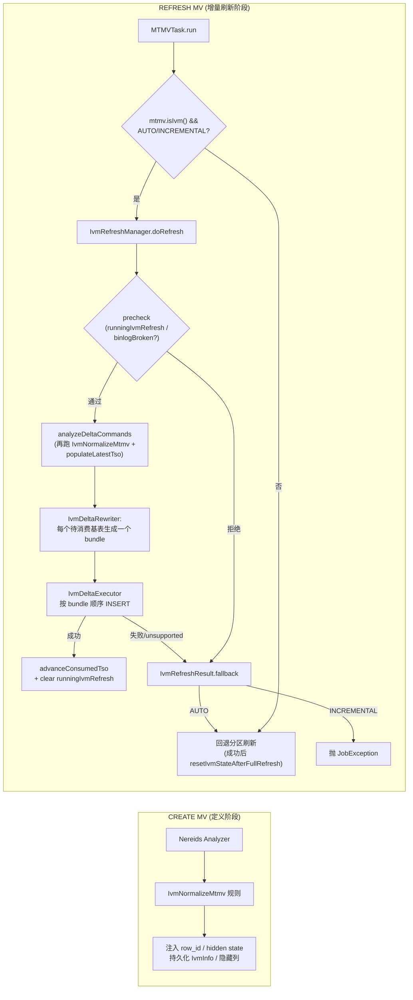
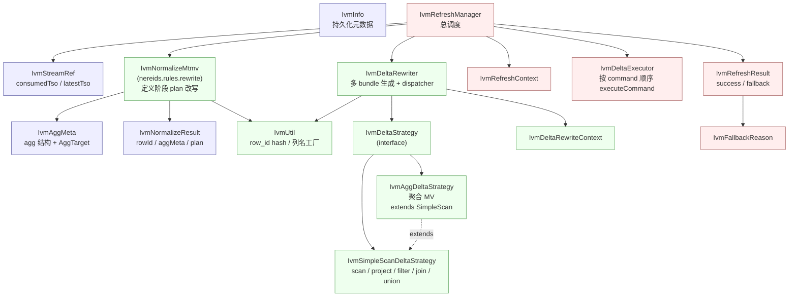
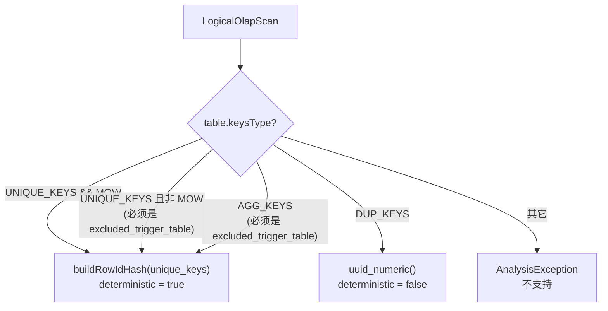
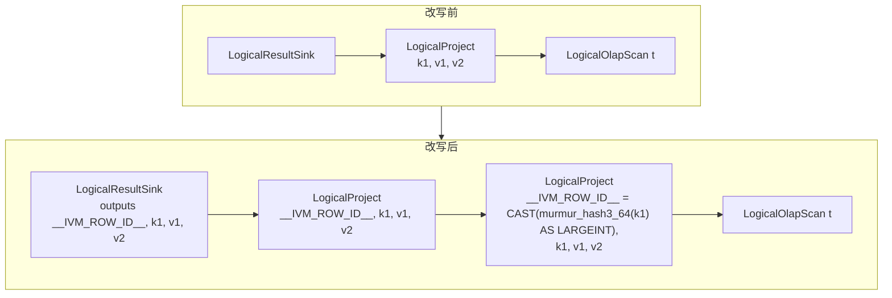
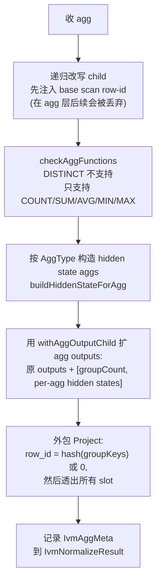
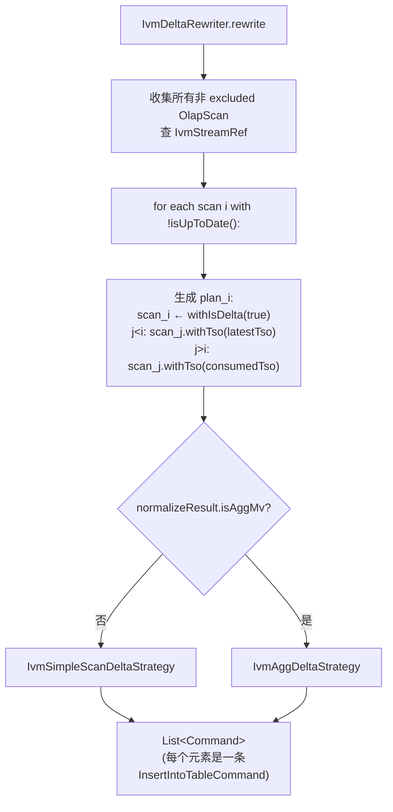
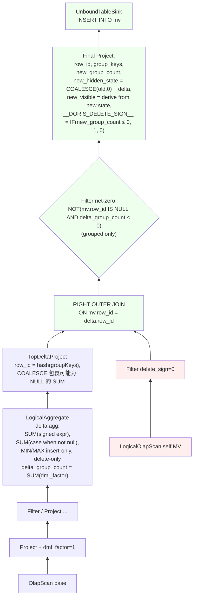
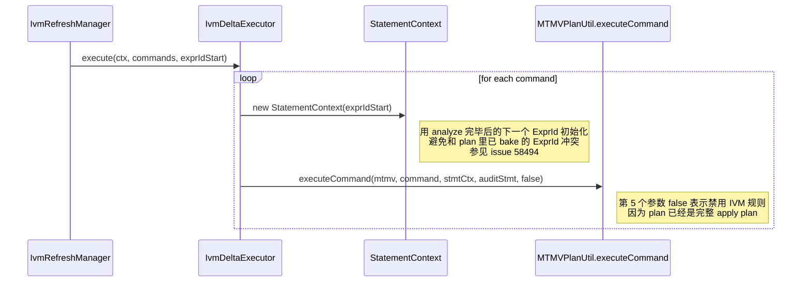
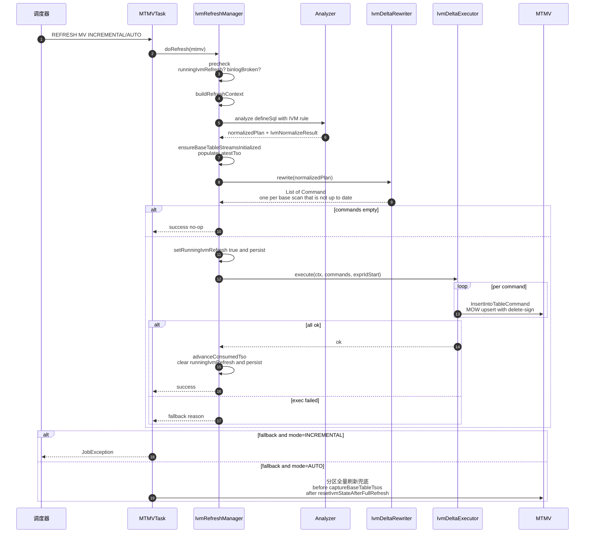

# Doris IVM（Incremental View Maintenance）设计文档

> 范围：`fe/fe-core/src/main/java/org/apache/doris/mtmv/ivm/` 整个包 + `IvmNormalizeMtmv` 规则 + `MTMVTask` 中的 IVM 调度入口。  
> 版本：以当前分支代码为准（`IvmInfo.enableIvm=true` 的 MTMV 为 IVM 视图）。  
> 说明：binlog/stream 真实增量尚未落地，当前增量路径**以"全量扫描基表"作为 mock 的 delta**（见 `fe/fe-core/src/main/java/org/apache/doris/mtmv/ivm/AGENTS.md`）。但 delete 操作可以通过基表上的 `binlog_op` 列模拟（`0=insert, 1=delete`），从而驱动 `dml_factor`。下文描述的是代码真实结构与语义，不包含未实现内容。

---

## 1. 什么是 IVM

传统 MTMV（物化视图）的刷新方式是"COMPLETE / PARTITIONS"——要么全量重算，要么按分区重算。IVM（增量视图维护）希望做到：

- 只读取基表自上次刷新以来的增量（insert / delete / update 拆分为 delete+insert）
- 通过**代数式状态合并**（hidden state columns）在 MV 上做一次 MOW upsert，得到新的正确结果
- 失败时可以**回退到 COMPLETE**，保证正确性优先

IVM 的核心难点：

1. 如何稳定地把"一行基表行"关联到"一行 MV 行"——即 **row-id**
2. 对聚合 MV，如何把 `COUNT/SUM/AVG/MIN/MAX` 转成"可增量合并"的状态——即 **hidden state columns**
3. 如何把 `+insert / -delete` 两类变化统一表达——即 **dml_factor** 信号
4. 如何在 Nereids 里把"MV 定义 SQL"改写为"delta 计算 SQL + 回写 INSERT"——即 **IvmNormalizeMtmv + IvmDeltaRewriter**

---

## 2. 架构概览



**两次跑 `IvmNormalizeMtmv` 是设计要点**：

- **CREATE 阶段**：规则跑在建 MV 的定义 SQL 上，用来决定 MV schema（加隐藏列：`__DORIS_IVM_ROW_ID_COL__`、`__DORIS_IVM_AGG_COUNT_COL__`、`__DORIS_IVM_AGG_{n}_{STATE}_COL__`）。
- **REFRESH 阶段**：规则再跑一次，把 `IvmAggMeta`/`IvmNormalizeResult` 传给 `IvmDeltaRewriter`，由后者产出真正的 delta SQL。

**多 bundle 模型**：当 MV 引用多张基表（JOIN / UNION ALL）时，`IvmDeltaRewriter` 为每张"自上次刷新以来有未消费数据"的基表各生成一条 `Command`：被选中的 scan 标记为 delta（`scan.withIsDelta(true)`），其它 scan 按位置绑定 `latestTso`（已在前序 bundle 处理过）或 `consumedTso`（待后续 bundle 处理）作为 snapshot 视图。`IvmDeltaExecutor` 按顺序逐条执行；任何一条失败都整体回退。

---

## 3. 模块划分（ivm 包）



| 类 | 职责 |
|----|------|
| `IvmInfo` | 持久化在 MTMV 上的 IVM 元数据：`enableIvm`、`binlogBroken`、`runningIvmRefresh`（在途增量刷新标志，FE 崩溃后用于强制 COMPLETE）、`baseTableStreams`（基表→stream 引用） |
| `IvmStreamRef` | 单张基表的 IVM stream 绑定：`consumedTso`（持久化）+ `latestTso`（transient，每次刷新前从 OlapTable 读取）；`isUpToDate()` 判断是否有 delta |
| `IvmNormalizeMtmv` | **Nereids custom analyze 规则**，在 MV 定义 plan 上注入 row-id、agg 隐藏状态列；把结构写入 `IvmNormalizeResult` / `IvmAggMeta`；支持 OlapScan / Project / Filter / INNER & CROSS Join / UNION ALL / Aggregate 白名单 |
| `IvmNormalizeResult` | 规则结果载体：规则化后的 plan、每个 row-id slot 是否确定性、（如有）聚合元信息 |
| `IvmAggMeta` / `AggTarget` | 描述 MV 的聚合形态：是否 scalar、group key、`IVM_AGG_COUNT_COL`、每个可见聚合的 `AggType`（`COUNT_STAR/COUNT_EXPR/SUM/AVG/MIN/MAX`）及 hidden state slots |
| `IvmUtil` | `buildRowIdHash`：null-safe 的 `CAST(murmur_hash3_64(ifnull(cast(k AS VARCHAR),''), cast(isnull(k) AS VARCHAR), ...) AS LARGEINT)`；scalar agg 用 `0::largeint`；隐藏列命名 / `ColumnDefinition` 工厂；`findRowIdSlot` 等 |
| `IvmDeltaStrategy` | 策略接口：`List<Command> rewrite(Plan normalizedPlan)` |
| `IvmDeltaRewriter` | 入口：先收集所有非 excluded 的 OlapScan，再为每个 `!isUpToDate()` 的 scan 生成一个 delta plan（自身 `withIsDelta(true)`，前序 scan 绑定 `latestTso`、后序 scan 绑定 `consumedTso`），最后按 `normalizeResult.isAggMv()` 分发到 `IvmAggDeltaStrategy` 或 `IvmSimpleScanDeltaStrategy` |
| `IvmSimpleScanDeltaStrategy` | 简单 / JOIN / UNION ALL MV：注入 `dml_factor`，把 `dml_factor<0` 映射为 `__DORIS_DELETE_SIGN__=1`；UNION 中只保留 delta arm；JOIN 中要求至多一侧有 dml_factor |
| `IvmAggDeltaStrategy` | 聚合 MV：构造 signed delta aggregate，`RIGHT OUTER JOIN` 到 MV 当前状态上做状态合并，产出 sink |
| `IvmDeltaRewriteContext` | MV + ConnectContext + normalizeResult + baseTableStreams |
| `IvmRefreshManager` | 入口：`precheck → buildRefreshContext → analyzeDeltaCommands → execute → advanceConsumedTso & clear running 标志`；任何异常都转 `fallback`；提供静态 `captureBaseTableTsos` / `resetIvmStateAfterFullRefresh` 供 COMPLETE 兜底使用 |
| `IvmRefreshContext` | 刷新上下文（MTMV、ConnectContext、MTMVRefreshContext） |
| `IvmDeltaExecutor` | 为每个 command 新建 `StatementContext`（ExprId 从 `exprIdStart` 起步避免冲突），调 `MTMVPlanUtil.executeCommand` 执行（最后一个参数 `false`：禁用 IVM 规则，因为 plan 已是完整 apply plan） |
| `IvmRefreshResult` / `IvmFallbackReason` | 结果/回退原因，详见 §7 |

---

## 4. 关键概念

### 4.1 隐藏列（Hidden Columns）

IVM 在 MV schema 上额外加入一批以 `__DORIS_IVM_` 开头的列（`IvmUtil.isIvmHiddenColumn` 判断，前缀常量 `Column.IVM_HIDDEN_COLUMN_PREFIX`）：

| 列 | 含义 | 出现场景 |
|----|------|---------|
| `__DORIS_IVM_ROW_ID_COL__` | MV 的**行身份**，也是 UNIQUE_KEY（从而支持 MOW upsert） | 所有 IVM MV |
| `__DORIS_IVM_AGG_COUNT_COL__` | 当前 group 的**总行数**（删除时用来判定是否 group 消失） | 聚合 MV |
| `__DORIS_IVM_AGG_{n}_{STATE}_COL__` | 第 n 个 agg 的 hidden state：`COUNT/SUM/MIN/MAX` 等 | 聚合 MV |
| `__DORIS_IVM_DML_FACTOR_COL__` | delta 计算中间列：`+1`=插入，`-1`=删除 | 仅在 delta 子计划里出现，**不落盘** |
| `__DORIS_IVM_DELTA_GROUP_COUNT_COL__` | delta 中每个 group 的行数变化量 | 仅在 delta 子计划里出现 |

### 4.2 row-id：MV 的行身份

`IvmNormalizeMtmv` 在每个白名单节点上都会维护一个名为 `__DORIS_IVM_ROW_ID_COL__` 的 slot，统一通过 `IvmUtil.buildRowIdHash(keys)` 生成 null-safe 的 hash：

```
row_id = CAST(
  murmur_hash3_64(
    ifnull(cast(k1 AS VARCHAR), ''),  -- VARCHAR 列省略 cast
    cast(isnull(k1) AS VARCHAR),
    ifnull(cast(k2 AS VARCHAR), ''),
    cast(isnull(k2) AS VARCHAR),
    ...
  ) AS LARGEINT
)
```

每个 key 提供两个 hash 参数：`ifnull(...,'')` 避免 NULL 在 hash 内传染；`isnull(key)` 区分仅 NULL 位置不同的 group（如 `(NULL,'x')` vs `('x',NULL)`）。

`IvmNormalizeMtmv.buildRowId` 决定 base scan 的 row-id：



- **MOW UNIQUE_KEYS 基表**：unique key 稳定，hash 给出确定性 row-id；同 pk 的两次 insert 在 MV 上命中同一 row-id，MOW upsert 自动覆盖。
- **DUP_KEYS 基表**：每条插入视为新行，用 `uuid_numeric()` 生成随机 row-id。注意 **DUP_KEYS 基表的 COMPLETE 回退能力受限**——重建时 uuid 与旧值不一致，会造成重复行；并且当聚合 MV 之上发生 retraction 时，会触发 `NON_DETERMINISTIC_ROW_ID` 回退。
- **excluded_trigger_table**：明确声明不参与增量的基表（也就不会被读取增量），允许 UNIQUE_KEYS-非MOW / AGG_KEYS。

**JOIN（INNER / CROSS）**：`visitLogicalJoin` 把左右子树的 row-id 组合成 `hash(left_row_id, right_row_id)`，仅当两侧都确定性时新 row-id 才确定性；同时把子 row-id 从 join 输出里剥离，避免上层重复出现。

**UNION ALL**：`visitLogicalUnion` 为每个 arm 包一层 `hash(arm_index_literal, child_row_id)` —— `arm_index` 防止 self-union 的跨臂 row-id 冲突；UNION 输出再加一个 union 级 row-id slot。

**聚合 MV**：`visitLogicalAggregate` 会**丢弃** child 的 row-id，并以 group key 重新生成：

```
聚合 MV 的 row-id = buildRowIdHash(group_keys)   // grouped
                  = LargeIntLiteral(0)            // scalar，整张 MV 仅一行
```

### 4.3 dml_factor：+1 / −1 信号

在 delta 子计划里，`IvmSimpleScanDeltaStrategy.buildDmlFactorExpr` 决定每行的符号：

- **基表含 `binlog_op` 列**（`Column.BINLOG_OPERATION_COL`，TINYINT，遵循 delete-sign 约定 `0=insert, 1=delete`）：
  ```
  __DORIS_IVM_DML_FACTOR_COL__ = IF(binlog_op = 0, 1, -1)
  ```
- **不含 `binlog_op` 列**（普通表）：fallback 为常量 `1`（mock 全量扫描时假定全是 insert）。

仅当被 `IvmDeltaRewriter` 标记为 delta 的那个 scan（`isDelta() == true`）才会注入 `dml_factor`；同 plan 内其它 snapshot 视图的 scan 不带 `dml_factor`，也就不会贡献 `−1`。

Project / Filter 的 visitor 都会透传该 slot；JOIN 要求两侧 dml_factor 至多一侧非空（snapshot 侧通过 `withTso` 绑定为只读视图）；UNION ALL 中只有 delta arm 保留，其它 arm 被裁剪掉。最终：

- 简单 / JOIN / UNION ALL 形态 MV：`__DORIS_DELETE_SIGN__ = IF(dml_factor < 0, 1, 0)`
- 聚合 MV：`dml_factor` 会被吸收成 signed aggregation（见 §6）

> 当 MV 的 row-id 不确定（如 join/union 中包含 DUP_KEYS 表）且 delta 中出现了 `dml_factor < 0` 时，`IvmSimpleScanDeltaStrategy` 通过 `assert_true` 守卫直接抛出"delete on non-deterministic row_id"，由 `IvmRefreshManager` 转为 `NON_DETERMINISTIC_ROW_ID` 回退。

### 4.4 row-id 究竟解决了什么问题——一个具体例子

**场景**：基表 `orders` 是 MOW UNIQUE_KEY 表，主键 `id`。MV 是简单 SELECT。

```sql
CREATE TABLE orders (
  id INT, user_id INT, amount INT
) UNIQUE KEY(id) DISTRIBUTED BY HASH(id) BUCKETS 1
PROPERTIES("enable_unique_key_merge_on_write" = "true");

CREATE MATERIALIZED VIEW mv
BUILD IMMEDIATE REFRESH AUTO ON COMMIT
DISTRIBUTED BY HASH(`__DORIS_IVM_ROW_ID_COL__`) BUCKETS 1
PROPERTIES("enable_ivm" = "true")
AS SELECT id, user_id, amount FROM orders WHERE amount > 0;
```

**MV 的实际 schema** 多了一列：

```
mv(__DORIS_IVM_ROW_ID_COL__ LARGEINT [UNIQUE KEY, MOW],
   id, user_id, amount,
   __DORIS_DELETE_SIGN__)
```

`__DORIS_IVM_ROW_ID_COL__` 由 `murmur_hash3_64(ifnull(cast(id AS VARCHAR),''), cast(isnull(id) AS VARCHAR))` 算出来。**它就是 MV 自己的主键**，作用是把 base 表的"逻辑同一行"在 MV 上稳定地映射到同一物理行。

**Step 1: 初始 INSERT**
```sql
INSERT INTO orders VALUES (1, 100, 50), (2, 100, 80);
-- 增量刷新后 mv 的物理数据：
-- row_id=H(1), id=1, user_id=100, amount=50, delete_sign=0
-- row_id=H(2), id=2, user_id=100, amount=80, delete_sign=0
```
其中 `H(k) = murmur_hash3_64(...)`。

**Step 2: 对 id=1 做 UPDATE（在 MOW UNIQUE_KEY 表上等价于覆写）**
```sql
INSERT INTO orders VALUES (1, 100, 200);
```
基表的 binlog 会产生两条记录（MOW delete-then-insert）：
```
binlog_op=1, id=1, user_id=100, amount=50    -- 旧值 delete
binlog_op=0, id=1, user_id=100, amount=200   -- 新值 insert
```
增量刷新读 binlog，`dml_factor = IF(binlog_op=0, 1, -1)`：

```
delta 子计划输出：
  row_id=H(1), id=1, amount=50,  dml_factor=-1   --> delete_sign=1
  row_id=H(1), id=1, amount=200, dml_factor=+1   --> delete_sign=0
```

两条 delta 都写到 MV，因为 `__DORIS_IVM_ROW_ID_COL__` 是 MV 的 UNIQUE_KEY 且 MOW 开启，**后写赢**：MV 上 `H(1)` 这一行被最后那条 `delete_sign=0` 覆盖成新值 (1, 100, 200)。**没有 row-id 就做不到这件事**——你无法用业务列做 MV pk（业务列可能改），也不能让 MV "认得" 之前那条对应行。

**Step 3: DELETE id=2**
```sql
DELETE FROM orders WHERE id=2;
-- binlog: binlog_op=1, id=2, user_id=100, amount=80
-- delta:  row_id=H(2), id=2, amount=80, dml_factor=-1 --> delete_sign=1
```
MOW 看到 `H(2)` 上 delete_sign=1，物理删掉 MV 这一行。

**最终 MV 数据**（与全量 `SELECT id,user_id,amount FROM orders WHERE amount>0` 一致）：
```
row_id=H(1), id=1, user_id=100, amount=200
```

**对聚合 MV** 含义略有不同：聚合 MV 的 row-id = `hash(group_keys)` 或 `0`（scalar agg），它把 MV 的物理行和"某个 group"绑定，使得 delta 的 `+sum / -sum / +count / -count` 能**精确累加**到对应那一行 hidden state 上。当 `group_count` 减到 0 时整组 delete。

**为什么必须是 hash？**因为 MV 主键只有一列 LARGEINT；如果 group key 是多列就需要折叠成单列。hash 冲突在 LARGEINT 域内可忽略，且 null-safe 形式还能区分 `(NULL,'x')` 和 `('x',NULL)`。

---

## 5. IvmNormalizeMtmv：plan 改写核心

### 5.1 在 Nereids 里的位置

`Analyzer.java:224`:

```java
custom(RuleType.IVM_NORMALIZE_MTMV, IvmNormalizeMtmv::new),
```

位于 analyze 阶段末尾（在 `NormalizeAggregate` 之后、`AdjustNullable` 之前）。由 session variable `enable_ivm_normal_rewrite` 控制开关。规则是幂等的：`CascadesContext` 已持有 `IvmNormalizeResult` 时直接返回。

### 5.2 白名单访问 + 自顶向下 + 注入

`IvmNormalizeMtmv extends DefaultPlanRewriter<Boolean>`，`Boolean` 参数含义是 `isFirstNonSink`（是否处于紧贴 sink 下方的位置——用来判定 `LogicalAggregate` 是否合法）。未在白名单中的 plan 节点直接抛 `AnalysisException`。当前白名单：

```
LogicalResultSink / LogicalOlapTableSink
LogicalProject
LogicalFilter
LogicalJoin              (仅 INNER_JOIN / CROSS_JOIN, 非 markJoin)
LogicalUnion             (仅 UNION ALL, 不含纯常量 arm)
LogicalAggregate         (仅限 first non-sink)
LogicalOlapScan
```

### 5.3 简单 MV 的改写



关键行为：

- 在每个 `LogicalOlapScan` 之上，用一个额外 `LogicalProject` 把 row-id alias 置于 output index 0
- 父节点 Project / Filter / Sink 负责**propagate**：`rewriteOutputsWithIvmHiddenColumns` 会保持原输出顺序，在前面插入 row-id slot，在末尾追加其它隐藏 slot；如果输出里已有同名隐藏列占位符（由 `BindSink` 引入），就**按 ExprId 在原位替换**以保证 schema 顺序稳定。

### 5.4 聚合 MV 的改写

输入假设：`NormalizeAggregate` 已经把 Aggregate 规范成
```
Project(top) → Aggregate(groupBy=[slots], outputs=[groupKeys..., Alias(AggFn(slot))...]) → Project(bottom) → ...
```

`visitLogicalAggregate` 分 5 步：



**每种 AggType 产生的 hidden state**：

| AggType | 原可见列 | 附带 hidden state 列 | 说明 |
|---------|----------|----------------------|------|
| `COUNT(*)` | `COUNT(*)` | 无（与 `__IVM_AGG_COUNT_COL__` 共用） | group 总行数就是 COUNT(*) |
| `COUNT(expr)` | `COUNT(expr)` | `COUNT` | 排除 NULL 的计数 |
| `SUM(expr)` | `SUM(expr)` | `SUM` + `COUNT` | 合并：`new_sum = old_sum + delta_sum` |
| `AVG(expr)` | `AVG(expr)` | `SUM` + `COUNT` | 可见值 = `IF(count>0, sum/count, NULL)` |
| `MIN(expr)` | `MIN(expr)` | `MIN` + `COUNT`（+ 运行时临时 `DELMIN`） | 删除可能击中当前 min → assert_true 守卫失败回退 |
| `MAX(expr)` | `MAX(expr)` | `MAX` + `COUNT`（+ 运行时临时 `DELMAX`） | 同 MIN |

所有新增 agg 输出都通过 `newAgg.getOutput()` 按**名字**重新解析，避免 ExprId 漂移（`resolveAggTargetSlots`）。

---

## 6. IvmDeltaRewriter：把规则化 plan 改写成回写 INSERT



### 6.0 多 bundle 生成（`generateDeltaPlans`）

- **Phase 1**：`rewriteDownShortCircuit` 收集 plan 中所有非 excluded 的 `LogicalOlapScan`，并按 `scan.getTable().getId()` 查 `baseTableStreams` 得到对应 `IvmStreamRef`。
- **Phase 2**：跳过 `isUpToDate()` 的 scan；对每个仍有 delta 的 scan i 生成一个修改后的 plan（同一遍 `rewriteDownShortCircuit`，按访问顺序计数）：
  - i 自身 → `scan.withIsDelta(true)`（mock 实现：占位标志；真实方案下会替换成 binlog 范围 scan）
  - j < i → `scan.withTso(latestTso)`（已包含 i 的更早 delta，看到的是新视图 v2）
  - j > i → `scan.withTso(consumedTso)`（i 的 delta 还未被它们感知，看到的是旧视图 v1）
- 不变量：每条 plan 必须恰好包含 1 个 `isDelta=true` 的 scan，否则 `Preconditions.checkState` 失败。

### 6.1 简单 / JOIN / UNION ALL 策略（`IvmSimpleScanDeltaStrategy`）

`PlanVisitor<RewriteResult, Void>`，`RewriteResult = (plan, dmlFactorSlot)`。

```
visit OlapScan  → 若 isDelta()，包 Project 注入 dml_factor (binlog_op 推导)；否则直接返回 (snapshot 侧)
visit Project   → 保留原投影并透传 dml_factor
visit Filter    → 递归并透传
visit Join      → 仅 INNER/CROSS；要求两侧 dml_factor 不同时存在；若 MV row-id 非确定且存在 delete 行，包 assert_true 守卫
visit Union     → 仅 UNION ALL；裁掉非 delta arm，重映射 ExprId 到 union 输出
其它节点        → 抛错
```

最后 `buildSinkProject` 把 plan 输出改写为：

```
[ inserted_col_1, ..., inserted_col_N,
  __DORIS_DELETE_SIGN__ = IF(dml_factor < 0, 1, 0) ]
```

再用 `UnboundTableSink(..., TPartialUpdateNewRowPolicy.APPEND, DMLCommandType.INSERT)` 包成 `InsertIntoTableCommand`，写回 MV 自己。

### 6.2 聚合 MV 策略（`IvmAggDeltaStrategy`）

聚合策略继承自 Simple，复用 Scan/Filter/Project 的 dml_factor 注入，但**override** 了 `visitLogicalAggregate` 和 `visitLogicalProject`（如果 project 的 child 是 aggregate，则直接把 aggregate 的结果往上抛，因为 agg 策略已经返回完整的 apply plan）。

整体计划形态：



**关键细节**：

1. **signed delta aggregation**（`signedExpr`）：`SUM(IF(dml_factor>0, expr, -expr))`——避免 TinyInt × Decimal 的精度丢失，用分支代替乘法。
2. **NULL 敏感计数**（`caseWhenExprNotNull`）：`SUM(IF(expr IS NULL, 0, dml_factor))`——符合 SQL 的 COUNT(expr) 忽略 NULL 的语义。
3. **MIN/MAX 的 assert-true 守卫**：当 delta 里存在 `delete-only min ≤ old_min`（对 MAX 对称），说明被删除的行可能**就是**当前极值，无法只用增量恢复极值——`AssertTrue` 在 BE 执行期抛错，`IvmRefreshManager` 捕获后回退到 COMPLETE 刷新（`IvmFallbackReason.INCREMENTAL_EXECUTION_FAILED`）。
4. **net-zero filter**：只对 grouped agg 生效。防止：在基表上出现了一个 MV 中从未存在的 group 的"净删除"行，如果没有 filter，会往 MV 插一条 `delete_sign=1` 的孤立行。
5. **assertNonNegative**：所有计数列重算时都会套一层 `AssertTrue(expr >= 0)`，兜底数据异常。
6. **JOIN 方向**：`RIGHT_OUTER_JOIN`，delta 作为 build 侧（小表），MV 作为 probe 侧（大表），这样没出现在 delta 的 MV 行不会被读进 pipeline，性能更优。

### 6.3 执行与回写（`IvmDeltaExecutor`）



---

## 7. 刷新端到端时序



**回退原因一览**（`IvmFallbackReason`）：

- `BINLOG_BROKEN`：`IvmInfo.binlogBroken=true`（precheck）
- `PREVIOUS_RUN_INCOMPLETE`：上一轮增量未完成（`runningIvmRefresh=true`），强制 COMPLETE 回收
- `STREAM_UNSUPPORTED`：基表 stream 类型不支持（目前 `checkStreamSupport` 被注释，未生效）
- `SNAPSHOT_ALIGNMENT_UNSUPPORTED`：`buildRefreshContext` 失败
- `PLAN_PATTERN_UNSUPPORTED`：规则没匹配到 / 规则抛 `AnalysisException`（例如 OUTER JOIN、DISTINCT、UNION DISTINCT、其它非白名单算子）
- `OUTER_JOIN_RETRACTION_UNSUPPORTED`：（保留）OUTER JOIN 在出现 retraction 时无法用代数式增量
- `AGG_UNSUPPORTED`：（保留）聚合形态本身不支持
- `NON_DETERMINISTIC_ROW_ID`：MV row-id 不确定（如含 DUP_KEYS 的 join/union）但 delta 中出现了 `dml_factor < 0`，BE 端 `assert_true` 抛错
- `MIN_MAX_BOUNDARY_HIT`：MIN/MAX 守卫触发——被删除行可能就是当前极值
- `INCREMENTAL_EXECUTION_FAILED`：BE 执行期失败的兜底分类（其它任何运行时错误）

---

## 8. 详细示例

### 示例 A：简单 MV，基表 **MOW**（`test_ivm_basic_mtmv`）

```sql
-- 基表：UNIQUE KEY(k1) + MOW
CREATE TABLE t_ivm_basic_base (k1 INT, v1 INT, v2 VARCHAR(50))
UNIQUE KEY(k1) DISTRIBUTED BY HASH(k1) BUCKETS 2
PROPERTIES("enable_unique_key_merge_on_write"="true", "replication_num"="1");

-- IVM MV
CREATE MATERIALIZED VIEW mv_ivm_basic
BUILD DEFERRED REFRESH INCREMENTAL ON MANUAL
DISTRIBUTED BY RANDOM BUCKETS 2 PROPERTIES('replication_num'='1')
AS SELECT * FROM t_ivm_basic_base;
```

#### A.1 CREATE MV 时 `IvmNormalizeMtmv` 的输出

原 plan：
```
ResultSink(k1, v1, v2)
  └─ Project(k1, v1, v2)
        └─ OlapScan(t_ivm_basic_base)
```

规则化后：
```
ResultSink(__IVM_ROW_ID__, k1, v1, v2)
  └─ Project(__IVM_ROW_ID__, k1, v1, v2)
        └─ Project(
              __IVM_ROW_ID__ = CAST(murmur_hash3_64(CAST(k1 AS VARCHAR)) AS LARGEINT),
              k1, v1, v2)
              └─ OlapScan(t_ivm_basic_base)
```

`IvmNormalizeResult`：
- `rowIdDeterminism = { Slot(__IVM_ROW_ID__) → true }`（MOW 稳定）
- `aggMeta = null`

**生成的 MV schema**：`(__IVM_ROW_ID__ LARGEINT [UNIQUE KEY, MOW], k1, v1, v2)`。

#### A.2 首次 COMPLETE 刷新

`REFRESH ... COMPLETE` 不走 IVM 路径（`MTMVTask.run` 里已过滤），直接分区刷新。

插入后 MV 内容：

| `__IVM_ROW_ID__` | k1 | v1 | v2  |
|---|---|---|---|
| hash(1) | 1 | 10 | aaa |
| hash(2) | 2 | 20 | bbb |
| hash(3) | 3 | 30 | ccc |

#### A.3 INCREMENTAL 刷新（基表新增 (4,40,'ddd'),(5,50,'eee')）

（当前 mock：delta = 整个基表全扫）

`IvmSimpleScanDeltaStrategy` 构造的 plan（简化）：

```
InsertIntoTableCommand(sink = mv_ivm_basic, columns=[__IVM_ROW_ID__, k1, v1, v2, __DORIS_DELETE_SIGN__])
  └─ Project(
        __IVM_ROW_ID__, k1, v1, v2,
        __DORIS_DELETE_SIGN__ = IF(dml_factor < 0, 1, 0)  -- 都是 0，因为 mock 全是 +1
     )
        └─ Project(__IVM_ROW_ID__, k1, v1, v2, dml_factor = 1)
              └─ OlapScan(t_ivm_basic_base)
```

执行后，MV 收到 5 行 upsert。因为 row-id = `hash(k1)` 是**确定性**的，旧行（k1=1,2,3）自动被同 row-id 覆盖、新行（k1=4,5）被插入。最终 MV 有 5 行 —— **和 COMPLETE 刷新完全一致**。

#### A.4 对比：如果基表是 **DUP_KEYS**（`test_ivm_dup_keys_mtmv`）

row-id = `uuid_numeric()`，每次刷新生成新 id。第二次 INCREMENTAL 会读全基表 3+2=5 行（mock），但产生 5 个新 row-id，MOW 无法去重——**会导致重复**。所以：

- DUP_KEYS 下 IVM 主要适用于 append-only 语义
- 真实 binlog 方案下，DUP_KEYS 的 delta 只包含新增行，不会重复

---

### 示例 B：聚合 MV，基表 **MOW**（`test_ivm_agg_mtmv`）

```sql
CREATE TABLE test_ivm_agg_mtmv_base (k1 INT, v1 INT)
UNIQUE KEY(k1) ... MOW;

CREATE MATERIALIZED VIEW test_ivm_agg_mtmv_mv
BUILD DEFERRED REFRESH INCREMENTAL ON MANUAL
DISTRIBUTED BY RANDOM BUCKETS 2 PROPERTIES('replication_num'='1')
AS SELECT k1, COUNT(*) AS cnt, SUM(v1) AS sum_v1
   FROM test_ivm_agg_mtmv_base GROUP BY k1;
```

#### B.1 规则化后的 plan

```
ResultSink(__IVM_ROW_ID__, k1, cnt, sum_v1, __IVM_AGG_COUNT_COL__,
           __IVM_AGG_1_SUM_COL__, __IVM_AGG_1_COUNT_COL__)
  └─ Project(
        __IVM_ROW_ID__ = CAST(murmur_hash3_64(CAST(k1 AS VARCHAR)) AS LARGEINT),
        k1, cnt, sum_v1,
        __IVM_AGG_COUNT_COL__,
        __IVM_AGG_1_SUM_COL__,
        __IVM_AGG_1_COUNT_COL__)
        └─ Aggregate(group=[k1],
              outputs=[
                k1,
                cnt     = COUNT(*),           -- visible ordinal 0 (COUNT_STAR)
                sum_v1  = SUM(v1),            -- visible ordinal 1 (SUM)
                __IVM_AGG_COUNT_COL__       = COUNT(*),   -- 共享 group 行数
                __IVM_AGG_1_SUM_COL__       = SUM(v1),
                __IVM_AGG_1_COUNT_COL__     = COUNT(v1)
              ])
              └─ Project(...)  ← bottom project after NormalizeAggregate
                    └─ Project(__IVM_ROW_ID_BASE__, k1, v1)   ← base scan row-id 在此层注入，但 agg 层不用
                          └─ OlapScan(test_ivm_agg_mtmv_base)
```

`IvmAggMeta`：
- `scalarAgg = false`
- `groupKeySlots = [k1]`
- `groupCountSlot = __IVM_AGG_COUNT_COL__`
- `aggTargets = [`
  - `AggTarget(ord=0, COUNT_STAR, visible=cnt, hidden={COUNT: __IVM_AGG_COUNT_COL__})`（*复用 groupCount*）
  - `AggTarget(ord=1, SUM, visible=sum_v1, hidden={SUM: __IVM_AGG_1_SUM_COL__, COUNT: __IVM_AGG_1_COUNT_COL__}, exprSlots=[v1])`
  - `]`

MV schema（UNIQUE KEY = `__IVM_ROW_ID__`，MOW）：

| 列 | 含义 |
|----|------|
| `__IVM_ROW_ID__` (LARGEINT) | `hash(k1)` |
| `k1` | group key |
| `cnt` | 可见 COUNT(*) |
| `sum_v1` | 可见 SUM(v1) |
| `__IVM_AGG_COUNT_COL__` | group 总行数（= cnt） |
| `__IVM_AGG_1_SUM_COL__` | SUM 的 hidden sum |
| `__IVM_AGG_1_COUNT_COL__` | SUM 的 hidden non-null count |

#### B.2 首次 COMPLETE 刷新后 MV

基表：`(1,10),(2,20),(3,30)`。

| row_id | k1 | cnt | sum_v1 | agg_count | agg_1_sum | agg_1_count |
|---|---|---|---|---|---|---|
| h(1) | 1 | 1 | 10 | 1 | 10 | 1 |
| h(2) | 2 | 1 | 20 | 1 | 20 | 1 |
| h(3) | 3 | 1 | 30 | 1 | 30 | 1 |

#### B.3 INCREMENTAL 刷新

`IvmAggDeltaStrategy` 构造的 delta plan（简化，省略 dml_factor 透传）：

```
-- delta sub plan
DeltaAgg = Aggregate(group=[k1],
   outputs=[
      k1,
      delta_group_count      = SUM(dml_factor),
      delta_1_sum            = SUM(IF(dml_factor>0, v1, -v1)),      -- signedExpr
      delta_1_count          = SUM(IF(v1 IS NULL, 0, dml_factor))   -- NULL-aware
   ])
   └─ Project(v1, dml_factor=1, ...)
       └─ OlapScan(base)

TopDeltaProject = Project(
   __IVM_ROW_ID__ = CAST(murmur_hash3_64(CAST(k1 AS VARCHAR)) AS LARGEINT),
   k1,
   COALESCE(delta_group_count, 0),
   COALESCE(delta_1_sum, 0),
   delta_1_count
)
```

Apply plan：

```
Project(final sink outputs):
  __IVM_ROW_ID__    = delta.row_id
  k1                = delta.k1
  cnt               = CAST(new_group_count AS type(cnt))
  sum_v1            = IF(new_agg_1_count > 0, new_agg_1_sum, NULL)
  __IVM_AGG_COUNT_COL__   = new_group_count
  __IVM_AGG_1_SUM_COL__   = new_agg_1_sum
  __IVM_AGG_1_COUNT_COL__ = new_agg_1_count
  __DORIS_DELETE_SIGN__   = IF(new_group_count <= 0, 1, 0)

where:
  new_group_count = AssertTrue(COALESCE(mv.agg_count,0) + delta_group_count >= 0)
                    && COALESCE(mv.agg_count,0) + delta_group_count
  new_agg_1_sum   = COALESCE(mv.agg_1_sum,0) + delta_1_sum
  new_agg_1_count = AssertTrue(...)&& COALESCE(mv.agg_1_count,0) + delta_1_count

  └─ Filter(NOT(mv.row_id IS NULL AND delta_group_count <= 0))   -- net-zero
        └─ RIGHT OUTER JOIN ON mv.__IVM_ROW_ID__ = delta.__IVM_ROW_ID__
              ├─ Filter(delete_sign=0) ← OlapScan(mv)  -- probe (大)
              └─ TopDeltaProject                        -- build (小)

-- 整体被包成 InsertIntoTableCommand(mv, columns=[...,__DORIS_DELETE_SIGN__])
```

##### 假设基表变为 `(1,10),(2,20),(3,30),(4,40)`（加一行）

mock 下 delta = 全量基表。对 k1=1/2/3，delta 里 `delta_group_count=1, delta_1_sum=v1, delta_1_count=1`。JOIN 后每组：

- `new_group_count = 1 + 1 = 2`（**数值不对**！真正 binlog 方案下 delta 只含 k1=4 行）
- `new_sum = old + v1 = 2*v1`

这就是 `test_ivm_agg_mtmv.groovy` 中明确标注"目前只验证任务不报错，不校验数值正确性"的原因。binlog 就绪后 delta 变成真正的 diff：只含 k1=4 行，`delta_group_count=1, delta_1_sum=40, delta_1_count=1`，JOIN 到 MV 找不到 row_id = hash(4) → MV 侧 NULL → `new_group_count = COALESCE(NULL,0)+1 = 1`，结果正确。

##### 假设删除 k1=2（dml_factor=-1）

delta：`(k1=2, delta_group_count=-1, delta_1_sum=-20, delta_1_count=-1)`。

- `new_group_count = 1 + (-1) = 0`
- `__DORIS_DELETE_SIGN__ = IF(0 <= 0, 1, 0) = 1` → MOW 删除该 row

其他 group 不出现在 delta → JOIN 后 delta 侧 NULL → 被 net-zero filter 过滤掉（`mv.row_id IS NULL AND delta_group_count <= 0` 本身不会触发，但没有 delta 行的 group 根本不会进 RIGHT JOIN 的输出）。

##### MIN/MAX 守卫实际例子

若 MV 是 `MIN(v1)`，old_min=10（row k1=1），删除 k1=1 →
- `delta_del_min = MIN over delete-only = 10`
- 守卫：`AssertTrue(delta_del_min IS NULL OR old_min IS NULL OR delta_del_min > old_min)` → `10 > 10` false → BE 抛错 → `IvmRefreshManager` 捕获 → `INCREMENTAL_EXECUTION_FAILED` → `MTMVTask` 回退到 COMPLETE（若 AUTO）。

---

### 示例 B2：聚合 MV with MIN/MAX（MOW 基表）

```sql
CREATE TABLE t_minmax_base (k1 INT, v1 INT)
UNIQUE KEY(k1) ... MOW;

CREATE MATERIALIZED VIEW mv_minmax
BUILD DEFERRED REFRESH INCREMENTAL ON MANUAL
DISTRIBUTED BY RANDOM BUCKETS 2 PROPERTIES('replication_num'='1')
AS SELECT k1, MIN(v1) AS min_v1, MAX(v1) AS max_v1
   FROM t_minmax_base GROUP BY k1;
```

#### B2.1 规则化后 MV schema

`IvmAggMeta.aggTargets`：
- `AggTarget(ord=0, MIN, visible=min_v1, hidden={MIN: __IVM_AGG_0_MIN_COL__, COUNT: __IVM_AGG_0_COUNT_COL__}, exprSlots=[v1])`
- `AggTarget(ord=1, MAX, visible=max_v1, hidden={MAX: __IVM_AGG_1_MAX_COL__, COUNT: __IVM_AGG_1_COUNT_COL__}, exprSlots=[v1])`

MV schema：

| 列 | 含义 |
|----|------|
| `__IVM_ROW_ID__` LARGEINT | `hash(k1)` |
| `k1` | group key |
| `min_v1` / `max_v1` | 可见值 |
| `__IVM_AGG_COUNT_COL__` | group 行数 |
| `__IVM_AGG_0_MIN_COL__` / `__IVM_AGG_0_COUNT_COL__` | MIN 的 hidden state |
| `__IVM_AGG_1_MAX_COL__` / `__IVM_AGG_1_COUNT_COL__` | MAX 的 hidden state |

> 注意：MIN/MAX 的 hidden MIN/MAX 列**允许 NULL**，因为 "空集合" 和 "NULL 值集合" 都会自然产生 NULL——这对守卫和 `LEAST/GREATEST` 的 NULL-安全分支逻辑很关键（`needsCoalesceInTopProject` 显式返回 false）。

#### B2.2 delta 子计划

对 MIN/MAX，`IvmAggDeltaStrategy` 在 delta aggregate 里除了 hidden count 以外，还产出**两个**极值列：insert-only 极值（落地为 MV 的 hidden 状态）+ delete-only 极值（**transient**，只在 delta plan 里存在，列名形如 `__ivm_transient_0_DELMIN__`，**不写回 MV**，仅作为 assert_true 守卫的输入）。

```
DeltaAgg = Aggregate(group=[k1],
   outputs=[
      k1,
      delta_group_count       = SUM(dml_factor),

      -- MIN 目标 (ord=0)
      delta_0_min             = MIN(IF(dml_factor > 0, v1, NULL)),   -- insertOnlyExpr
      delta_transient_0_DELMIN = MIN(IF(dml_factor < 0, v1, NULL)),  -- deleteOnlyExpr
      delta_0_count           = SUM(IF(v1 IS NULL, 0, dml_factor)),  -- NULL-aware count

      -- MAX 目标 (ord=1)
      delta_1_max             = MAX(IF(dml_factor > 0, v1, NULL)),
      delta_transient_1_DELMAX = MAX(IF(dml_factor < 0, v1, NULL)),
      delta_1_count           = SUM(IF(v1 IS NULL, 0, dml_factor))
   ])
   └─ Project(v1, dml_factor, ...)
        └─ OlapScan(t_minmax_base)

TopDeltaProject = Project(
   __IVM_ROW_ID__   = CAST(murmur_hash3_64(CAST(k1 AS VARCHAR)) AS LARGEINT),
   k1,
   delta_group_count,       -- grouped 情况下不需要 COALESCE
   delta_0_min,             -- **不** COALESCE (NULL 有语义含义)
   delta_transient_0_DELMIN,-- **不** COALESCE
   delta_0_count,
   delta_1_max,
   delta_transient_1_DELMAX,
   delta_1_count
)
```

#### B2.3 apply plan（按列逐项展开）

```
Project(final sink outputs):
  __IVM_ROW_ID__     = delta.__IVM_ROW_ID__
  k1                 = delta.k1
  __IVM_AGG_COUNT_COL__
                     = AssertTrue(new_group_count >= 0) && new_group_count
                       where new_group_count = COALESCE(mv.agg_count, 0) + delta_group_count

  -- MIN 目标
  __IVM_AGG_0_COUNT_COL__
                     = AssertTrue(new_c0 >= 0) && new_c0
                       where new_c0 = COALESCE(mv.agg_0_count, 0) + delta_0_count
  __IVM_AGG_0_MIN_COL__  = new_min_0   (见下)
  min_v1             = IF(new_c0 > 0, CAST(new_min_0 AS type(min_v1)), NULL)

  -- MAX 目标
  __IVM_AGG_1_COUNT_COL__  (对称)
  __IVM_AGG_1_MAX_COL__    = new_max_1
  max_v1                   = IF(new_c1 > 0, CAST(new_max_1 AS type(max_v1)), NULL)

  __DORIS_DELETE_SIGN__
                     = IF(new_group_count <= 0, 1, 0)
```

**new_min_0 的计算（`buildTargetExpressions` 中 `MIN` 分支）**：

```
-- 1. assert_true 守卫 (放在 If 的 cond 位置，条件必须为 true 否则 BE 抛错)
del_min_guard_cond =
     delta_transient_0_DELMIN IS NULL                                   -- 本轮没有删除
  OR mv.__IVM_AGG_0_MIN_COL__ IS NULL                                   -- MV 侧该组原本无值
  OR delta_transient_0_DELMIN > mv.__IVM_AGG_0_MIN_COL__                -- 被删行都严格大于当前 min

del_min_guard = AssertTrue(del_min_guard_cond,
                           "IVM: deleted row may be current MIN value, fallback to COMPLETE")

-- 2. 新 min 的 NULL 安全分支计算
new_min_raw =
  IF(mv.agg_0_min IS NULL,        delta_0_min,
    IF(delta_0_min IS NULL,       mv.agg_0_min,
                                   LEAST(mv.agg_0_min, delta_0_min)))

-- 3. 把守卫嵌进 If 的 condition 位置，无论走哪支返回值都一样 (仅为触发 assert_true 的副作用)
new_min_0 = IF(del_min_guard, new_min_raw, new_min_raw)
```

**new_max_1 对称**：`new_max_raw = GREATEST(...)`；守卫条件改为 `delta_transient_1_DELMAX < mv.agg_1_max`。

整体 apply plan 形态（聚合通用）：

```
Project(final sink outputs)
  └─ Filter(net-zero)
       └─ RIGHT OUTER JOIN ON mv.row_id = delta.row_id
            ├─ Filter(delete_sign=0) ← OlapScan(mv_minmax)   -- probe
            └─ TopDeltaProject (delta)                       -- build
```

#### B2.4 守卫触发与回退的具体场景

> 基础数据：base = `(1,10),(1,30),(1,20),(2,5)`（MOW 会去重，只保留每个 k1 的最新行——但为了演示我们假设各 key 有多行，或把这个例子改成 DUP_KEYS。为简化用 DUP_KEYS 语义看）。
> 首轮 COMPLETE 后 MV：
> - k1=1: count=3, min=10, max=30
> - k1=2: count=1, min=5,  max=5

**场景 1：删除一行 `(1, 20)` ——不击中极值**

delta（k1=1）：
- `delta_group_count = -1`
- `delta_0_min       = NULL` (没有 insert)
- `delta_transient_0_DELMIN = 20`
- `delta_0_count     = -1`
- `delta_1_max / delta_transient_1_DELMAX` 对称：`NULL / 20`

守卫：`20 > mv.min(=10)` ✓；`20 < mv.max(=30)` ✓ → 通过。

结果：`new_count = 3-1 = 2, new_min_raw = LEAST(10, NULL) 分支 = 10, new_max_raw = GREATEST(30, NULL) 分支 = 30`。MV 更新为 `(k1=1, count=2, min=10, max=30)`——正确。

**场景 2：删除一行 `(1, 10)` ——击中当前 min**

delta（k1=1）：
- `delta_transient_0_DELMIN = 10`

守卫：`10 > mv.min(=10)` ✗ → `AssertTrue` 失败 → BE 抛错 → `IvmRefreshManager.doRefreshInternal` 捕获 `Exception` → 返回 `IvmRefreshResult.fallback(INCREMENTAL_EXECUTION_FAILED, ...)` → `MTMVTask`：
- 若 `RefreshMode.AUTO` → 继续走分区刷新兜底
- 若 `RefreshMode.INCREMENTAL` → 抛 `JobException`

**场景 3：删除 k1=2 整组唯一的一行 `(2, 5)`**

delta（k1=2）：
- `delta_group_count = -1`
- `delta_transient_0_DELMIN = 5`

守卫：`5 > mv.min(=5)` ✗ → 同样触发守卫失败。

> 这个场景在直觉上 "group 都删光了，min/max 本来就应该不存在"，但守卫无法区分 "组内全删" 和 "部分删并击中极值"——因为 delta 只有极值聚合，没有"是否清空"的信息。所以保守地走回退，换取正确性。

---

### 示例 C：聚合 MV，基表 **DUP_KEYS**

与示例 B 逻辑完全一致，区别仅在**基表 row-id 层**：

- base scan 的 row-id = `uuid_numeric()`（非确定性）
- 但 **agg MV 的 row-id = hash(group_keys)**，依然是**确定性**的

所以 **聚合 IVM 对 DUP_KEYS 基表天然友好**：只要 group key 稳定，增量计算依然正确。`test_ivm_dup_keys_mtmv` 正是利用这一点验证聚合场景。

---

## 9. 设计要点与权衡

1. **row-id 分离了"基表行身份"和"MV 行身份"**。对聚合 MV，MV 行身份由 group key 决定，与基表行身份解耦；对简单 MV，基表 row-id 直接升格为 MV row-id。
2. **所有状态合并都是代数式的**（`+`、`COALESCE`、`LEAST/GREATEST`），不需要读 binlog 以外的历史；MIN/MAX 因为非代数式（需要"整个集合"）所以用 assert_true 守卫 + 回退。
3. **两趟 `IvmNormalizeMtmv`**：CREATE 时确定 schema 并持久化，REFRESH 时重新跑以拿到当前 ExprId 上的 `IvmAggMeta`，然后交给 `IvmDeltaRewriter`。
4. **幂等/正确性优先**：所有失败路径都能回退；MOW upsert 本身对同 row-id 的重复 insert 幂等；`AssertTrue` 在可疑场景里主动失败而不是给错数据。
5. **ExprId 隔离**：`IvmDeltaExecutor` 为每个 bundle 新建 `StatementContext(exprIdStart)`，避免 plan 内 baked ExprId 和执行期新分配 ExprId 冲突（见 apache/doris#58494）。
6. **白名单 + 显式抛错**：`IvmNormalizeMtmv` 对不认识的节点直接 `AnalysisException`，上层捕获后以 `PLAN_PATTERN_UNSUPPORTED` 回退。不做"能不能扛就尝试"的模糊处理。
7. **binlog 尚未接入**：当前以全量扫描 mock delta。所有测试在 mock 语义下通过；真实增量下数值会自然正确。

## 10. 当前不支持 / TODO

- **OUTER JOIN / 半连接 / 反连接**：`visitLogicalJoin` 仅放行 INNER / CROSS（且非 mark join）
- **UNION DISTINCT** / 含纯常量 arm 的 UNION：`visitLogicalUnion` 拒绝
- **DISTINCT 聚合**：`checkAggFunctions` 拒绝
- **窗口 / Having / CTE**：均不在白名单
- `avg` 的 delta 可见值通过 `sum/count` 重新计算；注释里已提到更原生的 avg rewrite 是 TODO
- **Stream / binlog 真增量**：`replaceWithDelta` 目前只是 `scan.withIsDelta(true)` 占位；真实方案下要替换成读 binlog 范围 `[consumedTso, latestTso]` 的 scan
- **`checkStreamSupport`**：暂被注释，未对 stream 类型做实际校验

---

## 附：关键文件索引

| 功能 | 文件 |
|------|------|
| 调度入口 | `fe/fe-core/src/main/java/org/apache/doris/job/extensions/mtmv/MTMVTask.java`（搜 `mtmv.isIvm()`） |
| Session 开关 | `fe/fe-core/src/main/java/org/apache/doris/qe/SessionVariable.java` `ENABLE_IVM_NORMAL_REWRITE` |
| 规则注册 | `fe/fe-core/src/main/java/org/apache/doris/nereids/jobs/executor/Analyzer.java` `IVM_NORMALIZE_MTMV` |
| plan 改写 | `fe/fe-core/src/main/java/org/apache/doris/nereids/rules/rewrite/IvmNormalizeMtmv.java` |
| 增量核心包 | `fe/fe-core/src/main/java/org/apache/doris/mtmv/ivm/`（含 `AGENTS.md`） |
| 回归测试 | `regression-test/suites/mtmv_p0/ivm/test_ivm_*.groovy` |
| 规则单测 | `fe/fe-core/src/test/java/org/apache/doris/nereids/rules/rewrite/IvmNormalizeMtmv*Test.java` |
| ivm 包单测 | `fe/fe-core/src/test/java/org/apache/doris/mtmv/ivm/` |
