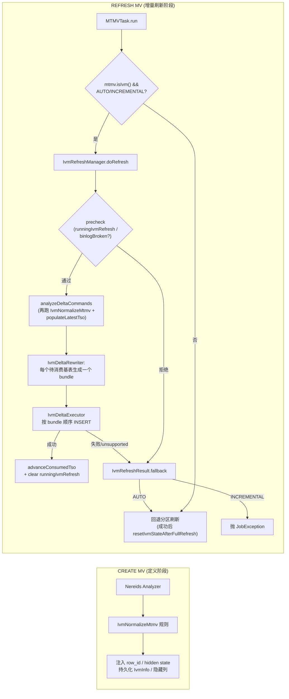
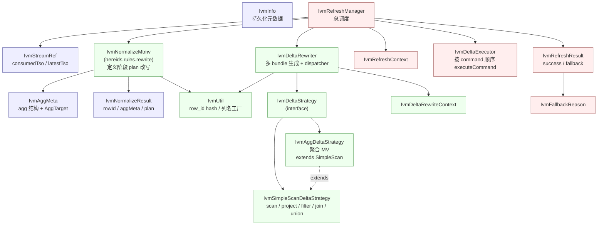
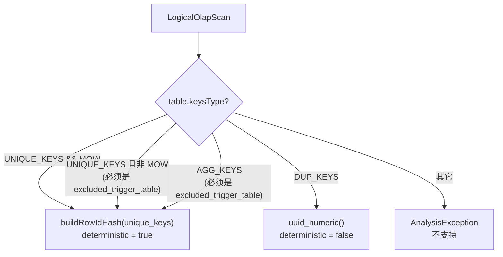
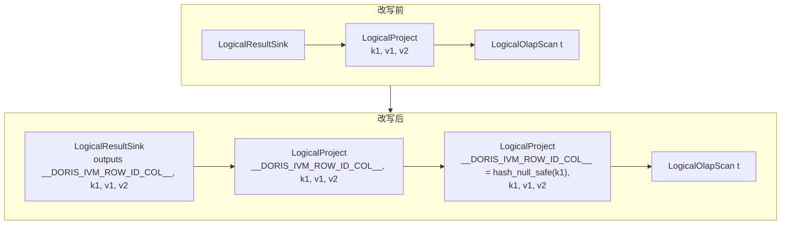
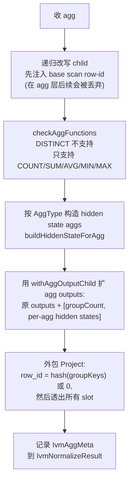
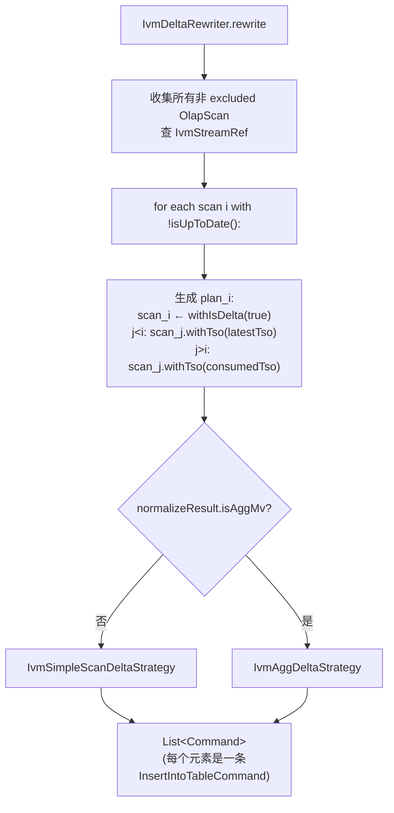
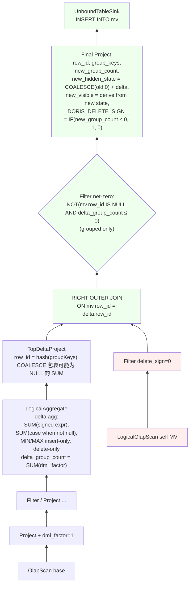
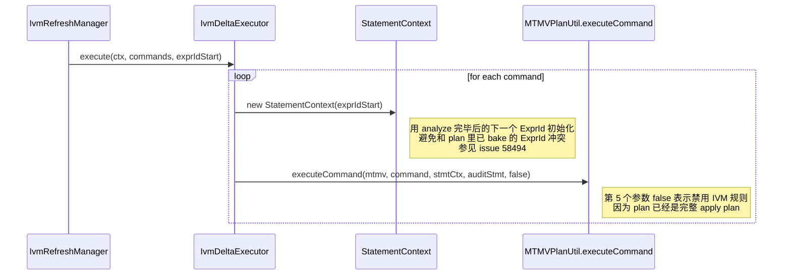
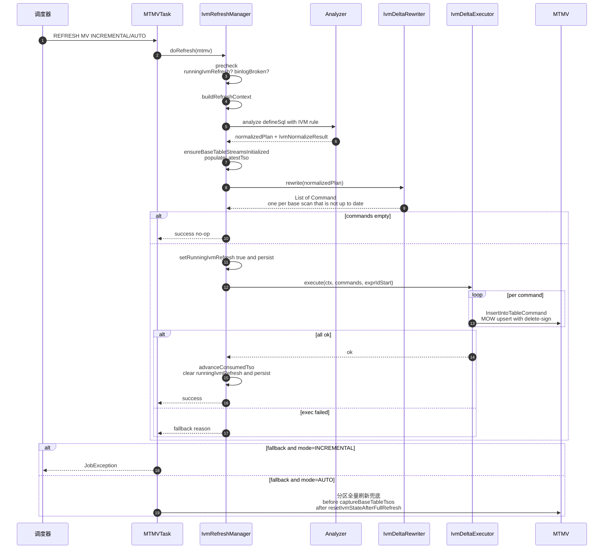

# Doris IVM（Incremental View Maintenance）设计文档

> 范围：`fe/fe-core/src/main/java/org/apache/doris/mtmv/ivm/` 整个包 + `IvmNormalizeMtmv` 规则 + `MTMVTask` 中的 IVM 调度入口。  
> 版本：以当前分支代码为准（`IvmInfo.enableIvm=true` 的 MTMV 为 IVM 视图）。  
> 说明：binlog/stream 真实增量尚未落地，当前增量路径**以"全量扫描基表"作为 mock 的 delta**（见 `fe/fe-core/src/main/java/org/apache/doris/mtmv/ivm/AGENTS.md`）。但 delete 操作可以通过基表上的 `binlog_op` 列模拟（`0=insert, 1=delete`），从而驱动 `dml_factor`。下文描述的是代码真实结构与语义，不包含未实现内容。

---

## 1. 什么是 IVM

传统 MTMV（物化视图）的刷新方式是"COMPLETE / PARTITIONS"——要么全量重算，要么按分区重算。IVM（增量视图维护）希望做到：

- 只读取基表自上次刷新以来的增量（insert / delete / update 拆分为 delete+insert）
- 通过**代数式状态合并**（hidden state columns）在 MV 上做一次 MOW upsert，得到新的正确结果
- 失败时可以**回退到 COMPLETE**，保证正确性优先

IVM 的核心难点：

1. 如何稳定地把"一行基表行"关联到"一行 MV 行"——即 **row-id**
2. 对聚合 MV，如何把 `COUNT/SUM/AVG/MIN/MAX` 转成"可增量合并"的状态——即 **hidden state columns**
3. 如何把 `+insert / -delete` 两类变化统一表达——即 **dml_factor** 信号
4. 如何在 Nereids 里把"MV 定义 SQL"改写为"delta 计算 SQL + 回写 INSERT"——即 **IvmNormalizeMtmv + IvmDeltaRewriter**

---

## 2. 架构概览



**两次跑 `IvmNormalizeMtmv` 是设计要点**：

- **CREATE 阶段**：规则跑在建 MV 的定义 SQL 上，用来决定 MV schema（加隐藏列：`__DORIS_IVM_ROW_ID_COL__`、`__DORIS_IVM_AGG_COUNT_COL__`、`__DORIS_IVM_AGG_{n}_{STATE}_COL__`）。
- **REFRESH 阶段**：规则再跑一次，把 `IvmAggMeta`/`IvmNormalizeResult` 传给 `IvmDeltaRewriter`，由后者产出真正的 delta SQL。

**多 bundle 模型**：当 MV 引用多张基表（JOIN / UNION ALL）时，`IvmDeltaRewriter` 为每张"自上次刷新以来有未消费数据"的基表各生成一条 `Command`：被选中的 scan 标记为 delta（`scan.withIsDelta(true)`），其它 scan 按位置绑定 `latestTso`（已在前序 bundle 处理过）或 `consumedTso`（待后续 bundle 处理）作为 snapshot 视图。`IvmDeltaExecutor` 按顺序逐条执行；任何一条失败都整体回退。

---

## 3. 模块划分（ivm 包）



| 类 | 职责 |
|----|------|
| `IvmInfo` | 持久化在 MTMV 上的 IVM 元数据：`enableIvm`、`binlogBroken`、`runningIvmRefresh`（在途增量刷新标志，FE 崩溃后用于强制 COMPLETE）、`baseTableStreams`（基表→stream 引用） |
| `IvmStreamRef` | 单张基表的 IVM stream 绑定：`consumedTso`（持久化）+ `latestTso`（transient，每次刷新前从 OlapTable 读取）；`isUpToDate()` 判断是否有 delta |
| `IvmNormalizeMtmv` | **Nereids custom analyze 规则**，在 MV 定义 plan 上注入 row-id、agg 隐藏状态列；把结构写入 `IvmNormalizeResult` / `IvmAggMeta`；支持 OlapScan / Project / Filter / INNER & CROSS Join / UNION ALL / Aggregate 白名单 |
| `IvmNormalizeResult` | 规则结果载体：规则化后的 plan、每个 row-id slot 是否确定性、（如有）聚合元信息 |
| `IvmAggMeta` / `AggTarget` | 描述 MV 的聚合形态：是否 scalar、group key、`IVM_AGG_COUNT_COL`、每个可见聚合的 `AggType`（代码枚举为 `COUNT/SUM/AVG/MIN/MAX`，`COUNT(*)` 与 `COUNT(expr)` 通过 `AggTarget.isCountStar()` 区分）及 hidden state slots |
| `IvmUtil` | `buildRowIdHash`：null-safe 的 `CAST(murmur_hash3_64(ifnull(cast(k AS VARCHAR),''), cast(isnull(k) AS VARCHAR), ...) AS LARGEINT)`；scalar agg 用 `0::largeint`；隐藏列命名 / `ColumnDefinition` 工厂；`findRowIdSlot` 等 |
| `IvmDeltaStrategy` | 策略接口：`List<Command> rewrite(Plan normalizedPlan)` |
| `IvmDeltaRewriter` | 入口：先收集所有非 excluded 的 OlapScan，再为每个 `!isUpToDate()` 的 scan 生成一个 delta plan（自身 `withIsDelta(true)`，前序 scan 绑定 `latestTso`、后序 scan 绑定 `consumedTso`），最后按 `normalizeResult.isAggMv()` 分发到 `IvmAggDeltaStrategy` 或 `IvmSimpleScanDeltaStrategy` |
| `IvmSimpleScanDeltaStrategy` | 简单 / JOIN / UNION ALL MV：注入 `dml_factor`，把 `dml_factor<0` 映射为 `__DORIS_DELETE_SIGN__=1`；UNION 中只保留 delta arm；JOIN 中要求至多一侧有 dml_factor |
| `IvmAggDeltaStrategy` | 聚合 MV：构造 signed delta aggregate，`RIGHT OUTER JOIN` 到 MV 当前状态上做状态合并，产出 sink |
| `IvmDeltaRewriteContext` | MV + ConnectContext + normalizeResult + baseTableStreams |
| `IvmRefreshManager` | 入口：`precheck → buildRefreshContext → analyzeDeltaCommands → execute → advanceConsumedTso & clear running 标志`；任何异常都转 `fallback`；提供静态 `captureBaseTableTsos` / `resetIvmStateAfterFullRefresh` 供 COMPLETE 兜底使用 |
| `IvmRefreshContext` | 刷新上下文（MTMV、ConnectContext、MTMVRefreshContext） |
| `IvmDeltaExecutor` | 为每个 command 新建 `StatementContext`（ExprId 从 `exprIdStart` 起步避免冲突），调 `MTMVPlanUtil.executeCommand` 执行（最后一个参数 `false`：禁用 IVM 规则，因为 plan 已是完整 apply plan） |
| `IvmRefreshResult` / `IvmFallbackReason` | 结果/回退原因，详见 §7 |

---

## 4. 关键概念

### 4.1 隐藏列（Hidden Columns）

IVM 在 MV schema 上额外加入一批以 `__DORIS_IVM_` 开头的列（`IvmUtil.isIvmHiddenColumn` 判断，前缀常量 `Column.IVM_HIDDEN_COLUMN_PREFIX`）：

| 列 | 含义 | 出现场景 |
|----|------|---------|
| `__DORIS_IVM_ROW_ID_COL__` | MV 的**行身份**，也是 UNIQUE_KEY（从而支持 MOW upsert） | 所有 IVM MV |
| `__DORIS_IVM_AGG_COUNT_COL__` | 当前 group 的**总行数**（删除时用来判定是否 group 消失） | 聚合 MV |
| `__DORIS_IVM_AGG_{n}_{STATE}_COL__` | 第 n 个 agg 需要额外持久化的 hidden state。当前实现中：`SUM/MIN/MAX` 只额外持久化 `COUNT`，可见列本身存储 sum/extreme；`AVG` 持久化 `SUM + COUNT`；`COUNT` 不额外持久化 per-target hidden state | 聚合 MV |
| `__DORIS_IVM_DML_FACTOR_COL__` | delta 计算中间列：`+1`=插入，`-1`=删除 | 仅在 delta 子计划里出现，**不落盘** |
| `__DORIS_IVM_DELTA_GROUP_COUNT_COL__` | delta 中每个 group 的行数变化量 | 仅在 delta 子计划里出现 |

> 代码依据：`IvmNormalizeMtmv.buildHiddenStateForAgg`。旧版本设计里 MIN/MAX/SUM 可能被描述为各自持久化 hidden MIN/MAX/SUM；当前代码并不是这样，减少了物理 hidden 列数量，apply 阶段从 MV 可见列读取旧 sum/extreme。

### 4.2 row-id：MV 的行身份

`IvmNormalizeMtmv` 在每个白名单节点上都会维护一个名为 `__DORIS_IVM_ROW_ID_COL__` 的 slot，统一通过 `IvmUtil.buildRowIdHash(keys)` 生成 null-safe 的 hash：

```
row_id = CAST(
  murmur_hash3_64(
    ifnull(cast(k1 AS VARCHAR), ''),  -- VARCHAR 列省略 cast
    cast(isnull(k1) AS VARCHAR),
    ifnull(cast(k2 AS VARCHAR), ''),
    cast(isnull(k2) AS VARCHAR),
    ...
  ) AS LARGEINT
)
```

每个 key 提供两个 hash 参数：`ifnull(...,'')` 避免 NULL 在 hash 内传染；`isnull(key)` 区分仅 NULL 位置不同的 group（如 `(NULL,'x')` vs `('x',NULL)`）。

`IvmNormalizeMtmv.buildRowId` 决定 base scan 的 row-id：



- **MOW UNIQUE_KEYS 基表**：unique key 稳定，hash 给出确定性 row-id；同 pk 的两次 insert 在 MV 上命中同一 row-id，MOW upsert 自动覆盖。
- **DUP_KEYS 基表**：每条插入视为新行，用 `uuid_numeric()` 生成随机 row-id。注意 **DUP_KEYS 基表的 COMPLETE 回退能力受限**——重建时 uuid 与旧值不一致，会造成重复行；并且当聚合 MV 之上发生 retraction 时，会触发 `NON_DETERMINISTIC_ROW_ID` 回退。
- **excluded_trigger_table**：明确声明不参与增量的基表（也就不会被读取增量），允许 UNIQUE_KEYS-非MOW / AGG_KEYS。

**JOIN（INNER / CROSS）**：`visitLogicalJoin` 把左右子树的 row-id 组合成 `hash(left_row_id, right_row_id)`，仅当两侧都确定性时新 row-id 才确定性；同时把子 row-id 从 join 输出里剥离，避免上层重复出现。

**UNION ALL**：`visitLogicalUnion` 为每个 arm 包一层 `hash(arm_index_literal, child_row_id)` —— `arm_index` 防止 self-union 的跨臂 row-id 冲突；UNION 输出再加一个 union 级 row-id slot。

**聚合 MV**：`visitLogicalAggregate` 会**丢弃** child 的 row-id，并以 group key 重新生成：

```
聚合 MV 的 row-id = buildRowIdHash(group_keys)   // grouped
                  = LargeIntLiteral(0)            // scalar，整张 MV 仅一行
```

### 4.3 dml_factor：+1 / −1 信号

在 delta 子计划里，`IvmSimpleScanDeltaStrategy.buildDmlFactorExpr` 决定每行的符号：

- **基表含 `binlog_op` 列**（`Column.BINLOG_OPERATION_COL`，TINYINT，遵循 delete-sign 约定 `0=insert, 1=delete`）：
  ```
  __DORIS_IVM_DML_FACTOR_COL__ = IF(binlog_op = 0, 1, -1)
  ```
- **不含 `binlog_op` 列**（普通表）：fallback 为常量 `1`（mock 全量扫描时假定全是 insert）。

仅当被 `IvmDeltaRewriter` 标记为 delta 的那个 scan（`isDelta() == true`）才会注入 `dml_factor`；同 plan 内其它 snapshot 视图的 scan 不带 `dml_factor`，也就不会贡献 `−1`。

Project / Filter 的 visitor 都会透传该 slot；JOIN 要求两侧 dml_factor 至多一侧非空（snapshot 侧通过 `withTso` 绑定为只读视图）；UNION ALL 中只有 delta arm 保留，其它 arm 被裁剪掉。最终：

- 简单 / JOIN / UNION ALL 形态 MV：`__DORIS_DELETE_SIGN__ = IF(dml_factor < 0, 1, 0)`
- 聚合 MV：`dml_factor` 会被吸收成 signed aggregation（见 §6）

> 当 MV 的 row-id 不确定（如 join/union 中包含 DUP_KEYS 表）且 delta 中出现了 `dml_factor < 0` 时，`IvmSimpleScanDeltaStrategy` 通过 `assert_true` 守卫直接抛出"delete on non-deterministic row_id"，由 `IvmRefreshManager` 转为 `NON_DETERMINISTIC_ROW_ID` 回退。

### 4.4 row-id 究竟解决了什么问题——一个具体例子

**场景**：基表 `orders` 是 MOW UNIQUE_KEY 表，主键 `id`。MV 是简单 SELECT。

```sql
CREATE TABLE orders (
  id INT, user_id INT, amount INT
) UNIQUE KEY(id) DISTRIBUTED BY HASH(id) BUCKETS 1
PROPERTIES("enable_unique_key_merge_on_write" = "true");

CREATE MATERIALIZED VIEW mv
BUILD IMMEDIATE REFRESH AUTO ON COMMIT
DISTRIBUTED BY HASH(`__DORIS_IVM_ROW_ID_COL__`) BUCKETS 1
PROPERTIES("enable_ivm" = "true")
AS SELECT id, user_id, amount FROM orders WHERE amount > 0;
```

**MV 的实际 schema** 多了一列：

```
mv(__DORIS_IVM_ROW_ID_COL__ LARGEINT [UNIQUE KEY, MOW],
   id, user_id, amount,
   __DORIS_DELETE_SIGN__)
```

`__DORIS_IVM_ROW_ID_COL__` 由 `murmur_hash3_64(ifnull(cast(id AS VARCHAR),''), cast(isnull(id) AS VARCHAR))` 算出来。**它就是 MV 自己的主键**，作用是把 base 表的"逻辑同一行"在 MV 上稳定地映射到同一物理行。

**Step 1: 初始 INSERT**
```sql
INSERT INTO orders VALUES (1, 100, 50), (2, 100, 80);
-- 增量刷新后 mv 的物理数据：
-- row_id=H(1), id=1, user_id=100, amount=50, delete_sign=0
-- row_id=H(2), id=2, user_id=100, amount=80, delete_sign=0
```
其中 `H(k) = murmur_hash3_64(...)`。

**Step 2: 对 id=1 做 UPDATE（在 MOW UNIQUE_KEY 表上等价于覆写）**
```sql
INSERT INTO orders VALUES (1, 100, 200);
```
基表的 binlog 会产生两条记录（MOW delete-then-insert）：
```
binlog_op=1, id=1, user_id=100, amount=50    -- 旧值 delete
binlog_op=0, id=1, user_id=100, amount=200   -- 新值 insert
```
增量刷新读 binlog，`dml_factor = IF(binlog_op=0, 1, -1)`：

```
delta 子计划输出：
  row_id=H(1), id=1, amount=50,  dml_factor=-1   --> delete_sign=1
  row_id=H(1), id=1, amount=200, dml_factor=+1   --> delete_sign=0
```

两条 delta 都写到 MV，因为 `__DORIS_IVM_ROW_ID_COL__` 是 MV 的 UNIQUE_KEY 且 MOW 开启，**后写赢**：MV 上 `H(1)` 这一行被最后那条 `delete_sign=0` 覆盖成新值 (1, 100, 200)。**没有 row-id 就做不到这件事**——你无法用业务列做 MV pk（业务列可能改），也不能让 MV "认得" 之前那条对应行。

**Step 3: DELETE id=2**
```sql
DELETE FROM orders WHERE id=2;
-- binlog: binlog_op=1, id=2, user_id=100, amount=80
-- delta:  row_id=H(2), id=2, amount=80, dml_factor=-1 --> delete_sign=1
```
MOW 看到 `H(2)` 上 delete_sign=1，物理删掉 MV 这一行。

**最终 MV 数据**（与全量 `SELECT id,user_id,amount FROM orders WHERE amount>0` 一致）：
```
row_id=H(1), id=1, user_id=100, amount=200
```

**对聚合 MV** 含义略有不同：聚合 MV 的 row-id = `hash(group_keys)` 或 `0`（scalar agg），它把 MV 的物理行和"某个 group"绑定，使得 delta 的 `+sum / -sum / +count / -count` 能**精确累加**到对应那一行 hidden state 上。当 `group_count` 减到 0 时整组 delete。

**为什么必须是 hash？**因为 MV 主键只有一列 LARGEINT；如果 group key 是多列就需要折叠成单列。hash 冲突在 LARGEINT 域内可忽略，且 null-safe 形式还能区分 `(NULL,'x')` 和 `('x',NULL)`。

---

## 5. IvmNormalizeMtmv：plan 改写核心

### 5.1 在 Nereids 里的位置

`Analyzer.java:224`:

```java
custom(RuleType.IVM_NORMALIZE_MTMV, IvmNormalizeMtmv::new),
```

位于 analyze 阶段末尾（在 `NormalizeAggregate` 之后、`AdjustNullable` 之前）。由 session variable `enable_ivm_normal_rewrite` 控制开关。规则是幂等的：`CascadesContext` 已持有 `IvmNormalizeResult` 时直接返回。

### 5.2 白名单访问 + 自顶向下 + 注入

`IvmNormalizeMtmv extends DefaultPlanRewriter<Boolean>`，`Boolean` 参数含义是 `isFirstNonSink`（是否处于紧贴 sink 下方的位置——用来判定 `LogicalAggregate` 是否合法）。未在白名单中的 plan 节点直接抛 `AnalysisException`。当前白名单：

```
LogicalResultSink / LogicalOlapTableSink
LogicalProject
LogicalFilter
LogicalJoin              (仅 INNER_JOIN / CROSS_JOIN, 非 markJoin)
LogicalUnion             (仅 UNION ALL, 不含纯常量 arm)
LogicalAggregate         (仅限 first non-sink)
LogicalOlapScan
```

### 5.3 简单 MV 的改写



关键行为：

- 在每个 `LogicalOlapScan` 之上，用一个额外 `LogicalProject` 把 row-id alias 置于 output index 0
- 父节点 Project / Filter / Sink 负责**propagate**：`rewriteOutputsWithIvmHiddenColumns` 会保持原输出顺序，在前面插入 row-id slot，在末尾追加其它隐藏 slot；如果输出里已有同名隐藏列占位符（由 `BindSink` 引入），就**按 ExprId 在原位替换**以保证 schema 顺序稳定。

### 5.4 聚合 MV 的改写

输入假设：`NormalizeAggregate` 已经把 Aggregate 规范成
```
Project(top) → Aggregate(groupBy=[slots], outputs=[groupKeys..., Alias(AggFn(slot))...]) → Project(bottom) → ...
```

`visitLogicalAggregate` 分 5 步：



**每种 AggType 产生的 hidden state**：

| AggType | 原可见列 | 附带 hidden state 列 | 说明 |
|---------|----------|----------------------|------|
| `COUNT(*)` | `COUNT(*)` | 无（可见列直接等于 `__DORIS_IVM_AGG_COUNT_COL__`） | group 总行数就是 COUNT(*) |
| `COUNT(expr)` | `COUNT(expr)` | 无 | 可见列直接存储非 NULL 计数 |
| `SUM(expr)` | `SUM(expr)` | `COUNT` | 可见列直接存储 SUM；hidden COUNT 用于 NULL 语义和非负校验 |
| `AVG(expr)` | `AVG(expr)` | `SUM` + `COUNT` | 可见值 = `IF(count>0, sum/count, NULL)` |
| `MIN(expr)` | `MIN(expr)` | `COUNT`（+ 运行时临时 `DELMIN`） | 可见列直接存储 MIN；删除可能击中当前 min → assert_true 守卫失败回退 |
| `MAX(expr)` | `MAX(expr)` | `COUNT`（+ 运行时临时 `DELMAX`） | 可见列直接存储 MAX；同 MIN |

所有新增 agg 输出都通过 `newAgg.getOutput()` 按**名字**重新解析，避免 ExprId 漂移（`resolveAggTargetSlots`）。

---

## 6. IvmDeltaRewriter：把规则化 plan 改写成回写 INSERT



### 6.0 多 bundle 生成（`generateDeltaPlans`）

- **Phase 1**：`rewriteDownShortCircuit` 收集 plan 中所有非 excluded 的 `LogicalOlapScan`，并按 `scan.getTable().getId()` 查 `baseTableStreams` 得到对应 `IvmStreamRef`。
- **Phase 2**：跳过 `isUpToDate()` 的 scan；对每个仍有 delta 的 scan i 生成一个修改后的 plan（同一遍 `rewriteDownShortCircuit`，按访问顺序计数）：
  - i 自身 → `scan.withIsDelta(true)`（mock 实现：占位标志；真实方案下会替换成 binlog 范围 scan）
  - j < i → `scan.withTso(latestTso)`（已包含 i 的更早 delta，看到的是新视图 v2）
  - j > i → `scan.withTso(consumedTso)`（i 的 delta 还未被它们感知，看到的是旧视图 v1）
- 不变量：每条 plan 必须恰好包含 1 个 `isDelta=true` 的 scan，否则 `Preconditions.checkState` 失败。

### 6.1 简单 / JOIN / UNION ALL 策略（`IvmSimpleScanDeltaStrategy`）

`PlanVisitor<RewriteResult, Void>`，`RewriteResult = (plan, dmlFactorSlot)`。

```
visit OlapScan  → 若 isDelta()，包 Project 注入 dml_factor (binlog_op 推导)；否则直接返回 (snapshot 侧)
visit Project   → 保留原投影并透传 dml_factor
visit Filter    → 递归并透传
visit Join      → 仅 INNER/CROSS；要求两侧 dml_factor 不同时存在；若 MV row-id 非确定且存在 delete 行，包 assert_true 守卫
visit Union     → 仅 UNION ALL；裁掉非 delta arm，重映射 ExprId 到 union 输出
其它节点        → 抛错
```

最后 `buildSinkProject` 把 plan 输出改写为：

```
[ inserted_col_1, ..., inserted_col_N,
  __DORIS_DELETE_SIGN__ = IF(dml_factor < 0, 1, 0) ]
```

再用 `UnboundTableSink(..., TPartialUpdateNewRowPolicy.APPEND, DMLCommandType.INSERT)` 包成 `InsertIntoTableCommand`，写回 MV 自己。

### 6.2 聚合 MV 策略（`IvmAggDeltaStrategy`）

聚合策略继承自 Simple，复用 Scan/Filter/Project 的 dml_factor 注入，但**override** 了 `visitLogicalAggregate` 和 `visitLogicalProject`（如果 project 的 child 是 aggregate，则直接把 aggregate 的结果往上抛，因为 agg 策略已经返回完整的 apply plan）。

整体计划形态：



**关键细节**：

1. **signed delta aggregation**（`signedExpr`）：`SUM(IF(dml_factor>0, expr, -expr))`——避免 TinyInt × Decimal 的精度丢失，用分支代替乘法。
2. **NULL 敏感计数**（`caseWhenExprNotNull`）：`SUM(IF(expr IS NULL, 0, dml_factor))`——符合 SQL 的 COUNT(expr) 忽略 NULL 的语义。
3. **MIN/MAX 的 assert-true 守卫**：当 delta 里存在 `delete-only min ≤ old_min`（对 MAX 对称），说明被删除的行可能**就是**当前极值，无法只用增量恢复极值——`AssertTrue` 在 BE 执行期抛错，`IvmRefreshManager` 捕获后回退到 COMPLETE 刷新（`IvmFallbackReason.INCREMENTAL_EXECUTION_FAILED`）。
4. **net-zero filter**：只对 grouped agg 生效。防止：在基表上出现了一个 MV 中从未存在的 group 的"净删除"行，如果没有 filter，会往 MV 插一条 `delete_sign=1` 的孤立行。
5. **assertNonNegative**：所有计数列重算时都会套一层 `AssertTrue(expr >= 0)`，兜底数据异常。
6. **JOIN 方向**：`RIGHT_OUTER_JOIN`，delta 作为 build 侧（小表），MV 作为 probe 侧（大表），这样没出现在 delta 的 MV 行不会被读进 pipeline，性能更优。

### 6.3 执行与回写（`IvmDeltaExecutor`）



---

## 7. 刷新端到端时序



**回退原因一览**（`IvmFallbackReason`）：

- `BINLOG_BROKEN`：`IvmInfo.binlogBroken=true`（precheck）
- `PREVIOUS_RUN_INCOMPLETE`：上一轮增量未完成（`runningIvmRefresh=true`），强制 COMPLETE 回收
- `STREAM_UNSUPPORTED`：基表 stream 类型不支持（目前 `checkStreamSupport` 被注释，未生效）
- `SNAPSHOT_ALIGNMENT_UNSUPPORTED`：`buildRefreshContext` 失败
- `PLAN_PATTERN_UNSUPPORTED`：规则没匹配到 / 规则抛 `AnalysisException`（例如 OUTER JOIN、DISTINCT、UNION DISTINCT、其它非白名单算子）
- `OUTER_JOIN_RETRACTION_UNSUPPORTED`：（保留）OUTER JOIN 在出现 retraction 时无法用代数式增量
- `AGG_UNSUPPORTED`：（保留）聚合形态本身不支持
- `NON_DETERMINISTIC_ROW_ID`：MV row-id 不确定（如含 DUP_KEYS 的 join/union）但 delta 中出现了 `dml_factor < 0`，BE 端 `assert_true` 抛错
- `MIN_MAX_BOUNDARY_HIT`：MIN/MAX 守卫触发——被删除行可能就是当前极值
- `INCREMENTAL_EXECUTION_FAILED`：BE 执行期失败的兜底分类（其它任何运行时错误）

---

## 8. 详细示例

本节按当前代码和回归测试写。可以在本地集群运行时用：

```bash
mysql -h 127.0.0.1 -P 9030 -u root
```

然后进入一个测试库执行下面 SQL。当前分支里 `CREATE MATERIALIZED VIEW ... REFRESH INCREMENTAL ...` 才会让 `CreateMTMVInfo.isEnableIvm()` 返回 true，并在 `MTMV.ivmInfo.enableIvm` 中持久化；示例里不额外写 `"enable_ivm"="true"`。另外，用户 DDL 可以写 `DISTRIBUTED BY RANDOM BUCKETS n`，但 IVM MV 在创建阶段会被 `CreateMTMVInfo.analyze()` 改成 `HASH(__DORIS_IVM_ROW_ID_COL__)`，`SHOW CREATE` 再把它显示回 `RANDOM` 以保证 DDL 可重放。

### 8.1 简单 MV：MOW 基表（`test_ivm_basic_mtmv`）

```sql
DROP MATERIALIZED VIEW IF EXISTS mv_ivm_basic;
DROP TABLE IF EXISTS t_ivm_basic_base;

CREATE TABLE t_ivm_basic_base (
    k1 INT,
    v1 INT,
    v2 VARCHAR(50)
)
UNIQUE KEY(k1)
DISTRIBUTED BY HASH(k1) BUCKETS 2
PROPERTIES (
    "replication_num" = "1",
    "enable_unique_key_merge_on_write" = "true"
);

INSERT INTO t_ivm_basic_base VALUES
    (1, 10, 'aaa'),
    (2, 20, 'bbb'),
    (3, 30, 'ccc');

CREATE MATERIALIZED VIEW mv_ivm_basic
BUILD DEFERRED REFRESH INCREMENTAL ON MANUAL
DISTRIBUTED BY RANDOM BUCKETS 2
PROPERTIES ('replication_num' = '1')
AS SELECT * FROM t_ivm_basic_base;
```

#### 8.1.1 CREATE 阶段的 schema 和 row-id

`IvmNormalizeMtmv.visitLogicalOlapScan` 在 scan 上方加 row-id。因为基表是 `UNIQUE KEY(k1)` 且 MOW 开启，row-id 是确定性的：

```sql
CAST(
  murmur_hash3_64(
    ifnull(CAST(k1 AS VARCHAR), ''),
    CAST(k1 IS NULL AS VARCHAR)
  ) AS LARGEINT
)
```

规则化 plan 的核心形态：

```
ResultSink(__DORIS_IVM_ROW_ID_COL__, k1, v1, v2)
  └─ Project(__DORIS_IVM_ROW_ID_COL__, k1, v1, v2)
       └─ Project(
            __DORIS_IVM_ROW_ID_COL__ = hash_null_safe(k1),
            k1, v1, v2)
          └─ OlapScan(t_ivm_basic_base)
```

可观察的物理模型：

```sql
SET show_hidden_columns = true;
DESC mv_ivm_basic ALL;
SET show_hidden_columns = false;
```

应看到 `UNIQUE_KEYS`，主键是 `__DORIS_IVM_ROW_ID_COL__`，并带有 delete-sign 列。简化后等价于：

| 列 | 来源 / 含义 |
|----|-------------|
| `__DORIS_IVM_ROW_ID_COL__` | IVM hidden row-id，MV 的唯一键 |
| `k1, v1, v2` | 用户可见输出列 |
| `__DORIS_DELETE_SIGN__` | MOW delete-sign，delta 写回时由 `dml_factor` 计算 |

#### 8.1.2 COMPLETE 与 INCREMENTAL 的真实结果

首次完整刷新不走 IVM delta：

```sql
REFRESH MATERIALIZED VIEW mv_ivm_basic COMPLETE;
SELECT k1, v1, v2 FROM mv_ivm_basic ORDER BY k1;
```

回归测试期望结果：

| k1 | v1 | v2 |
|----|----|----|
| 1 | 10 | aaa |
| 2 | 20 | bbb |
| 3 | 30 | ccc |

插入两行后手动增量刷新：

```sql
INSERT INTO t_ivm_basic_base VALUES
    (4, 40, 'ddd'),
    (5, 50, 'eee');

REFRESH MATERIALIZED VIEW mv_ivm_basic INCREMENTAL;
SELECT k1, v1, v2 FROM mv_ivm_basic ORDER BY k1;
```

当前 mock delta 是“全量扫描基表”，因此 delta 子计划会读到 5 行：

```
InsertIntoTableCommand(mv_ivm_basic)
  └─ Project(
       __DORIS_IVM_ROW_ID_COL__, k1, v1, v2,
       __DORIS_DELETE_SIGN__ = IF(__DORIS_IVM_DML_FACTOR_COL__ < 0, 1, 0))
     └─ Project(
          __DORIS_IVM_ROW_ID_COL__, k1, v1, v2,
          __DORIS_IVM_DML_FACTOR_COL__ = 1)
        └─ OlapScan(t_ivm_basic_base, isDelta=true)
```

旧的 `k1=1/2/3` 三行虽然被重新写入，但 row-id 仍是 `hash_null_safe(k1)`，所以 MOW 按同一个 row-id 覆盖；`k1=4/5` 是新 row-id。结果为：

| k1 | v1 | v2 |
|----|----|----|
| 1 | 10 | aaa |
| 2 | 20 | bbb |
| 3 | 30 | ccc |
| 4 | 40 | ddd |
| 5 | 50 | eee |

再用 MOW upsert 更新已有 key：

```sql
INSERT INTO t_ivm_basic_base VALUES
    (2, 22, 'bbb_updated'),
    (3, 33, 'ccc_updated');

REFRESH MATERIALIZED VIEW mv_ivm_basic INCREMENTAL;
SELECT k1, v1, v2 FROM mv_ivm_basic ORDER BY k1;
```

因为 `k1=2/3` 的 row-id 不变，MV 上对应两行被覆盖，测试期望为：

| k1 | v1 | v2 |
|----|----|----|
| 1 | 10 | aaa |
| 2 | 22 | bbb_updated |
| 3 | 33 | ccc_updated |
| 4 | 40 | ddd |
| 5 | 50 | eee |

### 8.2 简单 MV：`binlog_op` 删除模拟

`IvmSimpleScanDeltaStrategy.buildDmlFactorExpr` 只认列名 `binlog_op`：表里存在这个列时，delta plan 使用 `IF(binlog_op = 0, 1, -1)`；不存在时使用常量 `1`。

```sql
DROP MATERIALIZED VIEW IF EXISTS mv_ivm_basic_op;
DROP TABLE IF EXISTS t_ivm_basic_op_base;

CREATE TABLE t_ivm_basic_op_base (
    k1 INT,
    v1 INT,
    v2 VARCHAR(50),
    binlog_op TINYINT
)
UNIQUE KEY(k1)
DISTRIBUTED BY HASH(k1) BUCKETS 2
PROPERTIES (
    "replication_num" = "1",
    "enable_unique_key_merge_on_write" = "true"
);

INSERT INTO t_ivm_basic_op_base VALUES
    (1, 10, 'aaa', 0),
    (2, 20, 'bbb', 0),
    (3, 30, 'ccc', 1);

CREATE MATERIALIZED VIEW mv_ivm_basic_op
BUILD DEFERRED REFRESH INCREMENTAL ON MANUAL
DISTRIBUTED BY RANDOM BUCKETS 2
PROPERTIES ('replication_num' = '1')
AS SELECT * FROM t_ivm_basic_op_base;
```

注意 `COMPLETE` 刷新不会解释 `binlog_op`，它只是全量重算 MV：

```sql
REFRESH MATERIALIZED VIEW mv_ivm_basic_op COMPLETE;
SELECT k1, v1, v2, binlog_op FROM mv_ivm_basic_op ORDER BY k1;
```

| k1 | v1 | v2 | binlog_op |
|----|----|----|-----------|
| 1 | 10 | aaa | 0 |
| 2 | 20 | bbb | 0 |
| 3 | 30 | ccc | 1 |

插入一行让 MV 变脏，再跑增量：

```sql
INSERT INTO t_ivm_basic_op_base VALUES (4, 40, 'ddd', 0);
REFRESH MATERIALIZED VIEW mv_ivm_basic_op INCREMENTAL;
SELECT k1, v1, v2, binlog_op FROM mv_ivm_basic_op ORDER BY k1;
```

当前 mock 会扫描 4 行，但 `k1=3` 的 `binlog_op=1` 使 `dml_factor=-1`，最终 sink project 写入 `__DORIS_DELETE_SIGN__=1`。MOW 把这行标记删除，因此查询结果是：

| k1 | v1 | v2 | binlog_op |
|----|----|----|-----------|
| 1 | 10 | aaa | 0 |
| 2 | 20 | bbb | 0 |
| 4 | 40 | ddd | 0 |

如果中间有 filter，`dml_factor` 也会被透传：

```sql
CREATE MATERIALIZED VIEW mv_ivm_basic_filter
BUILD DEFERRED REFRESH INCREMENTAL ON MANUAL
DISTRIBUTED BY RANDOM BUCKETS 2
PROPERTIES ('replication_num' = '1')
AS SELECT k1, v1 FROM t_ivm_basic_filter_base WHERE v1 > 15;
```

在 `test_ivm_basic_mtmv` 中，`k1=3, v1=30, binlog_op=1` 通过 `v1 > 15` 的 filter，但增量写回时 delete-sign=1；`k1=1, v1=10` 没通过 filter，根本不会进入 delta。增量后可见结果为 `(2,20),(4,40),(5,50)`。

### 8.3 JOIN / UNION：多 bundle 和 row-id 组合

JOIN 和 UNION 不只是“把每个 scan 加 row-id”。它们还决定了多表增量如何分批写回。

#### 8.3.1 INNER JOIN

回归测试 `test_ivm_inner_join_1` 的基本形态：

```sql
CREATE MATERIALIZED VIEW test_ivm_inner_join_1_basic_mv
BUILD DEFERRED REFRESH INCREMENTAL ON MANUAL
DISTRIBUTED BY RANDOM BUCKETS 2
PROPERTIES ('replication_num' = '1')
AS
SELECT
    t1.k1 AS k1,
    t1.v1 AS left_v1,
    t2.v2 AS right_v2
FROM test_ivm_inner_join_1_basic_t1 t1
INNER JOIN test_ivm_inner_join_1_basic_t2 t2
    ON t1.k1 = t2.k1;
```

CREATE 阶段：

```
t1 row-id = hash_null_safe(t1.k1)
t2 row-id = hash_null_safe(t2.k1)
join row-id = hash_null_safe(t1_row_id, t2_row_id)
```

刷新阶段，`IvmDeltaRewriter.generateDeltaPlans` 对每个未消费的 base scan 生成一个 bundle。某个 bundle 里只有一个 scan 被 `withIsDelta(true)`，JOIN 的另一侧保留为 snapshot scan 并绑定 TSO：

```
bundle for Δt1:
  t1.isDelta = true       -> 注入 dml_factor
  t2.withTso(snapshot)    -> 不注入 dml_factor

bundle for Δt2:
  t1.withTso(snapshot)
  t2.isDelta = true
```

`IvmSimpleScanDeltaStrategy.visitLogicalJoin` 要求左右最多一侧带 `dml_factor`。如果 snapshot 侧 row-id 非确定，且 delta 中出现删除，会在 `dml_factor` 上包 `assert_true(dml_factor >= 0, ...)`，运行期触发后回退。

测试里的可见结果：

| 阶段 | SQL 操作 | MV 结果 |
|------|----------|---------|
| COMPLETE | t1=(1,10),(2,20)，t2=(1,100),(3,300) | `(1,10,100)` |
| INCREMENTAL 1 | 插入 `t1=(3,30)` | `(1,10,100),(3,30,300)` |
| INCREMENTAL 2 | upsert `t2=(1,111),(2,220)` | `(1,10,111),(2,20,220),(3,30,300)` |

#### 8.3.2 UNION ALL

UNION ALL 的 row-id 会把 arm 序号放进 hash，防止 self-union 冲突：

```
arm0 row-id = hash_null_safe(0, child_row_id)
arm1 row-id = hash_null_safe(1, child_row_id)
union output row-id = arm-level row-id
```

delta rewrite 和 JOIN 的区别是：UNION ALL 中非 delta arm 会被裁掉，因为 `Δ(a UNION ALL b) = Δa UNION ALL Δb`，不需要 snapshot 侧参与组合。

基本两表 UNION：

```sql
SELECT k1, v1 FROM test_ivm_union_1_basic_t1
UNION ALL
SELECT k1, v1 FROM test_ivm_union_1_basic_t2;
```

测试结果：

| 阶段 | MV 结果 |
|------|---------|
| COMPLETE | `(1,10),(2,20),(3,30),(4,40)` |
| t1 插入 `(5,50)` 后 INCREMENTAL | `(1,10),(2,20),(3,30),(4,40),(5,50)` |
| t2 插入 `(6,60)` 后 INCREMENTAL | `(1,10),(2,20),(3,30),(4,40),(5,50),(6,60)` |

self-union 会保留两份逻辑行，因为 arm 序号不同：

```sql
SELECT k1, v1 FROM test_ivm_union_1_self_t
UNION ALL
SELECT k1, v1 FROM test_ivm_union_1_self_t;
```

`(1,10),(2,20)` 首次刷新后 MV 是 `(1,10),(1,10),(2,20),(2,20)`；插入 `(3,30)` 后增量结果是 `(1,10),(1,10),(2,20),(2,20),(3,30),(3,30)`。

### 8.4 聚合 MV：COUNT/SUM（`test_ivm_agg_1`）

```sql
DROP MATERIALIZED VIEW IF EXISTS test_ivm_agg_mtmv_mv;
DROP TABLE IF EXISTS test_ivm_agg_mtmv_base;

CREATE TABLE test_ivm_agg_mtmv_base (
    k1 INT,
    v1 INT
)
UNIQUE KEY(k1)
DISTRIBUTED BY HASH(k1) BUCKETS 2
PROPERTIES (
    "replication_num" = "1",
    "enable_unique_key_merge_on_write" = "true"
);

INSERT INTO test_ivm_agg_mtmv_base VALUES
    (1, 10),
    (2, 20),
    (3, 30);

CREATE MATERIALIZED VIEW test_ivm_agg_mtmv_mv
BUILD DEFERRED REFRESH INCREMENTAL ON MANUAL
DISTRIBUTED BY RANDOM BUCKETS 2
PROPERTIES ('replication_num' = '1')
AS SELECT k1, COUNT(*) AS cnt, SUM(v1) AS sum_v1
   FROM test_ivm_agg_mtmv_base
   GROUP BY k1;
```

#### 8.4.1 当前代码实际生成的 hidden state

这部分很容易和旧设计混淆。对上面的两个聚合目标：

| ordinal | 可见聚合 | `AggTarget` | 额外持久化 hidden state |
|---------|----------|-------------|--------------------------|
| 0 | `COUNT(*) AS cnt` | `AggType.COUNT`, `isCountStar=true` | 无。`cnt` 由 `__DORIS_IVM_AGG_COUNT_COL__` 推导 |
| 1 | `SUM(v1) AS sum_v1` | `AggType.SUM` | 只有 `__DORIS_IVM_AGG_1_COUNT_COL__`。`sum_v1` 可见列本身保存 SUM 状态 |

因此 schema 不是“visible + hidden sum + hidden count”，而是：

| 列 | 说明 |
|----|------|
| `__DORIS_IVM_ROW_ID_COL__` | `hash_null_safe(k1)` |
| `k1` | group key |
| `cnt` | 可见 COUNT(*) |
| `sum_v1` | 可见 SUM(v1)，同时作为旧 SUM 状态读取 |
| `__DORIS_IVM_AGG_COUNT_COL__` | group 总行数 |
| `__DORIS_IVM_AGG_1_COUNT_COL__` | `SUM(v1)` 对应的非 NULL 计数 |

规则化 plan 核心：

```
Project(
  __DORIS_IVM_ROW_ID_COL__ = hash_null_safe(k1),
  k1, cnt, sum_v1,
  __DORIS_IVM_AGG_COUNT_COL__,
  __DORIS_IVM_AGG_1_COUNT_COL__)
└─ Aggregate(group=[k1],
     outputs=[
       k1,
       cnt = COUNT(*),
       sum_v1 = SUM(v1),
       __DORIS_IVM_AGG_COUNT_COL__ = COUNT(*),
       __DORIS_IVM_AGG_1_COUNT_COL__ = COUNT(v1)
     ])
```

#### 8.4.2 增量 apply 公式

delta aggregate 会临时算出 `__DORIS_IVM_AGG_1_SUM_COL__`，但它只是 delta plan 中的语义 slot，不会作为 MV 物理列持久化：

```
DeltaAgg(group=[k1]):
  __DORIS_IVM_DELTA_GROUP_COUNT_COL__ = SUM(dml_factor)
  delta_sum_v1 = SUM(IF(dml_factor > 0, v1, -v1))
  delta_count_v1 = SUM(IF(v1 IS NULL, 0, dml_factor))
```

apply 阶段：

```
new_group_count = assert_true(COALESCE(mv.__DORIS_IVM_AGG_COUNT_COL__, 0)
                              + delta_group_count >= 0)
                  ? COALESCE(mv.__DORIS_IVM_AGG_COUNT_COL__, 0) + delta_group_count
                  : NULL

new_sum_count = assert_true(COALESCE(mv.__DORIS_IVM_AGG_1_COUNT_COL__, 0)
                            + delta_count_v1 >= 0)
                ? COALESCE(mv.__DORIS_IVM_AGG_1_COUNT_COL__, 0) + delta_count_v1
                : NULL

new_sum_v1 = COALESCE(mv.sum_v1, 0) + delta_sum_v1

sink:
  cnt       = CAST(new_group_count AS type(cnt))
  sum_v1    = IF(new_sum_count > 0, CAST(new_sum_v1 AS type(sum_v1)), NULL)
  delete    = IF(new_group_count <= 0, 1, 0)
```

`RIGHT OUTER JOIN` 仍是通用形态：左侧扫 MV 当前状态并过滤 delete-sign=0，右侧是 delta aggregate。grouped aggregate 还会套 net-zero filter：

```
NOT(mv.row_id IS NULL AND delta_group_count <= 0)
```

它防止“MV 中从未存在的 group 收到净删除 delta”时插入一条孤立 delete-sign 行。

#### 8.4.3 当前 mock 下的数值为什么会膨胀

首次 COMPLETE 后：

| k1 | cnt | sum_v1 |
|----|-----|--------|
| 1 | 1 | 10 |
| 2 | 1 | 20 |
| 3 | 1 | 30 |

然后：

```sql
INSERT INTO test_ivm_agg_mtmv_base VALUES
    (4, 40),
    (1, 15);

REFRESH MATERIALIZED VIEW test_ivm_agg_mtmv_mv INCREMENTAL;
SELECT k1, cnt, sum_v1 FROM test_ivm_agg_mtmv_mv ORDER BY k1;
```

MOW 基表此时是 `(1,15),(2,20),(3,30),(4,40)`。因为 mock delta 全扫：

| k1 | old `(cnt,sum)` | delta `(count,sum)` | new `(cnt,sum)` |
|----|-----------------|---------------------|-----------------|
| 1 | `(1,10)` | `(1,15)` | `(2,25)` |
| 2 | `(1,20)` | `(1,20)` | `(2,40)` |
| 3 | `(1,30)` | `(1,30)` | `(2,60)` |
| 4 | `(0,0)` | `(1,40)` | `(1,40)` |

测试期望正是：

| k1 | cnt | sum_v1 |
|----|-----|--------|
| 1 | 2 | 25 |
| 2 | 2 | 40 |
| 3 | 2 | 60 |
| 4 | 1 | 40 |

再 upsert `k1=2`：

```sql
INSERT INTO test_ivm_agg_mtmv_base VALUES (2, 25);
REFRESH MATERIALIZED VIEW test_ivm_agg_mtmv_mv INCREMENTAL;
```

全表 delta 变为 `(1,15),(2,25),(3,30),(4,40)`，所以输出继续膨胀为：

| k1 | cnt | sum_v1 |
|----|-----|--------|
| 1 | 3 | 40 |
| 2 | 3 | 65 |
| 3 | 3 | 90 |
| 4 | 2 | 80 |

这不是最终 binlog 语义的正确结果，而是当前 mock delta 的真实行为。随后 COMPLETE 会回到全量真值：

| k1 | cnt | sum_v1 |
|----|-----|--------|
| 1 | 1 | 15 |
| 2 | 1 | 25 |
| 3 | 1 | 30 |
| 4 | 1 | 40 |

### 8.5 Scalar aggregate：row-id 固定为 0

scalar aggregate 没有 group key，`IvmUtil.buildRowIdHash(empty)` 返回 `0::largeint`。所以整张 MV 只有一个 IVM row-id，聚合 apply 的 delete-sign 恒为 0，不走 grouped net-zero filter。

测试 SQL：

```sql
CREATE MATERIALIZED VIEW test_ivm_agg_mtmv_scalar_mv
BUILD DEFERRED REFRESH INCREMENTAL ON MANUAL
DISTRIBUTED BY RANDOM BUCKETS 2
PROPERTIES ('replication_num' = '1')
AS SELECT COUNT(*) AS total_cnt,
          SUM(v1) AS total_sum,
          AVG(v1) AS avg_v1,
          COUNT(v1) AS cnt_v1
   FROM test_ivm_agg_mtmv_scalar_base;
```

当前 hidden state：

| 可见列 | 额外持久化 hidden state |
|--------|--------------------------|
| `total_cnt = COUNT(*)` | 无，使用 group count |
| `total_sum = SUM(v1)` | `__DORIS_IVM_AGG_1_COUNT_COL__` |
| `avg_v1 = AVG(v1)` | `__DORIS_IVM_AGG_2_SUM_COL__`, `__DORIS_IVM_AGG_2_COUNT_COL__` |
| `cnt_v1 = COUNT(v1)` | 无，可见列保存 count |

回归测试的可见结果：

| 阶段 | total_cnt | total_sum | avg_v1 | cnt_v1 |
|------|-----------|-----------|--------|--------|
| COMPLETE，base=(10,20,30) | 3 | 60 | 20 | 3 |
| upsert `k1=1 -> 15` 后 INCREMENTAL | 6 | 125 | 20.83333333333333 | 6 |
| 再插入 `k1=4 -> 40` 后 INCREMENTAL | 10 | 230 | 23 | 10 |
| COMPLETE 回到真值 | 4 | 105 | 26.25 | 4 |

膨胀原因同 §8.4：当前 delta 全扫。真实 binlog delta 接入后，scalar apply 公式本身不需要变化。

### 8.6 MIN/MAX：边界删除、count-drop-to-zero 与 mock 差异

```sql
CREATE MATERIALIZED VIEW test_ivm_agg_mtmv_minmax_mv
BUILD DEFERRED REFRESH INCREMENTAL ON MANUAL
DISTRIBUTED BY HASH(k1) BUCKETS 2
PROPERTIES ('replication_num' = '1')
AS SELECT k1, MIN(v1) AS min_v1, MAX(v1) AS max_v1
   FROM test_ivm_agg_mtmv_minmax_base
   GROUP BY k1;
```

#### 8.6.1 物理状态不是 hidden MIN/MAX

当前代码中，`MIN/MAX` 的可见列本身保存旧极值，只额外持久化非 NULL count：

| 列 | 说明 |
|----|------|
| `min_v1` | 可见 MIN，同时作为 old MIN 状态读取 |
| `max_v1` | 可见 MAX，同时作为 old MAX 状态读取 |
| `__DORIS_IVM_AGG_COUNT_COL__` | group 总行数 |
| `__DORIS_IVM_AGG_0_COUNT_COL__` | MIN(v1) 的非 NULL 计数 |
| `__DORIS_IVM_AGG_1_COUNT_COL__` | MAX(v1) 的非 NULL 计数 |

delta aggregate 临时产生 insert-only 和 delete-only 极值：

```
MIN target (ordinal=0):
  delta_insert_min = MIN(IF(dml_factor > 0, v1, NULL))
  delta_delete_min = MIN(IF(dml_factor < 0, v1, NULL))
                   AS __DORIS_IVM_TRANSIENT_0_DELMIN_COL__
  delta_min_count  = SUM(IF(v1 IS NULL, 0, dml_factor))

MAX target (ordinal=1):
  delta_insert_max = MAX(IF(dml_factor > 0, v1, NULL))
  delta_delete_max = MAX(IF(dml_factor < 0, v1, NULL))
                   AS __DORIS_IVM_TRANSIENT_1_DELMAX_COL__
  delta_max_count  = SUM(IF(v1 IS NULL, 0, dml_factor))
```

这些 transient DELMIN/DELMAX 列只用于守卫，不写回 MV。

#### 8.6.2 守卫公式

`IvmAggDeltaStrategy.buildExtremalTargetExpressions` 先算新非 NULL count：

```
new_count = assert_true(COALESCE(old_count, 0) + delta_count >= 0)
            ? COALESCE(old_count, 0) + delta_count
            : NULL
```

MIN 的守卫：

```
assert_true(
     new_count = 0
  OR delta_delete_min IS NULL
  OR old_min IS NULL
  OR delta_delete_min > old_min,
  'IVM: deleted row may be current MIN value, fallback to COMPLETE')
```

MAX 对称：

```
assert_true(
     new_count = 0
  OR delta_delete_max IS NULL
  OR old_max IS NULL
  OR delta_delete_max < old_max,
  'IVM: deleted row may be current MAX value, fallback to COMPLETE')
```

`new_count = 0` 是当前代码的重要分支：如果所有非 NULL 值都被删光，结果必然是 NULL，可以绕过边界比较。

极值合并：

```
new_min =
  CASE
    WHEN new_count = 0 THEN NULL
    WHEN old_min IS NULL THEN delta_insert_min
    WHEN delta_insert_min IS NULL THEN old_min
    ELSE LEAST(old_min, delta_insert_min)
  END

new_max 同理使用 GREATEST
```

#### 8.6.3 mock 下的 MIN/MAX 可见结果

`test_ivm_agg_1` 中，初始数据经过 MOW 后是 `(1,10),(2,20),(3,30)`。COMPLETE 后：

| k1 | min_v1 | max_v1 |
|----|--------|--------|
| 1 | 10 | 10 |
| 2 | 20 | 20 |
| 3 | 30 | 30 |

然后：

```sql
INSERT INTO test_ivm_agg_mtmv_minmax_base VALUES (1, 5);
INSERT INTO test_ivm_agg_mtmv_minmax_base VALUES (4, 40);
REFRESH MATERIALIZED VIEW test_ivm_agg_mtmv_minmax_mv INCREMENTAL;
```

当前 mock delta 只把全表当前行当 insert，没表达 `k1=1, v1=10` 的旧值 delete。因此 k1=1 的 old max=10 会保留：

| k1 | min_v1 | max_v1 |
|----|--------|--------|
| 1 | 5 | 10 |
| 2 | 20 | 20 |
| 3 | 30 | 30 |
| 4 | 40 | 40 |

COMPLETE 重算后才得到真值：

| k1 | min_v1 | max_v1 |
|----|--------|--------|
| 1 | 5 | 5 |
| 2 | 20 | 20 |
| 3 | 30 | 30 |
| 4 | 40 | 40 |

这说明 MIN/MAX 不是“简单地用当前全表再算一遍 delta”就能正确；必须有真实 delete delta 或回退。

#### 8.6.4 边界删除失败与 AUTO 回退

`test_ivm_agg_1` 的 scalar MIN/MAX + `binlog_op` 场景：

```sql
CREATE MATERIALIZED VIEW test_ivm_agg_mtmv_minmax_op_mv
BUILD DEFERRED REFRESH INCREMENTAL ON MANUAL
DISTRIBUTED BY RANDOM BUCKETS 2
PROPERTIES ('replication_num' = '1')
AS SELECT MIN(v1) AS min_v1, MAX(v1) AS max_v1, COUNT(*) AS cnt
   FROM test_ivm_agg_mtmv_minmax_op_base;
```

初始 `(1,10,0),(2,20,0),(3,30,0)` COMPLETE 后是：

| min_v1 | max_v1 | cnt |
|--------|--------|-----|
| 10 | 30 | 3 |

把当前 min 对应行标记为删除：

```sql
INSERT INTO test_ivm_agg_mtmv_minmax_op_base VALUES (1, 10, 1);
INSERT INTO test_ivm_agg_mtmv_minmax_op_base VALUES (5, 35, 0);
REFRESH MATERIALIZED VIEW test_ivm_agg_mtmv_minmax_op_mv INCREMENTAL;
```

delta 中 `delta_delete_min=10`，old min 也是 10，且新 count 不为 0，所以 MIN 守卫失败。执行链路是：

```
AssertTrue 抛错
  -> IvmRefreshManager.doRefreshInternal 捕获
  -> detail 包含 "IVM: deleted row may be current"
  -> IvmRefreshResult.fallback(MIN_MAX_BOUNDARY_HIT, detail)
```

如果用户显式写 `REFRESH ... INCREMENTAL`，`MTMVTask` 不会自动 full refresh，而是抛 `JobException`，任务状态为 FAILED。若触发模式是 `AUTO`，`MTMVTask` 会继续走分区/完整刷新兜底。

#### 8.6.5 删除到 zero count 不回退

`test_ivm_agg_6` 覆盖了当前代码的 `new_count = 0` 分支。初始：

```sql
INSERT INTO test_ivm_agg_mtmv_minmax_zero_base VALUES
    (1, 10, 0),
    (2, 20, 0);

CREATE MATERIALIZED VIEW test_ivm_agg_mtmv_minmax_zero_mv
BUILD DEFERRED REFRESH INCREMENTAL ON MANUAL
DISTRIBUTED BY RANDOM BUCKETS 2
PROPERTIES ('replication_num' = '1')
AS SELECT MIN(v1) AS min_v1, MAX(v1) AS max_v1, COUNT(*) AS cnt, SUM(v1) AS sum_v1
   FROM test_ivm_agg_mtmv_minmax_zero_base;
```

COMPLETE 后：

| min_v1 | max_v1 | cnt | sum_v1 |
|--------|--------|-----|--------|
| 10 | 20 | 2 | 30 |

把两行都改成 `binlog_op=1` 后增量：

```sql
INSERT INTO test_ivm_agg_mtmv_minmax_zero_base VALUES (1, 10, 1);
INSERT INTO test_ivm_agg_mtmv_minmax_zero_base VALUES (2, 20, 1);
REFRESH MATERIALIZED VIEW test_ivm_agg_mtmv_minmax_zero_mv INCREMENTAL;
```

`new_count=0`，MIN/MAX 守卫绕过，scalar MV 的单行保留但值变成 NULL：

| min_v1 | max_v1 | cnt | sum_v1 |
|--------|--------|-----|--------|
| NULL | NULL | 0 | NULL |

另一个测试场景是“只删除最后一个非 NULL 值，但还有 NULL 行保留”。MIN/MAX/SUM 的非 NULL count 归零，因此它们变 NULL；`COUNT(*)` 因为 NULL 行仍然存在，在当前 mock 下还会被全表 delta 膨胀。

### 8.7 DUP_KEYS 基表的边界

简单 scan MV 使用 base scan row-id 作为 MV row-id。DUP_KEYS 基表没有稳定主键，`IvmNormalizeMtmv.buildRowId` 会使用 `uuid_numeric()`：

```
OlapScan(DUP_KEYS table)
  -> __DORIS_IVM_ROW_ID_COL__ = uuid_numeric()
  -> deterministic = false
```

所以 `test_ivm_dup_keys_mtmv` 只验证 COMPLETE：

| 阶段 | MV 结果 |
|------|---------|
| 第一次 COMPLETE | `(1,10,'aaa'),(2,20,'bbb'),(3,30,'ccc')` |
| 插入 `(4,40,'ddd'),(1,11,'aaa_dup')` 后第二次 COMPLETE | 5 行，包含两个 `k1=1` |

如果对这种 simple MV 直接跑当前 mock INCREMENTAL，全表每行都会生成新 `uuid_numeric()`，MOW 无法用 row-id 去重，会累积重复。真实 binlog 接入后，append-only DUP_KEYS 的新增行可以作为 delta 写入；但 delete/update 仍没有稳定 row-id 可用于撤回。

聚合 MV 不直接使用 base row-id 作为 MV row-id，而是使用 `hash_null_safe(group_keys)`。这让“按 group 合并状态”本身可以确定地命中同一 MV 行；不过在当前 mock delta 下，DUP_KEYS 和 MOW 一样会因为全表重扫导致聚合值膨胀。要验证数值正确性，需要真实 `[consumedTso, latestTso]` delta scan。

---

## 9. 设计要点与权衡

1. **row-id 分离了"基表行身份"和"MV 行身份"**。对聚合 MV，MV 行身份由 group key 决定，与基表行身份解耦；对简单 MV，基表 row-id 直接升格为 MV row-id。
2. **所有状态合并都是代数式的**（`+`、`COALESCE`、`LEAST/GREATEST`），不需要读 binlog 以外的历史；MIN/MAX 因为非代数式（需要"整个集合"）所以用 assert_true 守卫 + 回退。
3. **两趟 `IvmNormalizeMtmv`**：CREATE 时确定 schema 并持久化，REFRESH 时重新跑以拿到当前 ExprId 上的 `IvmAggMeta`，然后交给 `IvmDeltaRewriter`。
4. **幂等/正确性优先**：所有失败路径都能回退；MOW upsert 本身对同 row-id 的重复 insert 幂等；`AssertTrue` 在可疑场景里主动失败而不是给错数据。
5. **ExprId 隔离**：`IvmDeltaExecutor` 为每个 bundle 新建 `StatementContext(exprIdStart)`，避免 plan 内 baked ExprId 和执行期新分配 ExprId 冲突（见 apache/doris#58494）。
6. **白名单 + 显式抛错**：`IvmNormalizeMtmv` 对不认识的节点直接 `AnalysisException`，上层捕获后以 `PLAN_PATTERN_UNSUPPORTED` 回退。不做"能不能扛就尝试"的模糊处理。
7. **binlog 尚未接入**：当前以全量扫描 mock delta。所有测试在 mock 语义下通过；真实增量下数值会自然正确。

## 10. 当前不支持 / TODO

- **OUTER JOIN / 半连接 / 反连接**：`visitLogicalJoin` 仅放行 INNER / CROSS（且非 mark join）
- **UNION DISTINCT** / 含纯常量 arm 的 UNION：`visitLogicalUnion` 拒绝
- **DISTINCT 聚合**：`checkAggFunctions` 拒绝
- **窗口 / Having / CTE**：均不在白名单
- `avg` 的 delta 可见值通过 `sum/count` 重新计算；注释里已提到更原生的 avg rewrite 是 TODO
- **Stream / binlog 真增量**：`replaceWithDelta` 目前只是 `scan.withIsDelta(true)` 占位；真实方案下要替换成读 binlog 范围 `[consumedTso, latestTso]` 的 scan
- **`checkStreamSupport`**：暂被注释，未对 stream 类型做实际校验

---

## 附：关键文件索引

| 功能 | 文件 |
|------|------|
| 调度入口 | `fe/fe-core/src/main/java/org/apache/doris/job/extensions/mtmv/MTMVTask.java`（搜 `mtmv.isIvm()`） |
| Session 开关 | `fe/fe-core/src/main/java/org/apache/doris/qe/SessionVariable.java` `ENABLE_IVM_NORMAL_REWRITE` |
| 规则注册 | `fe/fe-core/src/main/java/org/apache/doris/nereids/jobs/executor/Analyzer.java` `IVM_NORMALIZE_MTMV` |
| plan 改写 | `fe/fe-core/src/main/java/org/apache/doris/nereids/rules/rewrite/IvmNormalizeMtmv.java` |
| 增量核心包 | `fe/fe-core/src/main/java/org/apache/doris/mtmv/ivm/`（含 `AGENTS.md`） |
| 回归测试 | `regression-test/suites/mtmv_p0/ivm/test_ivm_*.groovy` |
| 规则单测 | `fe/fe-core/src/test/java/org/apache/doris/nereids/rules/rewrite/IvmNormalizeMtmv*Test.java` |
| ivm 包单测 | `fe/fe-core/src/test/java/org/apache/doris/mtmv/ivm/` |
