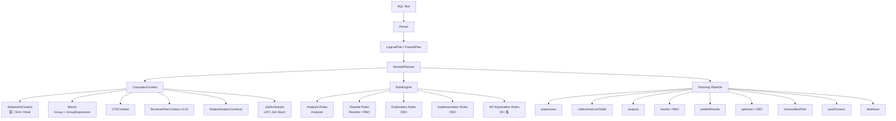
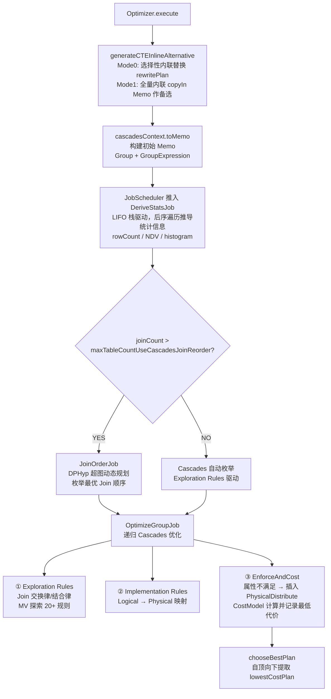
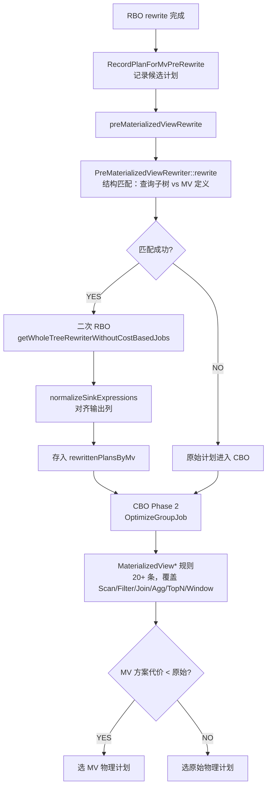
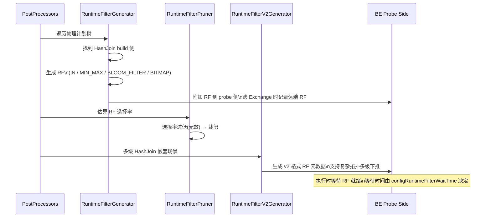
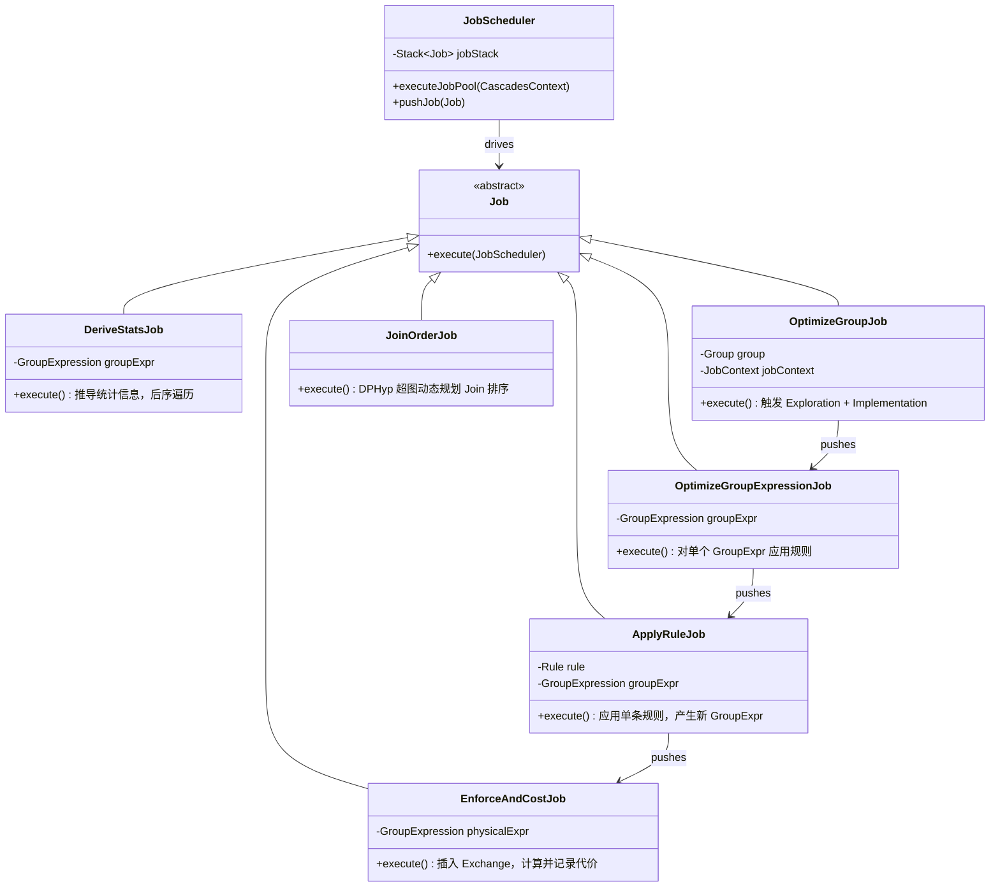

# NereidsPlanner — Apache Doris 新优化器完整指南

> 文件位置：`fe/fe-core/src/main/java/org/apache/doris/nereids/NereidsPlanner.java`

---

## 一、概述

NereidsPlanner 是 Apache Doris 的新一代基于 Cascades 框架的查询优化器（Nereids 引擎）的核心入口类。
它继承自 `Planner`，负责将解析后的逻辑计划（`LogicalPlan`）转换为可执行的物理计划（`PhysicalPlan`），
并最终生成用于分布式执行的 Fragment 计划。

Nereids 采用 **RBO（Rule-Based Optimization）+ CBO（Cost-Based Optimization）** 混合策略，
支持多达数百条重写规则与实现规则，并与 SQL Cache、物化视图改写、Runtime Filter、HBO（History-Based Optimization）等
高级特性深度集成。

---

## 二、整体架构图



---

## 三、完整优化流程时序图

```mermaid
sequenceDiagram
    participant Client
    participant NP as NereidsPlanner
    participant SC as StatementContext
    participant CC as CascadesContext
    participant RW as Rewriter(RBO)
    participant OPT as Optimizer(CBO)
    participant PP as PostProcessors

    Client->>NP: plan(queryStmt)
    NP->>NP: planWithLock()
    Note over NP: collectAndLockTable()<br/>NereidsLockTableFinishTime ✓
    NP->>SC: getPlannerHooks().beforeAnalyze()
    NP->>CC: analyze()
    Note over CC: NereidsAnalysisTime ✓
    NP->>SC: getPlannerHooks().afterAnalyze()
    NP->>RW: rewrite()
    Note over RW: NORMALIZE_PLAN_JOBS<br/>CTE_CHILDREN_REWRITE_JOBS_BEFORE<br/>CTE-level wrappers<br/>CTE_CHILDREN_REWRITE_JOBS_AFTER
    Note over RW: NereidsRewriteTime ✓
    NP->>SC: getPlannerHooks().afterRewrite()
    NP->>NP: preMaterializedViewRewrite()
    Note over NP: NereidsPreRewriteByMvFinishTime ✓
    NP->>OPT: optimize()
    Note over OPT: toMemo() → DeriveStatsJob<br/>→ DPHyp/Cascades<br/>→ OptimizeGroupJob
    Note over OPT: NereidsOptimizeTime ✓
    NP->>NP: chooseBestPlan() / chooseNthPlan()
    NP->>PP: postProcess()
    Note over PP: RF生成 / CSE / TopN优化 / Validator
    NP->>NP: distribute()
    Note over NP: NereidsTranslateTime ✓<br/>NereidsDistributeTime ✓
    NP-->>Client: PhysicalPlan + DistributedPlans
```

## 三-B、完整优化流程详解

```
SQL Text
   │
   ▼
[Parser] ──────────────────── LogicalPlan (ParsedPlan)
   │
   ▼
[1. preprocess()] ──────────── PlanPreprocessors
   │  • TurnOffPageCacheForInsertIntoSelect
   │  • PullUpSubqueryAliasToCTE
   │
   ▼
[2. initCascadesContext()]  ── 初始化 CascadesContext，设置 requireProperties
   │
   ▼
[3. collectAndLockTable()]  ── 收集表元数据，加表锁，初始化 CTEContext
   │
   ▼
[4. analyze()] ─────────────── Analyzer（语义分析）
   │  • AnalyzeCTE / EliminateLogicalSelectHint
   │  • BindRelation / BindExpression / BindSink
   │  • CheckPolicy / CheckAnalysis
   │  • 子查询处理 (SubqueryToApply)
   │  • 标准化 (NormalizeAggregate / NormalizeRepeat / NormalizeGenerate)
   │  • HAVING/QUALIFY 转 Filter
   │  • LeadingJoin Hint 处理
   │
   ▼
[5. rewrite()] ─────────────── Rewriter（规则驱动逻辑重写）
   │
   │  ┌── NORMALIZE_PLAN_JOBS ──────────────────────────────────────────┐
   │  │  Plan Normalization                                             │
   │  │   • FoldConstantForSqlCache                                    │
   │  │   • MergeProjectable                                           │
   │  │   • EliminateOrderByConstant / EliminateSortUnderSubqueryOrView│
   │  │   • ExpressionNormalizationAndOptimization                     │
   │  │   • AvgDistinctToSumDivCount / CountDistinctRewrite            │
   │  │  Subquery Unnesting                                             │
   │  │   • PullUpProjectUnderApply                                    │
   │  │   • AggScalarSubQueryToWindowFunction                          │
   │  │   • CorrelateApplyToUnCorrelateApply → ApplyToJoin             │
   │  └─────────────────────────────────────────────────────────────────┘
   │
   │  ┌── CTE_CHILDREN_REWRITE_JOBS (before sub-path pushdown) ────────┐
   │  │  Inline view & check column privileges                         │
   │  │  Eliminate optimization                                         │
   │  │   • EliminateLimit / EliminateFilter / EliminateAggregate      │
   │  │   • EliminateJoinCondition / EliminateSemiJoin                 │
   │  │  Rewrite join                                                   │
   │  │   • InferAggNotNull / InferFilterNotNull / InferJoinNotNull     │
   │  │   • PUSH_DOWN_FILTERS (bottomUp)                               │
   │  │   • ReorderJoin / PushFilterInsideJoin / FindHashConditionForJoin│
   │  │   • ConvertInnerOrCrossJoin / EliminateNullAwareLeftAntiJoin   │
   │  │   • TransposeSemiJoin* (push down SEMI join)                   │
   │  │  Set operation optimization                                     │
   │  │   • MergeSetOperations / BuildAggForUnion / EliminateEmptyRelation│
   │  │  Column pruning and infer predicate                             │
   │  │   • ColumnPruning / InferPredicates (×2 rounds)                │
   │  │   • ConstantPropagation                                        │
   │  │  Eliminate GroupBy / Eliminate join by FK/Unique               │
   │  │  Eager aggregation (cost-based)                                 │
   │  │   • PushDownAggThroughJoinOneSide / PushDownDistinctThroughJoin│
   │  │  Limit optimization                                             │
   │  │   • LimitSortToTopN / MergeTopNs / LimitAggToTopNAgg / SplitLimit│
   │  │   • PushDownTopN* / PushDownLimit*                             │
   │  │  Table/Physical optimization                                    │
   │  │   • PruneOlapScanPartition / PruneFileScanPartition            │
   │  │   • PruneOlapScanTablet                                        │
   │  └─────────────────────────────────────────────────────────────────┘
   │
   │  ┌── CTE-level wrappers ───────────────────────────────────────────┐
   │  │  PullUpCteAnchor / CTEInline / AddDefaultLimit                  │
   │  │  RecordPlanForMvPreRewrite                                      │
   │  │  RewriteCteChildren (before + after sub-path pushdown)         │
   │  │  ConvertOuterJoinToAntiJoin                                     │
   │  │  EliminateGroupByKeyByUniform / OrExpansion                     │
   │  │  DecomposeRepeatWithPreAggregation                              │
   │  │  DistinctAggStrategySelector                                    │
   │  └─────────────────────────────────────────────────────────────────┘
   │
   │  ┌── CTE_CHILDREN_REWRITE_JOBS (after sub-path pushdown) ─────────┐
   │  │  VariantSubPathPruning / NestedColumnPruning                    │
   │  │  DistinctAggregateRewriter                                      │
   │  │  PushDownVector/VirtualColumns/Match into OlapScan              │
   │  │  DeferMaterializeTopNResult                                     │
   │  │  AddProjectForJoin                                              │
   │  │  Final rewrite and check (CheckDataTypes, CheckAfterRewrite…)  │
   │  │  OperativeColumnDerive                                          │
   │  └─────────────────────────────────────────────────────────────────┘
   │
   ▼
[6. preMaterializedViewRewrite()] ── MV 预改写（RBO 阶段）
   │  • PreMaterializedViewRewriter::rewrite
   │  • 对 tmpPlansForMvRewrite 逐个尝试 MV 匹配
   │  • 对匹配成功的计划再次运行 RBO（不含 CBO rules）
   │  • normalizeSinkExpressions 与原始计划对齐
   │
   ▼
[7. optimize()] ────────────────── Optimizer（CBO，Cascades 框架）
   │
   │  ┌── 判断是否使用 DPHyp ──────────────────────────────────────────┐
   │  │  maxTableCountUseCascadesJoinReorder (默认值) vs 连续 Join 数  │
   │  │  unknown col stats 时阈值 ×2                                   │
   │  └─────────────────────────────────────────────────────────────────┘
   │
   │  ┌── generateCTEInlineAlternative() ──────────────────────────────┐
   │  │  Mode 0 (selective): 仅内联"合适"的 CTE                        │
   │  │  Mode 1 (full):      全量 CTE 内联后进入 Memo 作为候选计划     │
   │  │  内联后执行 PUSH_DOWN_FILTERS + ColumnPruning                  │
   │  └─────────────────────────────────────────────────────────────────┘
   │
   │  ┌── cascadesContext.toMemo() ─────────────────────────────────────┐
   │  │  将重写后的 LogicalPlan 装入 Memo（Group + GroupExpression）    │
   │  └─────────────────────────────────────────────────────────────────┘
   │
   │  ┌── DeriveStatsJob ───────────────────────────────────────────────┐
   │  │  自底向上推导各 Group 的统计信息（行数、NDV、直方图…）          │
   │  └─────────────────────────────────────────────────────────────────┘
   │
   │  ┌── DPHyp Join Ordering (可选) ───────────────────────────────────┐
   │  │  JoinOrderJob：用动态规划超图算法枚举最优连接顺序               │
   │  └─────────────────────────────────────────────────────────────────┘
   │
   │  ┌── OptimizeGroupJob（Cascades 递归优化）─────────────────────────┐
   │  │  Exploration Rules（逻辑等价变换）                              │
   │  │   • JoinCommute / InnerJoinLeftAssociate / InnerJoinLAsscom     │
   │  │   • OuterJoinAssoc / OuterJoinLAsscom                          │
   │  │   • LogicalJoinSemiJoinTranspose*                              │
   │  │   • PushDownProjectThrough* / MergeProjectsCBO                 │
   │  │   • IntersectReorder / TransposeAggSemiJoinProject             │
   │  │   • MaterializedView* (20+ 规则，覆盖 Scan/Join/Agg/TopN/Window)│
   │  │  Implementation Rules（逻辑→物理映射）                          │
   │  │   • LogicalOlapScan → PhysicalOlapScan                         │
   │  │   • LogicalJoin → HashJoin / NestedLoopJoin                    │
   │  │   • LogicalAggregate → AggregateStrategies(多阶段 Agg)         │
   │  │   • LogicalSort → PhysicalQuickSort                            │
   │  │   • LogicalTopN → PhysicalTopN                                  │
   │  │   • LogicalWindow → PhysicalWindow                             │
   │  │   • LogicalUnion/Except/Intersect → Physical*                  │
   │  │   • 各类 Sink（OlapTableSink, FileSink, HiveSink…）             │
   │  │  EnforceAndCost（属性强制 + 代价计算）                          │
   │  │   • 若子节点输出属性不满足父节点要求，插入 PhysicalDistribute    │
   │  │   • CostModel 计算各候选方案代价，选最小代价                    │
   │  └─────────────────────────────────────────────────────────────────┘
   │
   ▼
[8. chooseBestPlan() / chooseNthPlan()] ── 从 Memo 中提取最优物理计划
   │  • 按 lowest cost 递归提取 GroupExpression
   │  • 支持 requiredGroupIds（调试用，强制包含特定 Group）
   │  • 支持 nth_optimized_plan（返回第 N 优计划，用于对比）
   │
   ▼
[9. postProcess()] ─────────────── PlanPostProcessors（物理计划后处理）
   │  • PushDownFilterThroughProject
   │  • RemoveUselessProjectPostProcessor
   │  • ShuffleKeyPruner（裁剪分布键中冗余列）
   │  • RecomputeLogicalPropertiesProcessor
   │  • LazyMaterializeTopN（延迟物化 TopN 结果，减少 IO）
   │  • MergeProjectPostProcessor
   │  • ProjectAggregateExpressionsForCse（聚合 CSE 提取）
   │  • CommonSubExpressionOpt（公共子表达式优化）
   │  • PushTopnToAgg（TopN 下推聚合）
   │  • TopNScanOpt（TopN 推入 Scan 层）
   │  • FragmentProcessor（设置 Fragment 边界）
   │  • RuntimeFilterGenerator（生成 Runtime Filter）
   │  • RuntimeFilterPruner（裁剪低效 Runtime Filter）
   │  • RuntimeFilterV2Generator（新版 RF，支持更复杂拓扑）
   │  • Validator（最终合法性校验）
   │
   ▼
[10. distribute()] ─────────────── 分布式计划生成
   │  • splitFragments：PhysicalPlanTranslator 将物理计划翻译为 PlanFragment
   │    - 收集 ScanNode、PhysicalRelation、DescriptorTable
   │    - QueryCache 摘要生成（可选）
   │  • DistributePlanner.plan()
   │    - 分配数据分片、Exchange 节点、Fragment 间依赖
   │    - Cloud 模式：检查是否可在 FE 直接计算结果（ComputeResultSet）
   │
   ▼
PhysicalPlan + DistributedPlans (FragmentIdMapping)
```

---

## 四、各阶段模块说明

### 4.1 前置处理（Preprocess）

| 处理器 | 作用 |
|--------|------|
| `TurnOffPageCacheForInsertIntoSelect` | INSERT INTO SELECT 时关闭页缓存，避免脏页污染 |
| `PullUpSubqueryAliasToCTE` | 将子查询别名提升为 CTE，便于后续统一处理 |

### 4.2 语义分析（Analyzer）

Analyzer 采用 **bottomUp + topDown 混合顺序**的规则列表，不进入 Memo，直接对 LogicalPlan 树做变换。

| 规则分组 | 核心规则 |
|----------|---------|
| CTE 处理 | `AnalyzeCTE` |
| Hint 消除 | `EliminateLogicalSelectHint`, `EliminateLogicalPreAggOnHint` |
| 绑定 | `BindRelation`, `BindExpression`, `BindSink` |
| 权限检查 | `CheckPolicy`, `CheckAnalysis` |
| 聚合标准化 | `NormalizeAggregate`, `ProjectWithDistinctToAggregate`, `ProjectToGlobalAggregate` |
| HAVING/QUALIFY | `HavingToFilter`, `QualifyToFilter` |
| 窗口/Repeat | `NormalizeRepeat`, `NormalizeGenerate` |
| 子查询 | `SubqueryToApply` |
| Join 约束 | `CollectJoinConstraint`, `LeadingJoin`, `SemiJoinCommute` |

### 4.3 规则驱动重写（Rewriter / RBO）

Rewriter 按**有序 Topic 批次**组织规则，支持条件执行（仅当计划树含特定节点类型时才运行该批次）。执行顺序固定，不可跳过。

#### NORMALIZE_PLAN_JOBS（全局，不受 CTE 隔离）

| # | Topic | 规则 | 作用举例 |
|---|-------|------|---------|
| 1 | Plan Normalization | `FoldConstantForSqlCache`, `MergeProjectable`, `EliminateOrderByConstant`, `EliminateSortUnderSubqueryOrView`, `ExpressionNormalizationAndOptimization`, `AvgDistinctToSumDivCount`, `CountDistinctRewrite`, `ExtractFilterFromCrossJoin`, `ExtractSingleTableExpressionFromDisjunction` | `AVG(DISTINCT x)` → `SUM(DISTINCT x)/COUNT(DISTINCT x)`；消除 `ORDER BY 1` 常量列 |
| 2 | Subquery Unnesting（含 LogicalApply 时触发）| `PullUpProjectUnderApply`, `PushDownFilterThroughProject`, `MergeFilters`, `AggScalarSubQueryToWindowFunction`, `EliminateUselessPlanUnderApply`, `MergeProjectable`, `CorrelateApplyToUnCorrelateApply`, `ApplyToJoin` | 相关子查询 `WHERE id = (SELECT MAX(id) FROM t2 WHERE t2.k=t1.k)` → 转为 Window 函数或 Join |

#### CTE_CHILDREN_REWRITE_JOBS_BEFORE_SUB_PATH_PUSH_DOWN（CTE 子树内，28 个 topic）

| # | Topic | 规则 | 作用举例 |
|---|-------|------|---------|
| 3 | Inline view & privileges | `NormalizeAggregate`, `CheckPrivileges`, `InlineLogicalView` | 展开视图，检查列权限 |
| 4 | Eliminate optimization | `EliminateLimit`, `EliminateFilter`, `EliminateAggregate`, `EliminateAggCaseWhen`, `ReduceAggregateChildOutputRows`, `EliminateJoinCondition`, `EliminateAssertNumRows`, `EliminateSemiJoin`, `SimplifyEncodeDecode` | `LIMIT 0` → 空关系；`WHERE TRUE` → 消除 Filter |
| 5 | Agg normalization | `NormalizeAggregate`, `CountLiteralRewrite`, `RewriteSimpleAggToConstantRule`, `NormalizeSort` | `COUNT(1)` → `COUNT(*)` |
| 6 | Project merge | `MergeProjectable`, `PushDownEncodeSlot`, `DecoupleEncodeDecode` | 合并相邻 Project，减少算子层数 |
| 7 | Window analysis | `ExtractAndNormalizeWindowExpression`, `DistinctWindowExpression`, `CheckAndStandardizeWindowFunctionAndFrame`, `SimplifyWindowExpression` | 标准化窗口帧，拆分 DISTINCT 窗口 |
| 8 | Unnest pushdown | `PushDownUnnestInProject` | 将 UNNEST 下推到 Project 层 |
| 9 | Rewrite join | `InferAggNotNull`, `InferFilterNotNull`, `InferJoinNotNull`; bottomUp(`PUSH_DOWN_FILTERS`); `ReorderJoin`, `PushFilterInsideJoin`, `FindHashConditionForJoin`, `ConvertInnerOrCrossJoin`, `EliminateNullAwareLeftAntiJoin`, `JoinExtractOrFromCaseWhen`; `TransposeSemiJoinLogicalJoin/Project/Agg/AggProject`; `EliminateDedupJoinCondition`, `EliminateNotNull`, `ConvertInnerOrCrossJoin` | NOT NULL 推断后消除 Outer Join；谓词下推到 Join 内侧；Semi-Join 下推穿越 Agg |
| 10 | Set operation | `MergeSetOperations`, `MergeSetOperationsExcept`, `MergeOneRowRelationIntoUnion`, `InferSetOperatorDistinct`(costBased), `BuildAggForUnion`, `EliminateEmptyRelation`, `PushProjectIntoUnion` | 多层 UNION ALL 合并；空关系消除 |
| 11 | InferInPredicateFromOr | `InferInPredicateFromOr` | `a=1 OR a=2` → `a IN (1,2)` 便于分区裁剪 |
| 12 | Column pruning & predicate | `ColumnPruning`, `ConstantPropagation`, `InferPredicates`(×2), `PUSH_DOWN_FILTERS`(×2), `PushFilterInsideJoin`, `FindHashConditionForJoin`, `ProjectOtherJoinConditionForNestedLoopJoin`, `ConvertInnerOrCrossJoin` | 裁掉未引用列；`a=1 AND b=a` → 推导 `b=1` |
| 13 | EliminateUnnecessaryProject | `EliminateUnnecessaryProject` | 删除纯透传 Project |
| 14 | Eliminate Order By Key | `EliminateOrderByKey` | 删除 ORDER BY 中重复/冗余的 key |
| 15 | Eliminate GroupBy（含 LogicalAggregate）| `EliminateGroupBy`, `MergeAggregate` | 唯一键上的 GROUP BY 可消除 |
| 16 | Eliminate join by FK/Unique（含 LogicalJoin）| `EliminateJoinByFK`, `EliminateJoinByUnique` | 外键约束下 Join 结果等于驱动表，直接消除 |
| 17 | Join skew salting | `SaltJoin` | 数据倾斜时对 Join key 加盐打散 |
| 18 | Eliminate Agg by fd items | `EliminateGroupByKey`, `PushDownAggThroughJoinOnPkFk`, `PullUpJoinFromUnionAll` | 函数依赖下删除冗余 GROUP BY key |
| 19 | Eager aggregation（costBased，含 Agg+Join）| `PushDownAggWithDistinctThroughJoinOneSide`, `PushDownAggThroughJoinOneSide`, `PushDownDistinctThroughJoin`, `PushDownAggregation`, `PushCountIntoUnionAll` | 将 COUNT/SUM 下推到 Join 前，减少 Join 输入行数 |
| 20 | Limit optimization（含 Limit/TopN/Window）| `LimitSortToTopN`, `MergeTopNs`, `LimitAggToTopNAgg`, `SplitLimit`, `PushDownLimit`, `PushDownLimitDistinctThroughJoin/Union`, `PushDownTopNDistinctThroughJoin/Union`, `PushDownTopNThroughJoin/Window/Union`, `CreatePartitionTopNFromWindow`, `PullUpProjectUnderTopN/Limit` | `ORDER BY x LIMIT 10` → TopN；TopN 穿越 Join 下推 |
| 21 | Table/Physical opt（含 CatalogRelation）| `PruneOlapScanPartition`, `PruneEmptyPartition`, `PruneFileScanPartition`, `PushDownFilterIntoSchemaScan`, `PruneOlapScanTablet`, `PUSH_DOWN_FILTERS` | 分区裁剪；Tablet 裁剪；Filter 下推到 Scan |
| 22 | Pre-agg & sort | `SetPreAggStatus`, `EliminateSort`, Point query short circuit | 设置预聚合状态；消除无意义 Sort |
| 23 | Initial join order | `InitJoinOrder`, `PushDownJoinOnAssertNumRows`, `SkewJoin` | 设置初始 Join 顺序供 CBO 参考 |
| 24 | Agg rewrite | `SumLiteralRewrite`, `MergePercentileToArray` | `SUM(1)` → `COUNT(*)`；合并多个 PERCENTILE 调用 |
| 25 | Unique function projection | `AddProjectForUniqueFunction` | 为唯一函数添加 Project 层 |
| 26 | HBO scan filter | `CollectPredicateOnScan` | 收集 Scan 上的谓词供 HBO 使用 |
| 27 | CTE consumer pushdown | `CollectFilterAboveConsumer`, `CollectCteConsumerOutput` | 将 CTE consumer 上方的 Filter/Project 推入 producer |
| 28 | Column collection | `QueryColumnCollector` | 收集查询用到的列，供后续优化使用 |

#### CTE-level wrappers（包裹上述 CTE 子树）

| 规则/阶段 | 作用 |
|----------|------|
| `PullUpCteAnchor`, `CTEInline`, `AddDefaultLimit` | CTE 锚点提升；决定是否内联 CTE；添加默认 LIMIT |
| `RecordPlanForMvPreRewrite` | 记录候选计划供 MV 预改写使用 |
| `ConvertOuterJoinToAntiJoin` | Outer Join + IS NULL 过滤 → Anti Join |
| `EliminateGroupByKeyByUniform` | 均匀分布列上的 GROUP BY key 可消除 |
| `OrExpansion` | OR 谓词展开为 UNION，便于分区裁剪 |
| `DecomposeRepeatWithPreAggregation` | GROUPING SETS 分解 + 预聚合 |
| `DistinctAggStrategySelector` | 选择 DISTINCT 聚合策略（单阶段/两阶段/Global） |

#### CTE_CHILDREN_REWRITE_JOBS_AFTER_SUB_PATH_PUSH_DOWN

| 规则/阶段 | 作用 |
|----------|------|
| `PUSH_DOWN_FILTERS`, `ColumnPruning`, `MergeProjectable` | 二次谓词下推 + 列裁剪 |
| `DistinctAggregateRewriter`, `EliminateUnnecessaryProject` | DISTINCT 聚合改写 |
| `PushDownVectorTopNIntoOlapScan`, `PushDownVirtualColumnsIntoOlapScan` | 向量检索 TopN / 虚拟列下推到 OlapScan |
| `PushDownMatchProjectionAsVirtualColumn`, `PushDownScoreTopNIntoOlapScan` | 全文检索 Match 下推 |
| `DeferMaterializeTopNResult`, `AddProjectForJoin` | TopN 延迟物化；Join 前插入 Project |
| Final checks | `CheckDataTypes`, `CheckMatchExpression`, `CheckMultiDistinct`, `CheckScoreUsage`, `CheckRestorePartition`, `CheckAndStandardizeWindowFunctionAndFrame`, `CheckAfterRewrite`, `CheckLegalityAfterRewrite` |
| `OperativeColumnDerive`, `AdjustNullable`, `AdjustConjunctsReturnType` | 推导操作列；调整 nullable 属性 |
| `NullableDependentExpressionRewrite`, `MergeGuardExpr`, `ExpressionRewrite` | nullable 相关表达式改写 |
| Whole plan check | `RewriteSearchToSlots`, AccessPath rules | 全局合法性检查；搜索表达式转 Slot |

### 4.4 MV 预改写（preMaterializedViewRewrite）

在 RBO 重写完成后、进入 Cascades CBO 之前，对"可能匹配 MV"的计划先尝试 MV 改写：

```
1. PreMaterializedViewRewriter::rewrite
       ↓
2. Rewriter.getWholeTreeRewriterWithoutCostBasedJobs（对改写后计划二次 RBO）
       ↓
3. normalizeSinkExpressions（与原始计划对齐输出列）
       ↓
4. 成功的计划存入 statementContext.rewrittenPlansByMv
```

改写有独立超时控制（`materializedViewRewriteDurationThresholdMs`），超时后回退到原始计划走 CBO。

### 4.5 CBO 优化（Optimizer）



**Exploration Rules（部分）**：

| 规则 | 描述 |
|------|------|
| `JoinCommute` | A⋈B → B⋈A（交换律）|
| `InnerJoinLeftAssociateProject` | (A⋈B)⋈C → A⋈(B⋈C)（左结合）|
| `InnerJoinLAsscomProject` | 左结合+交换 |
| `OuterJoinAssocProject` | Outer join 结合 |
| `LogicalJoinSemiJoinTransposeProject` | Join/Semi-Join 转置 |
| `MaterializedView*` | 20+ 规则，覆盖 Scan/Filter/Join/Agg/TopN/Window 各场景 |
| `MergeProjectsCBO` | CBO 阶段合并 Project |

**Implementation Rules（部分）**：

| 逻辑算子 | 物理实现 |
|----------|---------|
| `LogicalOlapScan` | `PhysicalOlapScan` |
| `LogicalJoin` | `PhysicalHashJoin` / `PhysicalNestedLoopJoin` |
| `LogicalAggregate` | `AggregateStrategies`（单阶段/两阶段/三阶段 Distinct）|
| `LogicalSort` | `PhysicalQuickSort` |
| `LogicalTopN` | `PhysicalTopN` |
| `LogicalWindow` | `PhysicalWindow` |
| `LogicalUnion/Intersect/Except` | `PhysicalUnion/Intersect/Except` |
| `LogicalFileScan` | `PhysicalFileScan` |

### 4.6 最优计划提取

```java
// 正常路径：取代价最低的计划
physicalPlan = chooseNthPlan(root, requireProperties, nth=1)

// 调试路径：取第 N 优计划（nth_optimized_plan session 变量）
physicalPlan = chooseNthPlan(root, requireProperties, nth)

// 调试路径：强制包含指定 Group（required_group_ids session 变量）
physicalPlan = chooseBestPlanWithRequiredGroups(root, props, requiredGroupIds, reachableCache)
```

提取过程是 **自顶向下递归**，从每个 Group 中取 `lowestCostPlan(physicalProperties)`，
并标记 chosenProperties / chosenGroupExpressionId 供后续分析使用。

### 4.7 物理计划后处理（PlanPostProcessors）

后处理在 Memo 提取完毕之后对物理计划树做最终调整，**不再修改计划结构**（FragmentProcessor 之后禁止替换节点）。

| 处理器 | 作用 |
|--------|------|
| `PushDownFilterThroughProject` | 将 Filter 穿透 Project 下推 |
| `RemoveUselessProjectPostProcessor` | 删除纯透传 Project |
| `ShuffleKeyPruner` | 裁剪分布键中多余的列 |
| `RecomputeLogicalPropertiesProcessor` | 重新计算逻辑属性（nullable 等）|
| `LazyMaterializeTopN` | TopN 延迟物化，减少宽表 IO |
| `MergeProjectPostProcessor` | 合并相邻 Project |
| `ProjectAggregateExpressionsForCse` | 聚合表达式 CSE 提取 |
| `CommonSubExpressionOpt` | 公共子表达式优化（CSE） |
| `PushTopnToAgg` | 将 TopN 下推到聚合层 |
| `TopNScanOpt` | TopN 注入 Scan，支持提前终止 |
| `FragmentProcessor` | 设置 Fragment 分隔点 |
| `RuntimeFilterGenerator` | 生成 Runtime Filter 并附加到 Build 侧 |
| `RuntimeFilterPruner` | 根据代价裁剪低效 RF |
| `RuntimeFilterPrunerForExternalTable` | 外表专属 RF 裁剪 |
| `RuntimeFilterV2Generator` | 新版 RF（支持复杂拓扑、多级下推）|
| `Validator` | 最终合法性检查（类型、属性、引用等）|

### 4.8 分布式计划生成（distribute）

```
splitFragments()
    ├── PhysicalPlanTranslator.translatePlan()
    │     翻译为 PlanFragment 树
    │     收集 ScanNode / PhysicalRelation / DescriptorTable
    │     QueryCache 摘要生成（hash digest，可选）
    │
    └── DistributePlanner.plan()
          分配 Exchange / Bucket / Tablet 信息
          生成 FragmentIdMapping<DistributedPlan>
          Cloud 模式：ComputeResultSet 短路（FE 直接计算）
```

---

## 五、Explain 级别说明

NereidsPlanner 支持多个 Explain 级别，可在任意阶段截断并返回该阶段的计划：

| ExplainLevel | 截断位置 | 输出内容 |
|--------------|---------|---------|
| `PARSED_PLAN` | 解析后 | 未经任何优化的 AST 级计划树 |
| `ANALYZED_PLAN` | 语义分析后 | 绑定符号、类型推断完成的计划 |
| `REWRITTEN_PLAN` | RBO 重写后 | 规则改写完成的逻辑计划 |
| `OPTIMIZED_PLAN` | CBO 后 | 最优物理计划 + cost |
| `SHAPE_PLAN` | CBO 后 | 只显示算子形状（精简格式）|
| `MEMO_PLAN` | CBO 后 | Memo 全内容 + 最优物理计划 |
| `DISTRIBUTED_PLAN` | 分布式计划后 | Fragment 分配情况 |
| `ALL_PLAN` | 全过程 | 每个阶段的计划树+耗时 |

---

## 六、关键数据结构

```
CascadesContext
├── StatementContext          -- 单次 SQL 的全局上下文（锁、Hint、钩子…）
├── Memo                      -- CBO 核心数据结构
│   ├── Group[]               -- 等价逻辑/物理计划的集合
│   │   ├── LogicalExpression[] -- 逻辑等价形式
│   │   ├── PhysicalExpression[]-- 物理实现形式
│   │   └── lowestCostPlans  -- 各 PhysicalProperties 下的最低代价方案
│   └── GroupExpression       -- 单个算子 + 子 Group 引用
├── CTEContext                -- CTE producer/consumer 信息
├── RuntimeFilterContext      -- Runtime Filter 上下文（v1）
├── RuntimeFilterContextV2   -- Runtime Filter 上下文（v2）
├── MaterializationContexts[] -- MV 候选集合
└── JobScheduler              -- 作业调度器（LIFO 栈）
```

---

## 七、MV 改写机制

物化视图改写分为两个阶段：

### Phase 1：RBO 预改写（preMaterializedViewRewrite）
- 在 Rewrite 阶段标记候选计划（`RecordPlanForMvPreRewrite`）
- 用 `PreMaterializedViewRewriter` 尝试 MV 结构匹配
- 匹配成功后再次 RBO，产出完全重写的逻辑计划
- 存入 `statementContext.rewrittenPlansByMv`

### Phase 2：CBO 探索（OptimizeGroupJob）
- 在 Cascades 探索阶段，`MaterializedView*` 规则（20+ 条）对每个 Group 尝试 MV 替换
- 替换后的方案进入 Memo 作为候选，与原始方案共同参与代价比较
- 最终选代价最低的方案（可能是 MV 版本，也可能是原始版本）

```
MaterializedView 规则覆盖的模式：
  OnlyScan / FilterScan / ProjectScan / ProjectFilterScan
  FilterJoin / ProjectJoin / ProjectFilterJoin / ProjectFilterProjectJoin
  FilterAgg / ProjectAgg / FilterProjectAgg / ProjectFilterAgg
  LimitScan / LimitJoin / LimitAgg
  TopNScan / TopNJoin / TopNAgg
  WindowAgg / WindowJoin / WindowScan
  AggOnNoneAgg
```

---

## 八、Runtime Filter 生成流程

```
RegisterParent
    ↓（建立 parent 引用，便于 RF 向上传播）
RuntimeFilterGenerator
    ├── 遍历 HashJoin build 侧
    ├── 生成 RF（IN / MIN_MAX / BLOOM_FILTER / BITMAP）
    └── 附加到 probe 侧（跨 Exchange 时记录远端 RF）
    ↓
RuntimeFilterPruner
    ├── 估算 RF 选择率（依赖统计信息）
    └── 裁剪选择率过低（无效）的 RF
    ↓
RuntimeFilterV2Generator
    ├── 支持多级 HashJoin 嵌套的 RF 下推
    └── 生成 v2 格式 RF 元数据
```

RF 等待时间根据最大表行数自动调整（`configRuntimeFilterWaitTime`）：

| 场景 | 行数 | 等待时间 |
|------|------|---------|
| OLAP 表 | < 1G | 1s |
| OLAP 表 | 1G–10G | 5s |
| OLAP 表 | > 10G | 20s |
| 外表 | < 1G | 5s |
| 外表 | 1G–10G | 10s（20s） |
| 外表 | > 10G | 50s |
| Cloud 模式 | 任意 | max(默认值, queryTimeout) |

---

## 九、SQL Cache 集成

```
[SQL Cache 命中]
    LogicalSqlCache
        ↓
    NereidsPlanner 直接返回 PhysicalSqlCache
    跳过所有优化阶段

[SQL Cache 生成]
    rewrite 阶段：FoldConstantForSqlCache（折叠常量，生成缓存 key）
    distribute 阶段：QueryCacheNormalizer 生成 Fragment 摘要（hash digest）
    splitFragments 完成后：将 colLabels / fieldInfos / resultExprs 写入 SqlCacheContext
```

---

## 十、HBO（基于历史的优化）

```
distribute 阶段：
    if (StatisticsUtil.isEnableHboInfoCollection())
        collectHboPlanInfo(queryId, physicalPlan, planTranslatorContext)
            ├── 建立 nereids plan ID → PlanNodeId 映射
            └── 存入 HboPlanStatisticsManager

后续查询：
    HboStatisticsManager 用历史运行时统计（row count 等）
    修正 StatsCalculator 的估算，改善 CBO 计划选择
```

---

## 十一、Minidump 机制

```
planWithoutLock 开始：
    MinidumpUtils.serializeInputsToDumpFile(plan, statementContext)
    （将输入计划序列化，用于复现）

planWithoutLock 结束（optimize 成功后）：
    MinidumpUtils.serializeOutputToDumpFile(physicalPlan)
    （将输出物理计划序列化）
```

Minidump 文件可用于在独立环境中重现优化过程，便于调试复杂 bug。

---

## 十二、扩展点与 Hook 机制

```java
// StatementContext.plannerHooks 允许外部注入钩子
statementContext.getPlannerHooks().forEach(hook -> hook.beforeAnalyze(this));
// ... 分析 ...
statementContext.getPlannerHooks().forEach(hook -> hook.afterAnalyze(this));
// ... 重写 ...
cascadesContext.getStatementContext().getPlannerHooks().forEach(hook -> hook.afterRewrite(cascadesContext));
```

典型用途：
- MTMV/IVM 触发器（分析后初始化物化视图上下文）
- 测试注入（`@VisibleForTesting` 的 planWithLock/planWithoutLock）

---

## 十三、性能 Profile 埋点

| 埋点位置 | Profile 字段 |
|---------|-------------|
| collectAndLockTable 结束 | `NereidsLockTableFinishTime` |
| analyze 结束 | `NereidsAnalysisTime` |
| rewrite 结束 | `NereidsRewriteTime` |
| preMvRewrite 结束 | `NereidsPreRewriteByMvFinishTime` |
| optimize 结束 | `NereidsOptimizeTime` |
| translate 结束 | `NereidsTranslateTime` |
| distribute 结束 | `NereidsDistributeTime` |
| plan 结束 | `NereidsGarbageCollectionTime`（GC 耗时）|

---

## 十四、总结

```
NereidsPlanner 优化阶段速览：

  SQL
   │
   ├─ [preprocess]       AST 级预处理（CTE 提升、page cache 关闭）
   ├─ [analyze]          语义绑定、类型推断、子查询展开
   ├─ [rewrite/RBO]      100+ 条启发式重写规则（谓词下推、列裁剪、Join 重写…）
   ├─ [preMvRewrite]     MV 结构匹配预改写（RBO 阶段）
   ├─ [optimize/CBO]     Cascades 框架：统计推导 + DPHyp + 探索/实现规则 + 代价模型
   ├─ [chooseBest]       从 Memo 提取最低代价物理计划
   ├─ [postProcess]      Runtime Filter 生成、CSE、TopN 优化、最终校验
   └─ [distribute]       Fragment 切分、Exchange 分配、分布式计划生成
```

Nereids 的设计目标是实现 **完全可扩展** 的优化器框架：
- 新增重写规则只需实现 `Rule` 接口并注册到 `Analyzer`/`Rewriter`
- 新增物理实现只需实现 `ImplementationRule` 并注册到 `RuleSet`
- 新增统计信息来源只需扩展 `StatsCalculator`
- 新增代价模型只需扩展 `CostModel`

---

## 十五、统计信息推导

### 15.1 StatsCalculator（Visitor 模式）

`StatsCalculator` 以后序遍历方式访问 Memo 中每个 `GroupExpression`，为每个 Group 计算 `Statistics`（行数、列 NDV、直方图）。

```
fe/fe-core/src/main/java/org/apache/doris/nereids/stats/StatsCalculator.java
```

| 访问方法 | 对应算子 | 估算逻辑 |
|---------|---------|---------|
| `visitLogicalOlapScan` | OlapScan | 读取 BE 上报的列统计；无统计时用 `defaultRowCount` |
| `visitLogicalFilter` | Filter | `FilterEstimation.estimate(filter, inputStats)` |
| `visitLogicalJoin` | Join | `JoinEstimation.estimate(leftStats, rightStats, joinCondition)` |
| `visitLogicalAggregate` | Aggregate | GROUP BY 列 NDV 乘积作为输出行数上界 |
| `visitLogicalProject` | Project | 行数不变，传播列统计 |
| `visitLogicalTopN` | TopN | `min(limit + offset, inputRows)` |

### 15.2 FilterEstimation

```
fe/fe-core/src/main/java/org/apache/doris/nereids/stats/FilterEstimation.java
```

**举例：`WHERE age > 30`**

1. 查找 `age` 列的直方图（若有）→ 计算 `>30` 区间的频率之和
2. 无直方图时用默认选择率：范围谓词 `1/3`，等值谓词 `1/NDV`
3. 多个谓词 AND：选择率相乘（独立性假设）；OR：容斥原理

```
selectivity = (maxVal - 30) / (maxVal - minVal)   // 线性插值
outputRows  = inputRows × selectivity
```

### 15.3 JoinEstimation

```
fe/fe-core/src/main/java/org/apache/doris/nereids/stats/JoinEstimation.java
```

- **等值 Join**：`outputRows = leftRows × rightRows / max(NDV_left, NDV_right)`
- **Cross Join**：`outputRows = leftRows × rightRows`
- **Semi/Anti Join**：输出行数 ≤ 驱动侧行数

### 15.4 HBO 模式

当 `StatisticsUtil.isEnableHbo()` 为 true 时，`HboStatsCalculator` 替代 `StatsCalculator`，用历史运行时行数（存储在 `HboPlanStatisticsManager`）修正估算，避免统计信息过期导致的计划退化。

---

## 十六、代价模型

```
fe/fe-core/src/main/java/org/apache/doris/nereids/cost/CostModel.java
```

### 16.1 三维代价

| 维度 | 含义 |
|------|------|
| `cpuCost` | CPU 计算量（行数 × 处理代价系数） |
| `memoryCost` | 内存占用（Build 侧 Hash Table 大小） |
| `networkCost` | 网络传输量（Shuffle 数据量） |

最终代价 = `cpuCost + memoryCost × memWeight + networkCost × netWeight`（权重可配置）

### 16.2 各算子代价

**OlapScan**
```
cost = rows × scanRowCost
     - aggMvBonus          // 命中预聚合 MV 时减去奖励值
USE_MV hint → cost = -∞   // 强制选择该 MV
```

**HashJoin**
```
buildCost  = buildRows × buildRowSize   // memoryCost：构建 Hash Table
probeCost  = probeRows × probeRowCost   // cpuCost：探测阶段
cost = buildCost + probeCost
```

**PhysicalDistribute（Shuffle Exchange）**
```
networkCost = rows × rowSize × shuffleCost
```

**Aggregate（两阶段）**
```
localAggCost  = inputRows × aggCost     // 本地预聚合
globalAggCost = localOutputRows × aggCost
```

### 16.3 属性强制（EnforceAndCost）

当子节点输出的 `PhysicalProperties`（Distribution / Sort Order）不满足父节点要求时，`EnforceAndCost` 自动插入 `PhysicalDistribute`（Shuffle/Broadcast/Gather）并叠加网络代价，再与不插入 Exchange 的方案比较，选代价最低者。

---

## 十七、MV 改写两阶段流程图



**两阶段必要性**：Phase 1（RBO）在进入 Memo 前完成结构匹配，产出完整重写计划；Phase 2（CBO）在 Memo 内以规则形式探索，两者互补——Phase 1 覆盖 RBO 能确定的改写，Phase 2 在代价框架下与原始方案公平竞争。

---

## 十八、Runtime Filter 时序图



| 场景 | 行数 | 等待时间 |
|------|------|---------|
| OLAP 表 | < 1G | 1s |
| OLAP 表 | 1G–10G | 5s |
| OLAP 表 | > 10G | 20s |
| 外表 | < 1G | 5s |
| 外表 | 1G–10G | 10s（20s） |
| 外表 | > 10G | 50s |
| Cloud 模式 | 任意 | max(默认值, queryTimeout) |

---

## 十九、Job 调度体系



**LIFO 调度**：JobScheduler 使用栈（LIFO）驱动，深度优先展开 Group 树。每个 Job 执行时可向栈中压入新 Job，实现递归优化而无需系统调用栈递归。

---

## 二十、面试高频 Q&A

**Q1：Cascades 与 Volcano 的区别？**

| 维度 | Volcano | Cascades |
|------|---------|---------|
| 搜索方式 | 自顶向下，两阶段（逻辑优化 + 物理优化分离）| 自顶向下，逻辑/物理交织在同一搜索空间 |
| 等价类 | 无 Memo，每次展开新树 | Memo 中 Group 表示等价类，共享子计划 |
| 剪枝 | 有限 | Branch-and-bound：上界剪枝，避免无效展开 |
| 规则组织 | 变换规则 + 实现规则分离 | Exploration + Implementation 统一注册 |
| Doris 实现 | 旧 Planner（已废弃）| Nereids（当前）|

**Q2：DPHyp 适用场景？**

当 Join 表数量超过 `maxTableCountUseCascadesJoinReorder`（默认值，unknown stats 时 ×2）时启用。DPHyp（Dynamic Programming on Hypergraph）将 Join 图建模为超图，用 DP 枚举所有连通子图的最优 Join 顺序，时间复杂度 O(3^n)，比 Cascades 枚举更可控。适合星型/雪花型大表 Join 场景。

**Q3：MV 两阶段改写的必要性？**

- Phase 1（RBO）：在进入 Memo 前完成，产出完整重写计划，避免 Memo 膨胀；适合结构确定、无需代价比较的改写。
- Phase 2（CBO）：在 Memo 内以 Exploration Rule 形式探索，MV 方案与原始方案共享子计划、公平竞争代价；适合需要与其他物理实现比较的场景。
- 两阶段互补：Phase 1 快速过滤，Phase 2 精确选择。

**Q4：Runtime Filter 等待时间策略？**

RF 等待时间由 `configRuntimeFilterWaitTime` 根据 Build 侧最大表行数自动设置（见十八章表格）。Cloud 模式下取 `max(默认值, queryTimeout)` 避免超时。RF 选择率过低时由 `RuntimeFilterPruner` 裁剪，避免等待无效 RF 拖慢查询。

**Q5：RBO 与 CBO 如何协作？**

```
RBO（Rewriter）→ 确定性改写，消除冗余，化简结构
      ↓
preMvRewrite  → MV 结构匹配（RBO 阶段，快速路径）
      ↓
CBO（Optimizer）→ 在 Memo 中枚举等价计划，用代价模型选最优
      ↓
postProcess   → 物理层面微调（RF、CSE、TopN 下推）
```

RBO 先做确定性优化（谓词下推、列裁剪等），减小 CBO 搜索空间；CBO 在精简后的计划上做代价驱动的枚举，两者串行协作。部分 RBO 规则标记为 `costBased`（如 `PushDownAggThroughJoinOneSide`），在 RBO 阶段也会参考统计信息做决策。
